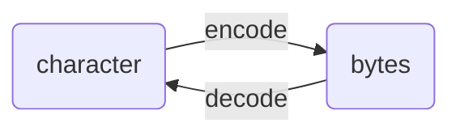
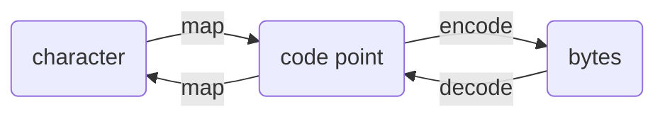

>[!Note]
>**Encoding/Decoding**（編碼與解碼）與 **Encrypting/Decrypting**（加密與解密）是兩組完全不相同的概念，本篇要講解的是前者，如果你在找的是加密與解密，請看[[Cryptography/Introduction|這篇]]。

我們知道在計算機中，所有資料都是以 0/1 的方式儲存，整數 (integer) 最好理解，就是把 10 進制轉成 2 進制；浮點數 (floating-point number) 稍為複雜一點，詳細可看[[Floating-Point Number|這篇]]；那還有一個最常用到的資料型態—字串 (string) 是如何以 0/1 的方式被儲存的呢？

字串可以被拆解成一個個字元 (character)，所以如果我們可以定義一個「對照表」，標明每個字元所對應到的 0/1 序列，問題其實就解決了。而這個「對照表」在學術上的名詞叫做 **Character Encoding Standard**，把 character 轉換成 0/1 序列 (bytes) 的動作叫 "encoding"（編碼）；把 bytes 轉回 character 的動作則叫 "decoding"（解碼）：



在計算機發展的歷史上出現過許多 character encoding standards，1960 到 1980 年代以 **ASCII** 最為普遍，後來因為電腦在世界各地越來越普及，加上網際網路的興起，ASCII 由於設計上的限制，導致無法把各國文字的字元都納入對照表，因此又陸續出現 **ISO 8859** 系列、**UTF** 系列等多種 standards，現今以 UTF-8 最為普遍，截至 2024 年，整個網際網路中約有 98% 的網頁都是用 UTF-8 編碼。

![[character-encoding-share.png]]

# ASCII

ASCII (American Standard Code for Information Interchange) 固定使用 7 個 bits 來表示一個字元，所以總共只能表達 $2^7 = 128$ 個字元，這 128 個字元包括大小寫的英文字母、數字 0 到 9、常用的標點符號、還有一些無法印出來但具有特出用途的 control characters（比如用來表示換行的 [[CR, LF]]），詳細可見 [ASCII table](https://www.ascii-code.com/)。

以英文字母 "A" 為例，用 ASCII 編碼後，以十進制表示的話是 `65`，以二進制的方式表達則是 `1000001`，或 `01000001`（在前面補一個 0）會補一個 0 是因為計算機中所有資料的最小單位都是 byte，而 1 byte = 8 bits，只是 ASCII 沒用到第 8 個 bit 而已，所以完整的寫法確實要寫成 8 bits。

# ISO 8859-1

ASCII 因為只有 7 bits 所以只能 encode 128 個字元，而前面提到「資料的最小單位是 byte」，所以其實可以說 ASCII 浪費了一個 bit 的空間。可想而知後來這第 8 個 bit 就被用上了，這個==用上第 8 個 bits 的 ASCII 就是 ISO 8859-1==（發表於 1985 年），總共可以 encode 256 個字元。

### 別稱

- 因為 ISO 8859-1 只是把原本的 ASCII 擴充了，前面 128 個字元一模一樣，所以又被稱為 **extended ASCII**
- 因爲多出來的 128 個字元大多是拉丁文，因此 ISO 8859-1 又稱為 **Latin-1**

# Unicode

即使有了 ISO 8859-1，256 個位置肯定還是無法容納世界各地的所有文字的字元與符號，更何況有一些文字不像拉丁文一樣是用少量的字母拼成各種單字，而是透過許多不同的字元來表達不同意思，比如中文，因此我們其實需要遠超過 256 的空間才能幫每個字元找到唯一的編碼，而 Unicode（統一碼）這個新的 character encoding standard 正是為了永久解決這個問題而生。

### Code Plane & Code Point

在 Unicode 的規範中，世界上任何字元、符號、甚至 emoji 都可以在 Unicode 定義的「對照表」中找到屬於它的位置（**code point**），這個對照表的結構如下：首先有 17 個 [code planes](https://en.wikipedia.org/wiki/Plane_(Unicode))，代表不同的「主題」，比如 plane 0 叫做 basic multilingual plane (BMP)、plane 1 叫做 supplementary multilingual plane (SMP)，每個 plane 有 $2^{16} = 65,536$ 個 code points 可以放置 character。

由此可知，Unicode 理論上總共可以容納 $2^{16} \times 17 = 1,114,112$ 個字元，但截至 2024 年爲止只有 154,998 個位置被使用，因此除非被外星人殖民 👽 不然理論上 Unicode 提供的空間應該是綽綽有餘的。

Code point 會以 4 到 6 位的 hexadecimal 來表示，從右邊數來的第 5、6 位代表 code plane，所以 plane 0 裡的 code point 一定是 `00` 開頭，因此就只剩 4 位數，以英文字母 "A" 為例，它的 code point 是 `0041`。

Unicode plane 0 的前 128 個字元與 ASCII table 裡的字元是一樣的，因此可以向後相容。比如將 `0041` ("A") 改以 binary 來表示的話就是 `01000001`，與 "A" 的 ASCII code 一樣。

### 程式碼

大多數程式語言中都有一些簡單的方法方便開發者可以在字元與 Unicode code point 之間做轉換。

Python:

```Python
# Get the unicode code point of "你" (10 base int type)
print(ord("你"))  # 20320

# Given a decimal unicode code point, get the character
print(chr(20320))  # 你

# Convert decimal to binary (string type)
print(bin(ord("你")))  # 0b100111101100000

# Convert decimal to hexadecimal (string type)
print(hex(ord("A")))  # 0x4f60

# Of course, you can do this
print(chr(0b100111101100000))  # 你
print(chr(0x4f60))  # 你

# Get the unicode code point of "你" (hexdecimal, with escape character reserved)
print("你".encode("unicode_escape"))  # b'\\u4f60'

# Use the "\u" escape character along with the hexadecimal code point
print("\u4f60" == "\U00004f60" == "你")  # True
```

JavaScript:

```JavaScript
// Get the unicode code point of "你" (10 base int type)
console.log("你".codePointAt());  // 20320

// Given a decimal unicode code point, get the character
console.log(String.fromCodePoint(20320));  // 你

// Convert decimal to binary (string type)
console.log("你".codePointAt().toString(2));  // 100111101100000

// Convert decimal to hexadecimal (string type)
console.log("你".codePointAt().toString(16));  // 4f60

// Use the "\u" escape character along with the hexadecimal code point
console.log("\u4f60" === "你");  // true
```

---

Unicode 與前面介紹的 ASCII、ISO 8859-1 最大的不同在於：==code point 並不是資料被儲存或傳遞的型態，還須要額外經過一層編碼（轉換）==。==Unicode 本身並沒有定義要怎麼編碼（怎麼以 0/1 序列來表示這個 code point）==，因此市面上有很多套機制，常見的有 UTF-8、UTF-16 與 UTF-32，其中又以 UTF-8 最為普及。



# UTF

UTF 是 Unicode Transformation Format 的縮寫，有一系列的 Unicode 編碼（轉換）機制都以 UTF 開頭，比如 UTF-8、UTF-16、UTF-32，這裡會依序介紹 UTF-32 與 UTF-8。

### UTF-32

UTF-32 的 32 得名於每個字元被編碼後，其大小皆固定為 32 bits。編碼方式其實就是很直觀地把 Unicode code point 以 hexadecimal 表達，並且前面補滿 0 直到長度為 8（$\because 16^8 = 2^{32}$），比如英文字母 "A" (Unicode code point 為 `0041`)，以 UTF-32 編碼後就會得到 `00 00 00 41`。

- 優點

    因為只是把 Unicode code point 補 0，所以 UTF-32「一定程度上」繼承了 Unicode「可向後兼容 ASCII」的優點。

- 缺點

    由於常用的字元大多都集中在 Unicode 的 code plane 0 (BMP)，而 plane 0 是 `00` 開頭，像 UTF-32 這樣固定長度為 32-bits 的編碼方式會導致出現大量的 `0`，這樣很浪費空間。

### UTF-8

UTF-8 的特色是「不同字元被 encode 成 bytes 後的長度不定」，目的是為了避免編碼中出現不必要的 leading zeros ，UTF-8 的 8 代表的是「長度的變動以 8 bits 為單位」。

前面提到 UTF-32 是直接在 Unicode hexadecimal code point 的前面補滿 0，但 UTF-8 並不是直接把 UTF-32 的 leading zero 拿掉，而是有一套另外的演算法，因此編碼後的結果會沒有 UTF-32 那麼直觀，但好消息是這個演算法在編碼 ASCII table 裡的 128 個字元時，得到的結果會與它們的 ASCII code 一模一樣。

- 優點

    本來 ASCII table 裡 128 個字元的 ASCII code 會跟 UTF-8 編碼後的結果一模一樣，因此相對於 UTF-32（只是一定程度上兼容）可以說 UTF-8 完全向後兼容了 ASCII。

- 缺點

    因為每個字元的長度可能不同，所以 decode 會比較花時間。

### 程式碼

Python:

```Python
print("你".encode("utf-8"))  # b'\xe4\xbd\xa0'
print([hex(b) for b in "你".encode("utf-8")])  # ['0xe4', '0xbd', '0xa0']
print(b"\xe4\xbd\xa0".decode("utf-8"))  # 你
```

JavaScript:

```JavaScript
let str = '你';
let utf8Bytes = new TextEncoder().encode(str);
console.log(utf8Bytes);  // Uint8Array(3) [228, 189, 160]

let utf8Hex = Array.from(utf8Bytes)
    .map(byte => byte.toString(16).padStart(2, '0'))
    .join(' ');
console.log(utf8Hex);  // e4 bd a0
```

如果編碼與解碼使用不同 standard，就會出現亂碼或直接報錯，以 Python 為例：

```Python
char = "你"
print(char.encode("utf-8").decode("unicode_excape"))  # ä½

print(char.encode("utf-8").decode("utf-32"))
# UnicodeDecodeError: 'utf-32-le' codec can't decode bytes in position 0-2: truncated data
```

# 參考資料

- <https://en.wikipedia.org/wiki/Character_encoding>
- <https://en.wikipedia.org/wiki/ASCII>
- <https://en.wikipedia.org/wiki/ISO/IEC_8859-1>
- <https://en.wikipedia.org/wiki/Unicode>
- <https://en.wikipedia.org/wiki/UTF-8>
- <https://www.youtube.com/watch?v=DntKZ9xJ1sM>
