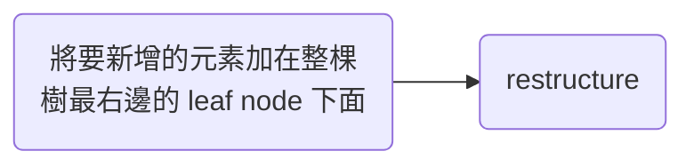
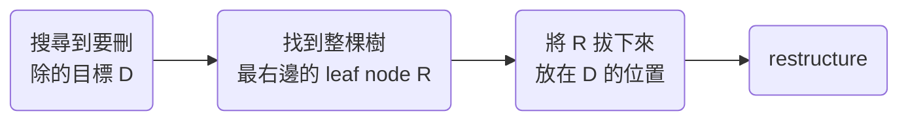

# Binary Search

若要在一個未經排序的數列中搜索指定的數字，其時間複雜度為 $O(n)$，其中 n 為數列的長度。

![[big-o-n-search.png]]

但若將數列經過排序，則之後每次要搜索指定的數字時，都可以用 binary search 的方式，讓時間複雜度降到 $O(\log n)$。

![[binary-search.png]]

但由於「排序」本身是一個具有一定複雜度的演算法，若未來 search 的機會不多，其實這麼做是多此一舉的。

### Linked List 中適合執行 Binary Search 嗎

No，因為從前面的圖中我們可以發現：binary search 會需要在數列中跳來跳去，並不是一個接著一個讀取，但在 linked list 中我們無法隨心所欲地跳到任意一個 node，只能透過現在的位置得知下一個（頂多還有前一個）node 在 memory 或 disk 中的位置，因此 binary search 無法在 linked list 中實現。

### Array 中適合執行 Binary Search 嗎？

這個問題的答案是「看情況」，當==資料數量固定時==，array 中適合執行 binary search，但反之則不然。

反之不然的主要原因是：array 在記憶體中使用的是一整塊連續的空間，當這塊連續的空間被佔滿後，若要繼續在 array 中加入新資料，就必須另外找一塊新的、更大的連續空間（通常是原本的兩倍大），然後把原本的資料複製過去，複製完後把原先佔用的空間 release 掉，最後才加入新資料，整個過程對系統而言是相對 expensive 的。

在資料庫的世界中，通常資料量是與日俱增的，因此在有需要進行 binary search 的場景中（比如利用 index 做搜尋）並不會選用 array 來當作存儲資料的結構。

# BST (Binary Search Tree)

BST 可以說是結合了 linked list 與 array 的優點，既可以執行 binary search，新增資料時的效率也較 array 高。

BST 有兩個規則：

1. 每個 node 最多只能有兩個 children
2. left child 的值要比自己小，right child 的值要比自己大

比如下圖：

![[big-o-log-n-search.png]]

在 BST 中做搜尋、新增、刪除的時間複雜度「平均而言」都是 $O(\log n)$，其中新增跟刪除會另外需要 restructure：

### 搜尋

如果一個 BST 夠平衡，其 depth 「平均而言」會是 $\log n$（n 為樹中元素數量），因此搜尋時的複雜度為 $O(\log n)$。

### 新增

新增時會先將要新增的元素加在整棵樹最右邊的 leaf node 下面（找到最右邊的 leaf node 的複雜度「平均而言」是 $O(\log n)$），然後「如果該元素出現在那個位置會打破 BST 規則的話」就進行 restructure，restructure 的時間複雜度「平均而言」也是 $O(\log n)$，所以整體而言，平均時間複雜度是 $O(\log n)$。

### 刪除

刪除時需要先搜尋到要刪除的目標 (D)，然後找到整棵樹最右邊的 leaf node (R)，將 R 拔下來並放在 D 的位置，然後「如果這麽做會打破 BST 規則的話」就進行 restructure。

大家應該也注意到了，上面在講到時間複雜度時都強調是「平均而言」，這是因為 BST 有可能不像一開始的圖一樣那麼平衡，最極端的不平衡的 BST 會長的像下面這樣：

![[imbalanced-bst.png]]

這樣的 BST 其實就是一個 linked list，無論是搜尋、新增或刪除，其時間複雜度都會是 $O(n)$，為避免發生這樣的憾事，於是有了接下來的 balanced BST。

# Balanced BST

Balanced BST 在原本的 BST 上加上了一個限制：「對於任何一個 balanced BST 及其 subtree，各個 leaf nodes 的 depth 不可相差超過 1。」

Balanced BST 其實只是一個分類，平衡樹的方法有很多種，不同方法做出來的樹名字都不同，比如 [[AVL Tree]] 以及 [[Red-Black Tree]]，此處不詳述。

### 資料庫的 Index 不使用 Balanced BST

事實上，Balanced BST 在 memory 中就已經是最有效率的資料結構了，但是若整個演算過程涉及與 disk 溝通，那就要額外考慮 disk I/O 問題（將 disk 中的資料讀進 memory，或將 memory 中的資料寫進 disk 的動作），因為 ==disk I/O 是造成 latency 的元兇之一==。

當資料庫中某張表的資料量 (n) 過大時，即使 $\log n$ 也會是一個很大的數字，而由於資料庫的資料是存在 disk 而非 memory 中，因此每往樹的下一層探索都會需要一次 disk I/O（進入 disk 將 child node 讀進 memory 中），因此我們會希望讓樹的 depth 再小一點，以減少可能的 disk I/O 次數。

而其中一個降低 depth 的方法就是==放棄 "binary"==，讓每個 node 儲存不只一筆資料且擁有不只兩個 children，這樣每次進 disk 都可以多讀一點資料回 memory，B Tree 就是這樣的資料結構。

# B Tree

如同上一段所述，B Tree 的每一個 node 中都可以塞入多筆資料，一個「m 階 B Tree」的 node 中最多可以塞 m-1 筆資料（排序好的），最多可以擁有 m 個 children（頭、尾以及間隔） ，下面是一個 2 階 B Tree 的示意圖：

![[b-tree.png]]

每個 node 都會被存在不同的 disk unit 中，disk 的最小可切割單位為 4 kB，每次進 disk 讀取資料的最小量也是 4 kB。B Tree 其實就是盡可能地將每個節點塞滿 4 kB 的資料，如此一來便能最大化每次 disk I/O 的效益。

B Tree 是某些 DBMS（如 PostgreSQL）所使用的資料結構，然而它還是有兩個缺點：

### 缺點一：「範圍搜尋」時沒有效率

範圍搜尋時，要選出所有範圍內的資料就必須 traverse 過樹中所有在選取範圍內的 nodes，因此需要很多次 disk I/O。

### 缺點二：當 Node 內的資料變大以致於超過 4 kB 後，需要 Restructrue

這個缺點的元兇是因為 B Tree 選擇「將實際的資料存儲在 node 中」。

不過不用擔心，我們其實還有其他選擇...

# B+ Tree

B+ Tree 可以說是針對 B Tree 的這兩個缺點而來，之所以能克服上述兩個難題，主要係因 B+ Tree 沒有將整筆資料存在 node 中，而是只在 internal nodes 中存須要排序 node 的 index，只在 external node 中存完整資料，像下圖這樣：

![[b-plus-tree.png]]

在 B+ Tree 中，由於每一筆真實資料都要出現在 external nodes 中，因此搜尋每一筆資料時所需要的 disk I/O 較平均，不會因爲該資料的 index 出現在比較上層就比較少。

另外還請注意一點：B+ Tree 中的各個相鄰的 external nodes 間會互相 refer（串成一串），且整串的資料恰巧會是排序好的，所以範圍搜尋時就不用 traverse 過整個 tree，只要找到範圍的開頭，便可以直接往右或往左找到下一筆。

# 參考資料

- <https://ithelp.ithome.com.tw/articles/10221111>
