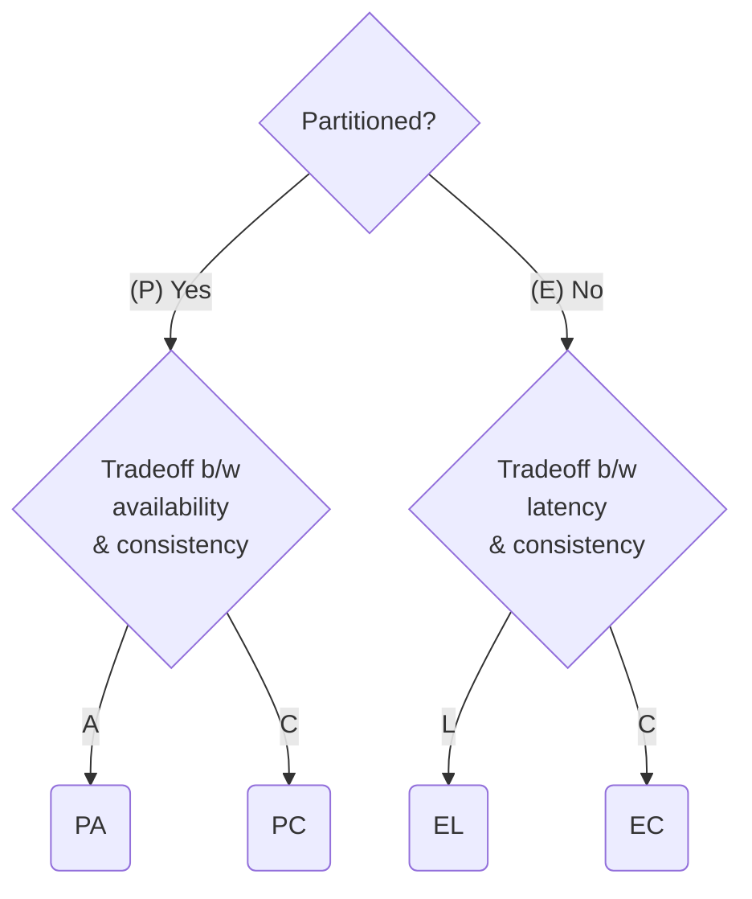

# ACID

### Atomicity

一個 [[Database/0 - Introduction#Database Transaction|transaction]]「執行成功」的定義是「transaction 中的每個步驟都成功」，若任一個步驟執行失敗，就會 **rollback** 回 transaction 執行前的初始狀態。

當一個 transaction 執行成功後會進行 **commit**，換言之 transaction 的結局有兩種，分別對應到一個動作：

- 成功 🙂 → 執行 commit
- 失敗 ☹️ → 執行 rollback

為何需要 rollback？假設在一個銀行的資料庫中，account A 要轉帳 n 元給 account B，撇除其他細節不談，最重要的步驟有兩個：

1. 將 account A 的 balance 減去 n
2. 將 account B 的 balance 加上 n

如果步驟一執行成功、步驟二執行失敗，但卻沒有 rollback，那 A 的 n 元就從這個世界上蒸發了，由此可見 rollback 的重要性。

##### Recoverability

「可以 rollback」這個性質叫做 "recoverability"，有兩種做法可以達到：

- **Logging**

    紀錄每一個對資料庫的操作紀錄，紀錄的資訊包括「在什麼時候」把「什麼資料」的值「從什麼改成什麼」，commit 失敗時依據 log 把資料庫回溯為原先的狀態。

- **Shadow Paging**

    把當前 transaction 預計要改動到的資料所在的 page 先複製一份出來，transaction 是對複製出來的資料做改動，commit 成功才將指向原本 page 的 pointer 改為指向複製出來的 page；反之，若 commit 失敗就直接把複製出來的 page 捨棄即可。

    Shadow paging 現在較少用，主要是因為效能問題，目前仍採用此做法的資料庫如 CouchDB。

### Consistency

Consistency 包括："Consistency in Data" 與 "Consistency in Read"

- **Consistency in Data** 指的就是 [[Integrity Constraint]]

- **Consistency in Read**

    Transaction 讀到的資料永遠是最新的，無論連上哪個 node。在某些情境中，完美的 consistency in read 是很難達成的，比如當服務是由[[Database Replication|不止一個 DB 在掌管資料時]]，由於 DB 之間的同步須要時間，須要給 DB 一點時間才能達到 consistency in read，這叫做 [[#Eventual Consistency]]。

>[!Note]
>Relational database 相對於 NoSQL (non-relational database) 最大的優勢在於：前者在單一 server 的情境下能提供 consistency，但後者通常只能做到 eventual consistency。

### Isolation

任兩個進行中 (in-flight) 的 transactions 不應互相影響／干擾，甚至不應看到彼此對資料庫所造成的影響，否則可能會出現 [[Concurrency#Concurrency Anomalies|Concurrency Anomalies]]。

##### Complete Isolation - Serializability

在具有一定用戶數量的應用程式中，「同時有多位用戶在存取資料庫」是很正常的事，web server 有能力平行 (parallel) 處理多個 requests，DBMS 也有能力平行處理多個 transactions。而 Perfect Isolation 的目標是：「==多個被同時執行的 transactions 執行完後，資料庫的狀態 (state) 應與 transactions 以某種特定順序一個接著一個被執行的結果一樣==」。

>[!Note]
>DBMS 會平行處理不同 client connections 所發起的 queries；但同一個 client connection 所發起的多個 queries 只會被一個接著一個處理。

##### Isolation Level

SQL standard 將 isolation 由寬鬆到嚴格分為四種等級：

|Isolation Level|Dirty read|Non-repeatable read|Phantom Read|
|---|---|---|---|
|Read Uncommitted|✅ Possible|✅ Possible|✅ Possible|
|Read Committed|🚫 Not Possible|✅ Possible|✅ Possible|
|Repeatable Read|🚫 Not Possible|🚫 Not Possible|✅ Possible|
|Serializable|🚫 Not Possible|🚫 Not Possible|🚫 Not Possible|

由上表可見，SQL standard 用來界定 isolation level 的 anomalies 其實很少（都只與「讀取」相關），所以其實這些 level 間的界線是模糊的，且就算是最高階的 serializable 也不是完美的 isolation。

- **Read Uncommitted** *(No Isolation)*

    一個 transaction 可以讀到另一個「執行到一半」的 transaction 對資料庫所做的「所有更動」。

    ![[read-uncommitted.png]]

- **Read Committed**

    一個 transaction 可以讀到另一個「執行完」的 transaction 對資料庫所做的「所有更動」。

    ![[read-committed.png]]

- **Repeatable Read**

    一個 transaction 可以讀到另一個「執行完」的 transaction 在資料庫「新增」的資料，但讀不到舊資料「被更改後的值」。

    ![[repeatable-read.png]]

- **Serializable**

    一個 transaction 讀不到所有在它開始之後，所有他以外的 transaction 對資料庫做的「所有更動」。

    ![[serializable.png]]

### Durability

一旦 transaction 被 commit 了，即使後來系統當機，結果也應該保存著。

有些服務會在 application level 使用 [[Caching.canvas|Caching]]（如 Redis），這種服務就不符合 durability。

# BASE

### Basically Available

無論發生什麼突發狀況（network failure、server crash, …）所有 clients 的所有 requests 都可以拿到 non-error response，無論 response 裡的資料是否是最新的。

### Soft State

即使沒有新的輸入，系統的狀態仍然有可能隨著時間改變。比如當有 [[Database Replication]] 時，leader DB 會需要一點時間將最新的資料狀態同步到其它 follower DBs 上。

### Eventual Consistency

給定一段時間沒有新的輸入，系統就可以達到 [[#Consistency|consistency in read]]。

# CAP Theorem

CAP theorem 又叫做 Brewer's theorem，它的主旨是：

>一個「分散式存儲系統」最多只能同時確保 consistency、availability 與 partition tolerance 三者中的兩個。
>
>\- Eric Brewer

![[cap-theorem-2.png]]

- **Consistency**

    Clients 總是可以從系統中拿到最新的資料，所以所有在同一時間讀取同一筆資料的 clients 都會拿到同樣的值，無論它們連上的是哪個 node。

- **Availability**

    即使有部分 nodes 下線了，所有 clients 的所有 requests 都仍然可以拿到 non-error response。（無論 response 裡的資料是否是最新的）

- **Partition Tolerance**

    即使有 node 與 node 間的連線中斷了，甚至 nodes 們形成兩個獨立的 subnets，整個服務仍必須持續運作不間斷。

### CP, AP, and CA Systems

- CP = Consistency + Partition Tolerance

    若要在分散式系統中實現 ACID model，意味著要在具備 partition tolerance 的條件下，提供具備 consistency 的服務，銀行業通常會需要這種 model。

- AP = Availability + Partition Tolerance

    若要在分散式系統中實現 BASE model，就代表要在具備 partition tolerance 的條件下，提供具備 availability 的服務。比如當我們採用 [[Database Replication]] 時，就是在分散式架構下試圖提高 availability，但隨之而來的就是可能發生資料短時間內不一致的問題。

- CA = Consistency + Availability

    若要同時兼顧 consistency 與 availability，就不能使用分散式系統。

# PACELC Theorem

CAP theorem 其實有一點把問題過度簡化了，在一個 CA system 中，其實我們還必須在 consistency 與 latency 間做出取捨：「是存取速度比較重要，還是資料的正確性比較重要？」於是有了 PACELC theorem：

# 參考資料

- <https://www.youtube.com/watch?v=pomxJOFVcQs>
- <https://phoenixnap.com/kb/acid-vs-base>
- <https://fauna.com/blog/introduction-to-transaction-isolation-levels>
- <https://stackoverflow.com/questions/4980801/how-simultaneous-queries-are-handled-in-a-mysql-database>
- <https://en.wikipedia.org/wiki/CAP_theorem>
