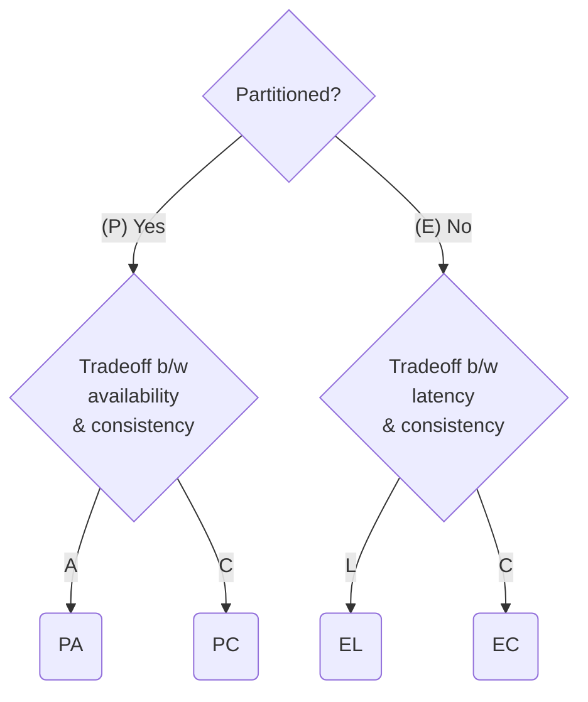

CAP theorem 是一個 database theory，又叫做 Brewer's theorem。

>一個分散式存儲系統最多只能同時確保 consistency、availability 與 partition tolerance 三者中的兩個。
>
>\- Eric Brewer

![[cap-theorem-2.png]]

### Consistency

Clients 總是可以從系統中拿到最新的資料，所以所有在同一時間讀取同一筆資料的 clients 都會拿到同樣的值，無論它們連上的是哪個 node。

### Availability

即使有部分 nodes 下線了，所有 clients 的所有 requests 都仍然可以拿到 non-error response。

### Partition Tolerance

即使有 node 與 node 間的連線中斷了，甚至 nodes 們形成兩個獨立的 subnets，整個服務仍必須持續運作不間斷。

# CP, AP, and CA Systems

若要在分散式系統中實現 [[ACID vs. BASE#ACID|ACID model]]，意味著要在具備 partition tolerance 的條件下，提供具備 consistency 的服務 (CP)，銀行業通常會需要這種 model。

相對地，若要在分散式系統中實現 [[ACID vs. BASE#BASE|BASE model]]，就代表要在具備 partition tolerance 的條件下，提供具備 availability 的服務 (AP)。

而若要同時兼顧 consistency 與 availability (CA)，就不能使用分散式系統。

# PACELC Theorem

CAP theorem 其實有一點把問題過度簡化了，在一個 CA system 中，其實我們還必須在 consistency 與 latency 間做出取捨：「是存取速度比較重要，還是資料的正確性比較重要？」於是有了 PACELC theorem：

# 參考資料

- <https://en.wikipedia.org/wiki/CAP_theorem>
