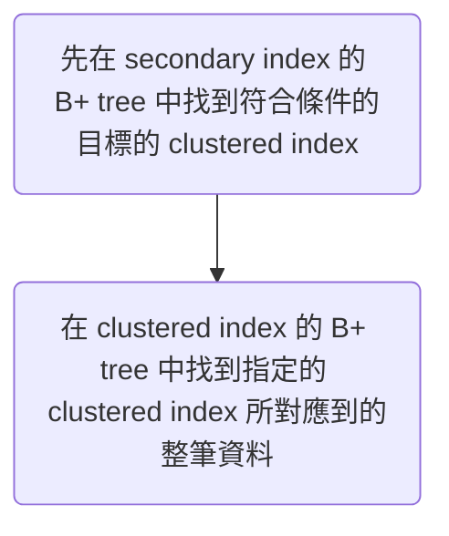

# Indexing 的目的與原理

如果 db table 單純就是 "an array of rows"，這樣每當我們要篩選這張表中的某些資料出來，就必須把這個 array 中的每筆資料都看過一遍，這個動作叫做 **full-table scan**，時間複雜度是 $O(n)$；若我們想要進一步拿到排序好的資料，還須要使用 $O(n \cdot \log n)$  的時間複雜度來排序，可以想像當資料量大時，這些操作都會變得非常慢。

而為資料表的欄位加 index 的目的就是加快該欄位出現在 `WHERE`、`GROUP BY`、`ORDER BY`、`DISTINCT` 等子句時的 query 速度。

Index 會被存在 [[從 Binary Search 到 B+ Tree#B+ Tree|B+ tree]] 或 [[從 Binary Search 到 B+ Tree#B Tree|B tree]] 這樣的資料結構中，這使得進行查尋／新增／刪除資料的時間複雜度皆縮小為 $O(\log n)$；另外，B tree 與 B+ tree 中的 external nodes 會剛好是排序後的結果，所以須要以某個欄位的值排序時，也只要花 $O(\log n)$ 的時間找到第一筆資料，就可以直接使用該欄位的 index  tree 中的 external nodes 的順序當作結果。

### Full-table scan：以沒有 index 的欄位搜尋

![[full-table-scan.png]]

### Index scan：以有 index 的欄位搜尋

![[b-tree-index.png]]

>[!Note]
>B+ tree 中的所有 internal nodes 都只存 index 本身，不會存該 index 所對應到的整筆資料，所以在 B+ tree 中 traverse 不會像 full-table scan 一樣須要將其它欄位的資料載入 memory。

# 與 Index 相關的 SQL

### 建立 Index

```SQL
CREATE INDEX {INDEX_NAME} ON {TABLE_NAME} ({COLUMN_NAME} [DESC]);
```

- 預設是以 `ASC` 的順序建立 index（B tree external nodes 的順序），若須要以 `DESC` 的順序建立，須特別聲明
- 在 MySQL 中除了 `CREATE`，也可以使用 `ALTER`：

    ```SQL
    ALTER TABLE {TABLE_NAME} ADD INDEX {INDEX_NAME} ({COLUMN_NAME} [DESC]);
    ```

>[!Note]
>在 PostgreSQL 中，使用 `CREATE INDEX` 建立 index 的過程中會鎖住整張表，只能 read 不能 write。替代方案是使用 `CREATE INDEX CONCURRENTLY` 來確保 table 不會被鎖住，不過 `CREATE INDEX CONCURRENTLY` 會花比較久的時間。

### 刪除 Index

```SQL
DROP INDEX {INDEX_NAME} ON {TABLE_NAME};
-- or
ALTER TABLE {TABLE_NAME} DROP INDEX {INDEX_NAME};
```

### 列出 Index

```SQL
SHOW INDEXES FROM {TABLE_NAME};
```

# Index 的種類

Index 可以分為 clustered index 與 secondary index 兩大類：

### Clustered Index

資料庫中的每一張表都有一個預設的 index，這個 index 在 `CREATE TABLE` 時就會被建立，它就是所謂的 clustered index，每張表都必須且只能有一個 clustered index。

會被拿來當作 clustered index 的第一順位人選，就是那張表的 primary key，如果那張表沒有 primary key，DBMS 會找一個 `NOT NULL` 且有 `UNIQUE` constraint 的欄位替代；若還是找不到這樣的欄位（這通常不是個好設計），DBMS 就會自己建立一個隱藏的欄位在這張表中，拿這個欄位來當作 clustered index。


由於存 clustered index 的 B+ tree 中的 internal nodes 只存 index，不存整筆資料，external nodes 才有完整的資料，所以一定要搜尋到 external node 才算真的找到資料。（詳見[[從 Binary Search 到 B+ Tree#B+ Tree|本文]]）

### Secondary Index

Secondary index 又叫做 non-clustered index，使用者自建的 index 都屬於 secondary index。

當我們為某 table 的某 column 建立 index 時，其實就是建立一個新的 B+ tree，然後將該 table 的該 column 的每一個值以特定規則塞入這個 B+ tree 中的每一個 node，使得之後使用這個 column 作為排序、分組、搜尋條件時可以更有效率。

須注意的是，==存 secondary index 的 B+ tree 中，即使是 external nodes 也不是存整筆資料，而是存著 secondary index 以及「該 index 所對應到的資料的 clustered index」==。

所以整個以 secondary index 搜尋總共有兩個步驟：



第一步驟叫做 **seek**，第二步驟則叫做 **key lookup**，==每一筆資料的 key lookup 都算是一次 disk I/O==，除非 `SELECT` 的欄位剛好只有被建立 index 的那個欄位，比如若已經對 book 的 price 做了 index，則下面這個 query 就會在對 secondary index 的 B+ tree 做完 seek 後直接回傳結果：

```SQL
SELECT price FROM book WHERE price > 300;
```

# Heap RID

若將一張表沒有任何 index（連 clustered index 也被刪除），則 `SELECT` 時就只能使用硬碟中實體資料的位置 (heap row ID) 找尋每一筆資料，這也是一種 full-table scan。

若一張表有 secondary index，但沒有 clustered index，則存放 secondary index 的 B+ tree 的 external nodes 就不是記載 clustered index，而是 heap RID，進行 lookup 時也變成是透過 heap RID 直接去找資料本身（又叫做 **RID Lookup**）。

# 一些特殊的 Index

### Partial Index

若希望 index 佔的空間不要太大，所以想讓 external nodes 只存某些特定資料的 index，則可以使用 `WHERE` 來達到此效果，舉例如下：

```SQL
CREATE INDEX access_log_client_ip_ix ON access_log (client_ip)
WHERE NOT (
    client_ip > inet '192.168.100.0'
    AND client_ip < inet '192.168.100.255'
);
```

### Compound Index

Compound index 又叫做composite index 或 multi-column index，是一種將多個 columns 的值組合後才建立的 index。

舉例：

```SQL
CREATE INDEX idx_age_name ON student (age, name);
```

此時的 B+ tree 會長得像下面這樣：

![[compound-index.png]]

- Compound index 的 external nodes 也會以排序好的樣子串連起來，他們會以「最左邊」的 column 來當作排序依據。
- ==一個 compound index 的各個欄位的 index 須「由左而右」依序被使用，且不可跳過。== 
    - 所以若 compound index 中的第一個欄位沒有被用到，則整組 index 都無法發揮效果；同理，若第二個欄位的 index 沒有被用到，則第三個欄位的 index 就無法發揮效果。
- 當 `WHERE` 中有 `>`、`<`、`>=` 或 `<=` 這類 "range query" 時，==出現在 range query 後面的其他條件就無法使用到 compound index 了==。
- 一個 compound index 的欄位數量有上限，不同 DBMS 的上限不同，PostgreSQL 是 32 個；MySQL 則是 16 個。

### Covering Index

在 PostgreSQL 中，若希望 secondary index 的 B+ tree 的 external nodes 還是可以存一些「常被 `SELECT` 的其它欄位」，來降低進行 key lookup 的需求，則可將那些欄位 `INCLUDE` 進來，下例中的 `y` 就是被涵蓋的欄位：

```SQL
CREATE INDEX tab_x_y ON tab(x) INCLUDE (y);
```

使用 covering index 會多一個副作用，就是每當資料中被 `INCLUDE` 的欄位的值被更改時，B+ tree 的 external node 的值也必須一起改。

>[!Note]
>在 MySQL 中，使用者無法建立 covering index，只能透過建立 compound index 來達到 covering index 的效果。

### Prefix Index

當 indexing 對象的型別為 `VARCHAR`、`TEXT` 等「可以切分成更小單位」的欄位時，可以只針對該欄位值的「前面一小段資料」建立 index，比如只對每篇 article 的 description 的前 5 個字元建立 index：

```SQL
CREATE INDEX aritcle_description ON article (LEFT(description, 5));
```

- 若判斷條件使用 `LIKE`，且以 wildcard (`%`) 開頭，則此時 index 無法發揮效果，只會 full-table scan。

### Unique Index

- 若一個欄位具有 [[Integrity Constraints#UNIQUE Constraint|UNIQUE constraint]]，則對該欄位建立的 index 就是 unique index。
- 某些 DBMS（比如 PostgreSQL 與 MySQL）會在 `CREATE TABLE` 時自動為 `PRIMARY KEY` 以及其它有 `UNIQUE` constraint 的 column 都建立 unique index。
- Clustered index 也是 unique index 的一種。

# Indexing 的副作用

- 一張表有越多 index，新增、刪除、修改資料就須要花越多的時間
- Index 本身佔據硬碟空間
- 在資料量大時，建立 index 須耗費不少時間（分鐘等級）

### 誰不適合當作 Index？

由於主表中被當作 index 的欄位的值有變動時，用來存該 index 的 tree nodes 內的值也要跟著連動，而改動 tree nodes 的值需要額外的時間，因此若某欄位的值很常被改動，通常該欄不適合拿來做 index。

# 你真的有利用到 Index 嗎？

不同的 query 方式或許都可以拿到相同的結果，但須要注意有些方式可以利用到 index，進而達到加速的效果，有些就不行。

### `WHERE A OR B`

當篩選條件為 `WHERE A OR B` 時，只有當 A 跟 B 中所提及的欄位「都有」被建立 index 時，index 才會發會效果。

### 可以用 `IN` 就不要用 `!=`

當某欄位只有幾種可能值、且該欄位有 index 時，使用 `=` 與 `IN` 篩選資料才會發揮 index 的效果，==用 `!=` 或 `NOT IN` 會觸發 full-table scan==。

比如 book 的 category 有 'A'、'B'、'C'、'D' 四種，現在想選取 category 'D' 以外的所有 books：

```SQL
-- Exploit index
SELECT * FROM book
WHERE category IN ('A', 'B', 'C');

-- Full-Table Scan
SELECT * FROM book
WHERE category != 'D';
```

### 若欄位須經過 Function，則該欄的 Index 無法發揮效果

舉例：

```SQL
-- index 無法發揮效果
SELECT * FROM book_order
WHERE YEAR(order_date) = 2022 AND MONTH(order_date) = 1;

-- index 可以發揮效果
SELECT * FROM book_order
WHERE order_date BETWEEN '2023-01-01' AND '2023-01-31';
```

### 若欄位在四則運算中，則該欄的 Index 無法發揮效果

假設已對 book 的 cost 做了 indexing，則：

```SQL
-- index won't work
SELECT * FROM book
WHERE cost - price > 100;

-- Exploit index
SELECT * FROM book
WHERE cost > price + 100;
```

### 當作 Index 的欄位有長度上限

- 不同 DBMS 的上限不同，PostgreSQL 是 63 bytes；MySQL 則是 767 bytes。
- 若對型別為 `TEXT`、`BLOB` 或 `JSON` 這種沒有長度上限的欄位建立 index，則只會建立 prefix index，超過上限的部分不會進入 index。

# Index 不是越多越好

使用 index 就是在以空間換取時間，每建立一組 index 就需要在 disk 中建立一個 B+ tree 來儲存它，太多不常派上用場的 B+ tree 其實是在浪費空間。

另外，由於 index 需要真實 table 的對應欄位的值連動，因此一張表有越多 index，新增、刪除、修改資料就須要花越多的時間。

### 使用「基數」來判斷適不適合 Indexing

$$
基數 = {可能值的種類 \over 資料筆數}
$$

比如若性別只有兩種可能值（男、女），某張表現在有 10,000 筆資料，此時基數就是 2/10000 = 0.0002；若有某個具有 `UNIQUE` constraint 欄位，其基數則必為 1。

基數越接近 1 者，越值得被建立 index。

使用 SQL 語法計算基數的方法如下：

```SQL
SELECT COUNT(DISTINCT {COLUMN_NAME})::float/COUNT(1)
FROM {TABLE_NAME};
```

# Reindex

刪除資料時，其對應的 index 也會被刪除，但 B tree 的結構並不會因此 restructure，所以若有大量資料從 table 中被刪除，就會造成 B tree 中有很多空白的節點，進而使得搜尋速度沒有因資料變少而加快，要想讓這些空白節點從 B tree 中消失，就須要重建 index (reindex)。Reindex 的指令如下：

```SQL
REINDEX INDEX {INDEX_NAME};
```

不過進行 `REINDEX` 的過程中也會造成鎖表，如果不允許服務暫停的話，可以改用 `CREATE INDEX CONCURRENTLY` 的方式重新建立一個全新的 index，再把舊的 index 刪除。雖然這會比 `REINDEX` 耗費更久時間，不過可以確保 table 不被鎖住。

# 參考資料

- 🔥 [Online Course](https://planetscale.com/learn/courses/mysql-for-developers/indexes/introduction-to-indexes)
- <https://www.youtube.com/watch?v=BIwAEuT5jVs>
- <https://ithelp.ithome.com.tw/articles/10221572>
- <https://ithelp.ithome.com.tw/articles/10221971>
- <https://isdaniel.github.io/dbindex-1/>
- <https://isdaniel.github.io/dbindex-2/>
- <https://medium.com/d-d-mag/e7e1e8d9340c>
