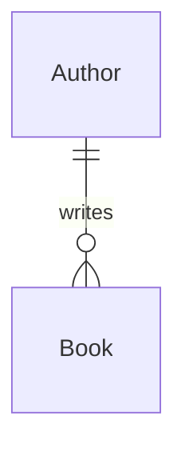

# ORM 中的 N+1 Problem

在 [[ORM.canvas|ORM]] 的盛行的時代裡，開發者可能會因為忘記思考每一行程式碼是否牽涉與資料庫溝通，而寫出沒有效率的程式碼，而 N+1 就是其中一種沒效率的例子。

假設今天資料庫有 `Author` 與 `Book` 兩張表，兩者的關係為「一對多」：



若今天要依序列出每個 Author 所寫的所有書，有些人可能會用 ORM 寫成這樣（以 Django 示範）：

```Python
authors = Author.objects.all()
for a in authors:
    books_of_author = Book.objects.filter(author=a)
    
    # List all books along with author name in some way
    # ...
```

上面這個寫法，就是標準的會造成 N+1 Query Problem 的寫法，實際上解析成 SQL 後大概等同於下面這樣（以 PostgreSQL 示範）：

```SQL
SELECT * FROM author;

SELECT * FROM book WHERE aid = 1;
SELECT * FROM book WHERE aid = 2;
.
.
.
SELECT * FROM book WHERE aid = n;
```

你會發現寫成 SQL 後總共有 N+1 行，也就是說為了依序列出每個 Author 所寫的所有書，必須進出資料庫 N+1 次，其中 "1" 為列出所有 authors，"N" 則為依序找出 N 位 author 的著作。

N+1 Query 之所以會被稱為 "Problem"，主要原因有二：

- 進出資料庫這件事本身「耗時間」
- 與資料庫溝通越頻繁，DBMS 的負擔越大

讓我們循序漸進地來改良它吧～

或許我們可以只進資料庫兩次，第一次取得「所有 authors」，第二次取得「所有剛剛要到的 authors 的著作」，以 Django 來寫大概會像這樣：

```Python
authors_id_list = Author.objects.all().values_list("pk", flat=True)
books = Book.objects.filter(author__pk__in=list(authors_id_list))
for aid in authors_id_list:
    for b in books:
        if b.author.pk == aid:
            # List all books along with author name in some way
            # ...
```

上面的程式碼中，只有前兩行在與資料庫溝通，我們改成在 memory 中才將 books 進行分類。與資料庫溝通的那兩行解析成 SQL 後也會是兩行：

```SQL
SELECT * FROM author;
SELECT * FROM book WHERE aid IN (1, 2, ..., n);
```

這樣一來我們其實已經成功避免 N+1 Problem 了，不過這還不是最有效率的。

如果使用 `JOIN`，其實我們可以只進資料庫一次就拿到所有書以及它的作者，對吧。SQL 如下：

```SQL
SELECT b.*, a.name FROM book AS b JOIN author AS a ON b.aid = a.id;
```

使用 Django ORM 的話就會變成這樣：

```Python
books = Book.objects.select_related('author').all()
for book in books:
    # ...
```

這個故事告訴我們，使用 ORM 時最好都先思考過每一行 code 被轉成 SQL 後會是什麼樣子，才不會寫出一些看起來很笨又很沒效率的東西。

# GraphQL 中的 N+1 Problem

當 GraphQL 中出現 nested query 時，通常 N+1 Problem 就會伴隨而來，比如下面這個 query：

```graphql
query {
    authors {
        id,
        books {
            title
        }
    }
}
```

當遇到上面這種一次取所有 authors 的所有 books 的 query，GraphQL 原生的運作方式是使用 authors 的 resolver 取得所有 authors 後，對這些 authors 進行 loop，針對每一個 loop 到的 author 進入 query 的巢狀結構的下一層（也就是 books），使用 books 的 resolver 將所有此次 loop 的 author 的著作找出來，當發現沒有更深的巢狀結構可以探索後才回到上一層，接著 loop 到下一個 author…… 直到 loop 完所有 authors。故這裡的 N+1 Problem 並不像 ORM 一樣是「換個方式寫」就可以解決的。

解決 GraphQL 中的 N+1 Problem 的方法主要有二：

- Data Loader
- Batching

### Data Loader

#TODO

### Batching

#TODO

# 參考資料

- <https://stackoverflow.com/questions/97197/what-is-the-n1-selects-problem-in-orm-object-relational-mapping>
- <https://hygraph.com/blog/graphql-n-1-problem>
