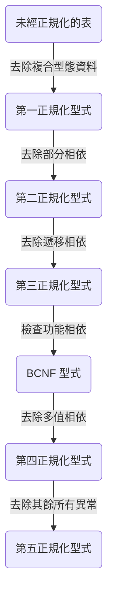

# Introduction

### 正規化目的

- 降低資料重複性 (Redundancy)
- 使維護資料更方便
- 避免新增、修改、刪除資料時導致的異常 (Anomalies)

### 正規化又叫做 Lossless Decomposition

正規化就是將原 table 的所有資訊「分解」成若干個新 table(s)，這些新 table(s) 應仍能透過「合併」得到和舊 table 相同的資訊。

### 正規化的副作用

資料庫操作的效率可能降低（因為可能因此需要用到 [[Nested Query]]）

### 只有關聯式資料庫會有資料正規化的議題，NoSQL 並不需要正規化

### 正規化的流程圖

# 第一正規化

### 第一正規化要完成的工作

- 欄位內只儲存「單值 (Atomic)」型態的資料
- 消除意義上重複的欄位
- 決定每張表的 Primary Key，使得該表的其他欄位都「部份」或「完全」相依於 Primary Key
- 確定表內任兩筆資料皆不完全相同

### 何謂「單值 (Atomic)」

單值白話一點就是「一個值」，與其相對的叫做「複合值」或「多值」，與其講解兩者的定義，不如直接舉例：

- 「單值」包括：整數、浮點數、字串
- 「多值」包括：Tuple、Array、JSON

要避免多值的原因，是因為==多值的長度不定，因此要預留很大的儲存空間給型態為多值的欄位，會造成浪費==。

### 何謂「相依」？

##### 完全相依

如果在一張表中，只要知道 cloumn A 的值，就可以確定 column B 的值為何，那我們就會說 column B 「完全相依」於 column A 這個 key。

如果必須**同時**知道 cloumn A 與 column B 的值，才可以確定 column C 的值為何，那我們就會說 column C 「完全相依」於 (column A, column B) 這樣的「複合 key」。

##### 部分相依

如果在一張表中，只要知道 cloumn A 的值，就可以確定 column C 的值為何，那我們就會說 column C 「部分相依」於 (column A, column B) 這樣的「複合 key」。

### 示範

- 原始表

    **消費紀錄**

    |姓名|性別|gender|項目|單價|數量|商店|地址|日期|
    |---|---|---|---|---|---|---|---|---|
    |阿寶|女|F|鉛筆、橡皮擦|20, 20|1,2|久成久|東區大學路|12/17|
    |豆芽|女|F|牛奶、三明治|70, 20|2,1|全家|東區北門路|12/18|
    |豆芽|女|F|牛奶、三明治|70, 20|3,4|全家|東區北門路|12/19|
    |老皮|男|M|蛋餅、三明治|30, 40|1,2|日蝕|東區成功路|12/19|
    |老皮|男|M|蛋餅、三明治|30, 40|1,2|日蝕|東區成功路|12/19|

- 步驟一：移除 "gender" 這個與「性別」具有重複意義的欄位

    **消費紀錄**

    |姓名|性別|項目|單價|數量|商店|地址|日期|
    |---|---|---|---|---|---|---|---|
    |阿寶|女|鉛筆、橡皮擦|20, 20|1,2|久成久|東區大學路|12/17|
    |豆芽|女|牛奶、三明治|70, 20|2,1|全家|東區北門路|12/18|
    |豆芽|女|牛奶、三明治|70, 20|3,4|全家|東區北門路|12/19|
    |老皮|男|蛋餅、三明治|30, 40|1,2|日蝕|東區成功路|12/19|
    |老皮|男|蛋餅、三明治|30, 40|1,2|日蝕|東區成功路|12/19|

- 步驟二：因為發現有兩行完全相同的紀錄，所以為消費紀錄加上具唯一性的編號

    **消費紀錄**

    |記錄編號|姓名|性別|項目|單價|數量|商店|地址|日期|
    |---|---|---|---|---|---|---|---|---|
    |1|阿寶|女|鉛筆、橡皮擦|20, 20|1,2|久成久|東區大學路|12/17|
    |2|豆芽|女|牛奶、三明治|70, 20|2,1|全家|東區北門路|12/18|
    |3|豆芽|女|牛奶、三明治|70, 20|3,4|全家|東區北門路|12/19|
    |4|老皮|男|蛋餅、三明治|30, 40|1,2|日蝕|東區成功路|12/19|
    |5|老皮|男|蛋餅、三明治|30, 40|1,2|日蝕|東區成功路|12/19|

- 步驟三：將「項目」、「單價」與「數量」從多值欄位變成單值欄位

    **消費紀錄**

    |記錄編號|姓名|性別|項目|單價|數量|商店|地址|日期|
    |---|---|---|---|---|---|---|---|---|
    |1|阿寶|女|鉛筆|20|1|久成久|東區大學路|12/17|
    |1|阿寶|女|橡皮擦|20|2|久成久|東區大學路|12/17|
    |2|豆芽|女|牛奶|70|2|全家|東區北門路|12/18|
    |2|豆芽|女|三明治|20|1|全家|東區北門路|12/18|
    |3|豆芽|女|牛奶|70|3|全家|東區北門路|12/19|
    |3|豆芽|女|三明治|20|4|全家|東區北門路|12/19|
    |4|老皮|男|蛋餅|30|1|日蝕|東區成功路|12/19|
    |4|老皮|男|三明治|40|2|日蝕|東區成功路|12/19|
    |5|老皮|男|蛋餅|30|1|日蝕|東區成功路|12/19|
    |5|老皮|男|三明治|40|2|日蝕|東區成功路|12/19|

我們可以發現原本就重複出現很多次的資料，現在重複更多次了，這樣不但浪費儲存空間，更容易導致在新增、修改或刪除資料時因為某些欄位缺少值而出錯。因此，我們需要第二正規化。

# 第二正規化

### 第二正規化要完成的工作：消除「部分相依」

表中所有「不屬於任何 Candidate Key 的欄位」都不能部分相依於該表的任何 Candidate Key。

只有表中含有「複合」Candidate Keys 時會需要另外檢查是否滿足第二正規化型式，否則做完第一正規劃化後會直接滿足第二正規化型式。

### 示範

- 經過第一正規化後的表

    **消費紀錄**

    |記錄編號|姓名|性別|項目|單價|數量|商店|地址|日期|
    |---|---|---|---|---|---|---|---|---|
    |1|阿寶|女|鉛筆|20|1|久成久|東區大學路|12/17|
    |1|阿寶|女|橡皮擦|20|2|久成久|東區大學路|12/17|
    |2|豆芽|女|牛奶|70|2|全家|東區北門路|12/18|
    |2|豆芽|女|三明治|20|1|全家|東區北門路|12/18|
    |3|豆芽|女|牛奶|70|3|全家|東區北門路|12/19|
    |3|豆芽|女|三明治|20|4|全家|東區北門路|12/19|
    |4|老皮|男|蛋餅|30|1|日蝕|東區成功路|12/19|
    |4|老皮|男|三明治|40|2|日蝕|東區成功路|12/19|
    |5|老皮|男|蛋餅|30|1|日蝕|東區成功路|12/19|
    |5|老皮|男|三明治|40|2|日蝕|東區成功路|12/19|

>[!Note]
>此時 (姓名, 項目, 商店, 日期) 與 (紀錄編號, 項目) 皆為 Candidate Keys。

- 步驟一：「性別」部分相依於 (姓名, 項目, 商店, 日期)，僅完全相依於「姓名」，因此將「性別」與「姓名」獨立成一張「顧客」表，同時為了避免有同名字但不同性別的人，因此為「顧客」表添加「顧客編號」這個 Primary Key

    **顧客**

    |顧客編號 (pk)|姓名|性別|
    |---|---|---|
    |1|阿寶|女|
    |2|豆芽|女|
    |3|老皮|男|

    **消費紀錄**

    |記錄編號|顧客編號|項目|單價|數量|商店|地址|日期|
    |---|---|---|---|---|---|---|---|
    |1|1|鉛筆|20|1|久成久|東區大學路|12/17|
    |1|1|橡皮擦|20|2|久成久|東區大學路|12/17|
    |2|2|牛奶|70|2|全家|東區北門路|12/18|
    |2|2|三明治|20|1|全家|東區北門路|12/18|
    |3|2|牛奶|70|3|全家|東區北門路|12/19|
    |3|2|三明治|20|4|全家|東區北門路|12/19|
    |4|3|蛋餅|30|1|日蝕|東區成功路|12/19|
    |4|3|三明治|40|2|日蝕|東區成功路|12/19|
    |5|3|蛋餅|30|1|日蝕|東區成功路|12/19|
    |5|3|三明治|40|2|日蝕|東區成功路|12/19|

    >[!Note]
    >此時「消費紀錄」表的 Candidate Keys 包括 (顧客編號, 項目, 商店, 日期) 與 (紀錄編號, 項目)。

- 步驟二：「消費紀錄」表中的「地址」部分相依於 (顧客編號, 項目, 商店, 日期)，僅完全相依於「商店」，因此將「地址」與「商店」獨立成一張「商店」表，同時為了避免有同店名但不同地址的店，因此為「商店」表添加「商店編號」這個 Primary Key

    **商店**

    |商店編號 (pk)|店名|地址|
    |---|---|---|
    |1|久成久|東區大學路|
    |2|全家|東區北門路|
    |3|日蝕|東區成功路|

    **消費紀錄**

    |記錄編號|顧客編號|項目|單價|數量|商店編號|日期|
    |---|---|---|---|---|---|---|
    |1|1|鉛筆|20|1|1|12/17|
    |1|1|橡皮擦|20|2|1|12/17|
    |2|2|牛奶|70|2|2|12/18|
    |2|2|三明治|20|1|2|12/18|
    |3|2|牛奶|70|3|2|12/19|
    |3|2|三明治|20|4|2|12/19|
    |4|3|蛋餅|30|1|3|12/19|
    |4|3|三明治|40|2|3|12/19|
    |5|3|蛋餅|30|1|3|12/19|
    |5|3|三明治|40|2|3|12/19|

    >[!Note]
    >此時「消費紀錄」表的 Candidate Keys 包括 (顧客編號, 項目, 商店編號, 日期) 與 (紀錄編號, 項目)。

- 步驟三：「消費紀錄」表中的「單價」部分相依於 (顧客編號, 項目, 商店編號, 日期)，僅完全相依於 (項目, 商店編號)，因此將「單價」、「項目」與「商店編號」獨立成一張「商品」表，同時為了避免一家店內有同名但不同價格的商品，因此為「商品」表添加「商品編號」這個 Primary Key

    **商品**

    |商品編號 (pk)|商店編號|品名|單價|
    |---|---|---|---|
    |1|1|鉛筆|20|
    |2|1|橡皮擦|20|
    |3|2|牛奶|70|
    |4|2|三明治|20|
    |5|3|蛋餅|30|
    |6|3|三明治|40|

    **消費紀錄**

    |記錄編號|顧客編號|商品編號|數量|商店編號|日期|
    |---|---|---|---|---|---|
    |1|1|1|1|1|12/17|
    |1|1|2|2|1|12/17|
    |2|2|3|2|2|12/18|
    |2|2|4|1|2|12/18|
    |3|2|3|3|2|12/19|
    |3|2|4|4|2|12/19|
    |4|3|5|1|3|12/19|
    |4|3|6|2|3|12/19|
    |5|3|5|1|3|12/19|
    |5|3|6|2|3|12/19|

    >[!Note]
    >此時「消費紀錄」表的 Candidate Keys 包括 (顧客編號, 商品編號, 日期) 與 (紀錄編號, 商品編號)。

# 第三正規化

### 第三正規化要完成的工作：消除「遞移相依」

若 column A 相依於 Primary Key（A 本身不是 Primary Key），且 column B 相依於 column A，且 B「不屬於任何 Candidate Key 的欄位」，則說 column B「遞移相依」於 Primary Key，此時應將 (A, B) 獨立出來，並將 column B 從原表中剔除。

### 示範

- 經過第二正規化後的「消費紀錄」表：

    **消費紀錄**

    |記錄編號|顧客編號|商品編號|數量|商店編號|日期|
    |---|---|---|---|---|---|
    |1|1|1|1|1|12/17|
    |1|1|2|2|1|12/17|
    |2|2|3|2|2|12/18|
    |2|2|4|1|2|12/18|
    |3|2|3|3|2|12/19|
    |3|2|4|4|2|12/19|
    |4|3|5|1|3|12/19|
    |4|3|6|2|3|12/19|
    |5|3|5|1|3|12/19|
    |5|3|6|2|3|12/19|

輔以「商品」表可以得知：「商店編號」相依於「商品編號」，而從「消費紀錄」表可知「商品編號」相依於 (記錄編號, 商品編號) 這個 Primary Key，且「商店編號」不在「消費紀錄」表的任何 Candidate Keys 中，因此可將 (商店編號, 商品編號) 獨立出來，並將「商店編號」從「消費紀錄」表中移除。

而其實「將 (商店編號, 商品編號) 獨立出來」這個動作已經在「商品」表中做好了，因此我們現在只要將「商店編號」從「消費紀錄」表中移除即可：

**消費紀錄**

|記錄編號|顧客編號|商品編號|數量|日期|
|---|---|---|---|---|
|1|1|1|1|12/17|
|1|1|2|2|12/17|
|2|2|3|2|12/18|
|2|2|4|1|12/18|
|3|2|3|3|12/19|
|3|2|4|4|12/19|
|4|3|5|1|12/19|
|4|3|6|2|12/19|
|5|3|5|1|12/19|
|5|3|6|2|12/19|

# BCNF

BCNF 被視為大部分應用程式所需的最高階正規形式。

### BCNF 的條件

- 如果 B 相依於 A，則 A 必須是 Primary Key
- 如果某張表的 Primary Key 是「複合」的，則 Primary Key 中的各個欄位不能相依於其他非 Primay Key 欄位

### 示範

經過第三正規化後的「消費紀錄」表：

**消費紀錄**

|記錄編號|顧客編號|商品編號|數量|日期|
|---|---|---|---|---|
|1|1|1|1|12/17|
|1|1|2|2|12/17|
|2|2|3|2|12/18|
|2|2|4|1|12/18|
|3|2|3|3|12/19|
|3|2|4|4|12/19|
|4|3|5|1|12/19|
|4|3|6|2|12/19|
|5|3|5|1|12/19|
|5|3|6|2|12/19|

>[!Note]
>此時「消費紀錄」表的 Candidate Keys 包括 (顧客編號, 商品編號, 日期) 與 (紀錄編號, 商品編號)。

可以發現，「顧客編號」與「日期」其實都相依於「記錄編號」，所以我們可以將 (顧客編號, 日期, 記錄編號) 獨立成「紀錄」表，並以「記錄編號」作為此表的 Primary Key：

**紀錄**

|記錄編號 (pk)|顧客編號|日期|
|---|---|---|
|1|1|12/17|
|2|2|12/18|
|3|2|12/19|
|4|3|12/19|
|5|3|12/19|

**消費紀錄**

|記錄編號|商品編號|數量|
|---|---|---|
|1|1|1|
|1|2|2|
|2|3|2|
|2|4|1|
|3|3|3|
|3|4|4|
|4|5|1|
|4|6|2|
|5|5|1|
|5|6|2|

>[!Note]
>此時「消費紀錄」表的 Primary Key 為 (記錄編號, 商品編號)。

### 整理示範結果

經過四階段正規化後，原本的「消費紀錄」表被拆成了以下五張表：

- 顧客（顧客編號｜姓名｜性別）
- 商店（商店編號｜店名｜地址）
- 商品（商品編號｜商店編號｜品名｜單價）
- 紀錄（紀錄編號｜顧客編號｜日期）
- 消費紀錄（紀錄編號｜商品編號｜數量）

### BCNF 的替代方案

以貫穿全文的這個的示範例子來說，其實完成第三正規化後，除了進行 BCNF 外，還有另外一種可行的做法。

讓我們先回顧一下第三正規化完後的「消費紀錄」表：

**消費紀錄**

|記錄編號|顧客編號|商品編號|數量|日期|
|---|---|---|---|---|
|1|1|1|1|12/17|
|1|1|2|2|12/17|
|2|2|3|2|12/18|
|2|2|4|1|12/18|
|3|2|3|3|12/19|
|3|2|4|4|12/19|
|4|3|5|1|12/19|
|4|3|6|2|12/19|
|5|3|5|1|12/19|
|5|3|6|2|12/19|

可以發現：「紀錄編號」好像其實沒什麼用。因此我們不妨直接刪除此欄，然後加上一個具有唯一性的欄位來當做 Primary Key：

**消費紀錄**

|id|顧客編號|商品編號|數量|日期|
|---|---|---|---|---|
|1|1|1|1|12/17|
|2|1|2|2|12/17|
|3|2|3|2|12/18|
|4|2|4|1|12/18|
|5|2|3|3|12/19|
|6|2|4|4|12/19|
|7|3|5|1|12/19|
|8|3|6|2|12/19|
|9|3|5|1|12/19|
|10|3|6|2|12/19|

在 BCNF 完的結果中，我們在「消費紀錄」表中必須透過「紀錄編號」去「紀錄」表中查詢「顧客編號」以及「日期」，但在現在這個替代方案中，「消費紀錄」表中可以直接知道「顧客編號」以及「日期」，少了一張表，少了一次查詢，比較有效率。

# 參考資料

- <http://cc.cust.edu.tw/~ccchen/doc/db_04.pdf>
- <https://ithelp.ithome.com.tw/articles/10229472>
