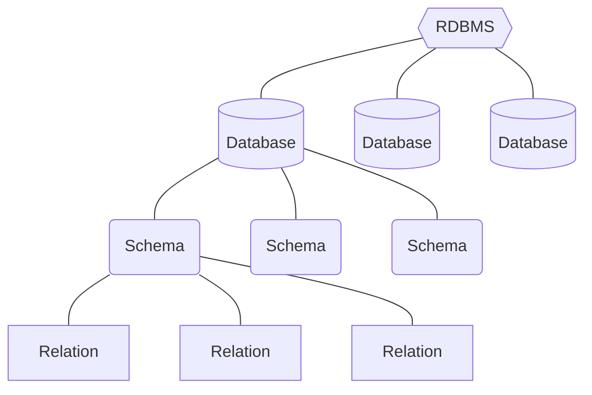

### [官方文件](https://www.postgresql.org/docs/current/index.html)

---

### SQL Standard

比起 MySQL，PostgreSQL 更貼近 SQL standard。

---

### PostgreSQL 的架構

PostgreSQL 與 MySQL、MS SQL 等其它 RDBMS 最大的不同點之一，就是它在 database 與 relation 之間還有一層 **schema** 的存在。一個 database 下可以有多個 schemas，預設為一個，名稱為 "public"。



##### 切換至指定 Schema

```SQL
SET search_path TO {schema_name}
```

---

### GUI

pgAdmin 是常用的 GUI Tool。

### Port

PostgreSQL 預設使用 port 5432。

### 任何名稱都不要包含大寫字母

若名稱由多單字組成，應使用 snake\_case（全小寫並以 `_` 連接各單字）。

- Database 名稱不要用大寫
- Schema 名稱不要用大寫
- Relation 名稱不要用大寫，否則須下 `{schema_name}."{relation_name}"` 才能找到
- Column 名稱不要用大寫，否則須下 `{tableName}."{columnName}"` 才能 select

---

### `LIMIT`

SQL standard 中的 `FETCH FIRST n ROWS ONLY` 在 PostgreSQL 可以簡寫為 `LIMIT n`。
