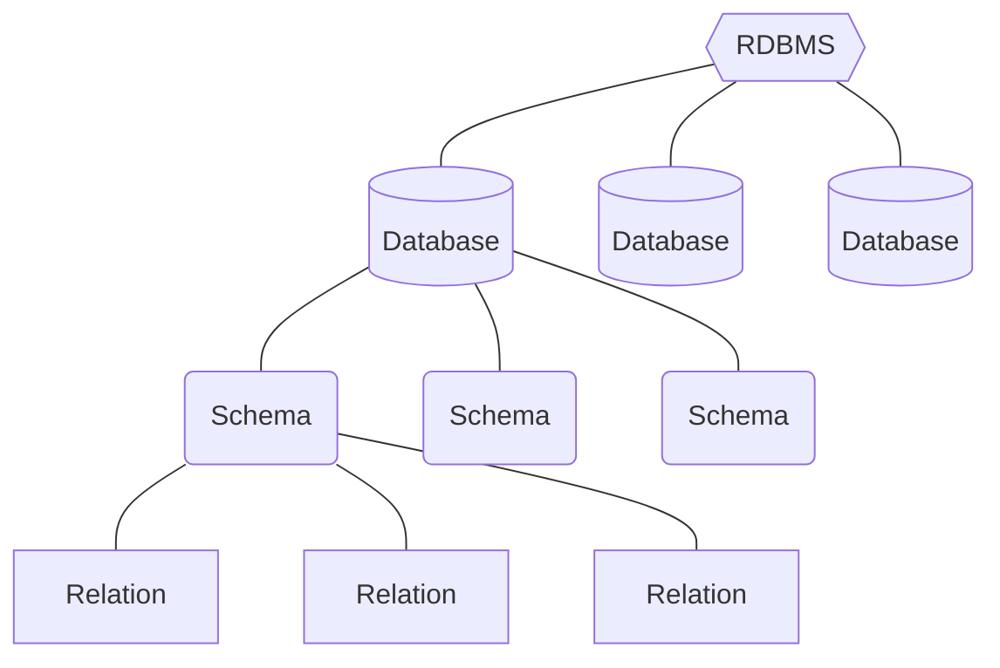

### [官方 Document](https://www.postgresql.org/docs/current/index.html)

### 比起 MySQL，PostgreSQL 更貼近 SQL Standard

### PostgreSQL 的架構

PostgreSQL 與 MySQL、MS SQL 等最大的不同點之一，就是在 database 與 relation 之間，還有一層 schema 的存在，一個 database 下可以有多個 schemas，預設為一個，名稱為 "public"：



###### 切換至指定 Schema

```PostgreSQL
SET search_path TO <schema_name>
```

---

### GUI: pg admin

---

### 任何名稱都不要包含大寫字母

若名稱由多單字組成，應使用 snake case（全小寫並以 `_` 連接各單字）。

- Database name 不要用大寫
- Schema name 不要用大寫
- Relation name 不要用大寫，否則須下 `<schema_name>."<relation_name>"` 才能找到
- Column name 不要用大寫，否則須下 `<tableName>."<columnName>"` 才能 select

---

### `CHAR(n)` vs. `VARCHAR(n)` vs. `TEXT`

| Data Type | Description |
|---|---|
| `CHARACTER VARYING(n)`, `VARCHAR(n)` | variable-length with length limit |
| `CHARACTER(n)`, `CHAR(n)` | fixed-length, ==blank padded== |
| `TEXT`, `VARCHAR` | variable unlimited length |

---

### `LIMIT`

SQL standard 中的 `FETCH FIRST n ROWS ONLY` 在 PostgreSQL 可以簡寫為 `LIMIT n`。

---

### 自定義資料型態

舉例：

```PostgreSQL
CREATE TYPE gender_type AS ENUM ('M', 'F');
```

將 column `gender` 的資料型態改成自定義的型態 `gender_type`：

```PostgreSQL
ALTER TABLE customer
ALTER COLUMN gender TYPE gender_type USING gender::gender_type;
```

---
