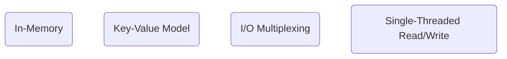

# Redis 的特色

Redis 是一個將資料存在 memory 的 database，由於存在 memory 的資料可以被快速存取，所以這類型的 database 被廣泛應用在 server side，用來實作 [caching](</System Design/Caching.canvas>)、rate limit、distributed lock 等機制。

Redis 包含以下特色：

### In-Memory

##### Pros & Cons

- Pros: Low latency, hight throughput

    In-memory database 的存取速度是 disk-base memory 的 1000 倍以上。

    

- Cons
    - Volatile，不適合作為 SSoT (single source of truth)
        - 針對這個缺點，Redis 提供了一些解決方案，詳見[本文](</Database/Redis/Redis Persistence.draft.md>)
    - 由於價格因素，memory 通常比 disk 小很多，不能存太多資料

##### BASE Model

綜合上面的優缺點，可知對於 Redis 來說 availability 比 consistency 重要，所以 Redis 屬於 [BASE model](</Database/ACID vs. BASE.md#BASE>)。

### Key-Value Model

- Key-value model 就像是多數程式語言裡的 [hash table 或 hash map](</Data Structures & Algorithms/Hash Function、Hash Table.canvas>) 資料結構
- Redis 屬於 [NoSQL](</Database/淺談 NoSQL.canvas>)
- Redis 中的單一個 key 或 value 最大可以存到 512 MB 的資料

### IO Multiplexing + Single-Threaded Read/Write

##### Pros & Cons

- Pros
    - 只有一個 thread 就不需要 [locks](</Database/Locks in Database.md>) 或其它解決 synchronization problem 的手段
    - 只有一個 thread所以沒有 [Concurrency](</Database/Concurrency.md>) 問題，比較好 debug
    - I/O multiplexing 使得 Redis 不會因為只有一個 thread 而塞車
- Cons
    - 只有一個 thread，所以即使 server 有很多 CPUs 也只能利用其中一個（但這也意味著一個 server 上有辦法架設多個 Redis instances）

### 其它特色

- Redis 可以安裝在 IoT 裝置裡

# Top 6 Redis Use Cases

- [Application-level cache](</System Design/Caching.canvas>)
- Storage for user session data
- [Distributed lock](</Database/Redis/使用 Redis 實作 Distributed Lock.draft.md>)
- Rate limiter
- Leader board
- [Pub-sub MQ pattern](</System Design/Message-Queuing System.md#Publish-Subscribe (Pub-Sub)>)

---

>[! Info] 官方文件
><https://redis.io/docs/latest/>

# 參考資料

- <https://www.crio.do/blog/what-is-redis/>
- <https://www.youtube.com/watch?v=5TRFpFBccQM>
- <https://www.youtube.com/watch?v=a4yX7RUgTxI>
- <https://www.youtube.com/watch?v=jgpVdJB2sKQ>
