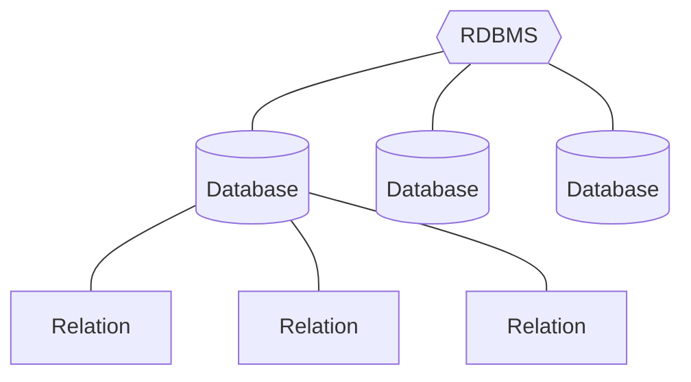

# Flat-File Database

使用純文字檔（如 `.csv`, `.tsv`, `.txt`, `.json`）或 binary file 直接儲存資料。

[Relational database](</./Database/淺談 Database.md# Relational Database 的架構>) 中的 n 個 relations (tables) 在 flat-file database 中就會是 n 個 files。

### 缺點

- 無法確保資料永遠符合 [Integrity Constraint](</Database/Integrity Constraint.md>)
- 若使用 `.csv`, `.tsv`, `.txt`，則「搜尋」的 time complexity 至少是 O(n)
- 若使用 `.json`，則先將整個檔案讀進 memory 才能開始存取資料
- 不能同時有兩個以上的 threads (users) 在存取資料
- 無法 rollback

### SQLite3

SQLite3 雖然也是 file-based database，但不算是 "flat-file" database，因為 SQLite3 使用了較複雜的檔案格式，使得它可以做到 [Index](</Database/Index.md>)、[transaction](</./Database/淺談 Database.md#Database Transaction>) 等一般 flat-file database 做不到的事。

# Data Model vs. Schema

Data model 就是資料庫的 logical layer；而 schema 就是資料庫的 physical layer。

> [!Note]
>Logical layer & physical layer (multi-layer architecture) 的概念其實不只在資料庫這個領域看得到，比如網路通訊理論中的 [[OSI Model]] 也是一種 multi-layer architecture。

### Data Model

Data model 用來描述／定義資料庫中「資料與資料間的關係」如何對應到現實世界中的「實體 (entity) 與實體間的關係」。

Data model 有很多不同流派，比如：

- **Relational** *(最大宗)*
- **Key-Value** *(in NoSQL)*
- **Graph** *(in NoSQL)*
- **Array/Matrix** *(for Machine Learning)*
- ...

以 relational database 為例，relational data model 會定義下面三種東西：

- **Structure**：有哪些 entity、entity 有哪些 attribute(s)、entity 間的關係...
- **[Integrity](</Database/Integrity Constraint.md>)**
- **Manipulation**：可以對資料做哪些操作

### Schema

Schema 用來實現 data model 的描述／定義，所以要給定一個 data model 才能進一步給出 schema。

這裡同樣以 relational database 為例，一個 relational database schema 會包括：

- 有哪些 relations (tables)
- 每個 relation 有哪些 attributes (columns)
- 各 column 接受什麼資料型態
- 各 relation 要使用什麼資料結構來儲存 tuples (rows)
- 哪些 column 要建立 [Index](</Database/Index.md>)
- 要存在 disk 還是 memory
- ...

開發人員使用 SQL 撰寫 database schema，交給 DBMS 執行過一次後，schema 便設定完成。

---

以前，database schema (physical layer) 是寫在 application codebase 裡的，也就是說，如果有一天你想要更改資料庫儲存資料的方式，你就必須去找到散佈在 application codebase 各處的與資料庫存取相關的片段（一堆 query plans），然後一一修改它們，application codebase 會因此變得較難維護。*(使用 [#Flat-File Database](</./Database/淺談 Database.md#Flat-File Database>) 的 application 至今都還是如此，這其實也算是它的缺點之一)*

現今使用 relational database（甚至 NoSQL database）時，我們幾乎不會直接在 application code 裡描述我們要「如何儲存」資料、或者「如何找到」我們想要的資料，而是使用[高階](</Programming Language/零碎筆記.md#程式語言的演進>)的 SQL 口語化地陳述我們想做的事情，DBMS 的 **query optimizer** 可以有效率地將這些 SQL 轉換成 query plans（通常這些 query plans 本身也是有效率的）。

# Relational Database 的架構



在 [PostgreSQL](</Database/PostgreSQL/Introduction.md#PostgreSQL 的架構>) 中，database 與 relation 之間還有一層 **schema**。
# Database Transaction

Transaction 字面上的意思：「交易」，意味著一手交錢、一手交貨，一旦買方拿不出錢，或者賣方無法提供貨品，或者買方無法接收貨品，或者賣方無法接收錢，這個交易就不算成功。

在資料庫的世界中，transaction 的定義衍變成「一個可以包含若干個 database queries 的工作」，所有 queries 都執行成功後，才會進行 **commit** 來表示這個 transaction 執行成功，若 commit 失敗，則應將資料庫狀態 **rollback** 回 commit 前的樣子。

下面示範如何使用 PostgreSQL 寫一個 transaction：

```SQL
BEGIN;

-- Withdraw money from account abc.
UPDATE accounts SET balance = balance - 10 WHERE id = 'abc';

-- Deposit money to account def.
UPDATE accounts SET balance = balance + 10 WHERE id = 'def';


COMMIT;
```

其實就是在要打包的 queries 的開頭加上一行 `BEGIN;`，結尾加上一行 `COMMIT;` 而已，若 commit 失敗，則 DBMS 會自動執行 rollback。

# 參考資料

- <https://www.youtube.com/watch?v=oeYBdghaIjc>
