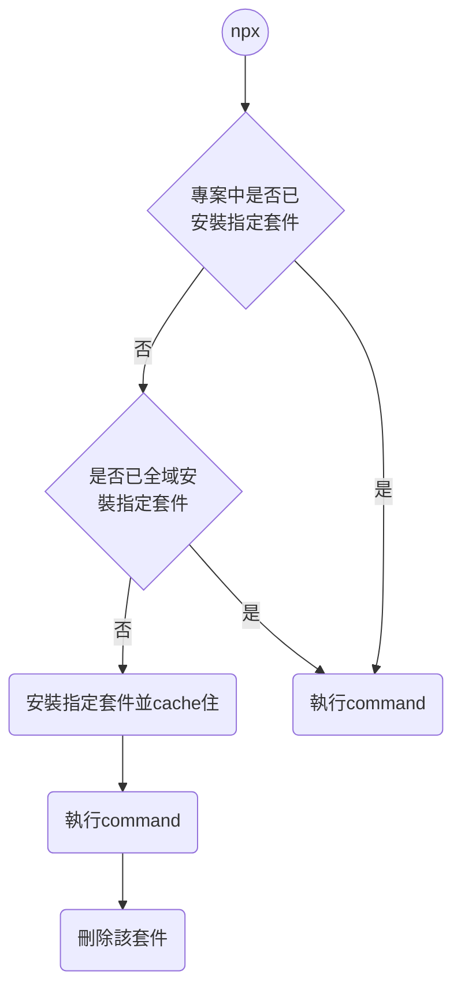

當我們安裝 npm 5.2 以上的版本時，npx 也會隨之被安裝。

### 不用全域安裝 (`-g`) 第三方 Node 套件，也能使用套件的指令

通常我們會希望第三方套件不要污染到電腦的 Node.js 全域環境，所以會只將套件安裝到 local environment（也就是專案內的 `node_modules` folder），但這樣一來就不能「直接」在 terminal 使用這個第三方套件的指令（會出現類似 `zsh: command not found: <npm-package-command>` 的錯誤提示），這個問題可以使用 npx 解決：

```bash
npx <package-name> <package-command> [args...]

# Or to be precise:
npx --package=<package-name> -c '<package-command> [args...]'
```

### npx 是如何運作的

當我們在專案的根目錄執行 `npx <package-name> <package-command>` 時，npx 會先看看這個專案的 local environment 中是否已有 `<package-name>` 這個套件，有的話就直接使用，沒有的話就換去 global environment 找，還是沒有的話就開始下載該套件，但是並==不會將下載來的套件存進 storage，而是將其 cache 住==，下載完成後執行指定的指令，執行完後就會將 cache 住的套件刪除了。



# 參考資料

- <https://www.educative.io/answers/what-is-npx>
- <https://docs.npmjs.com/cli/v9/commands/npx>
