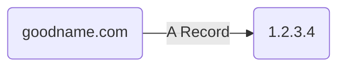
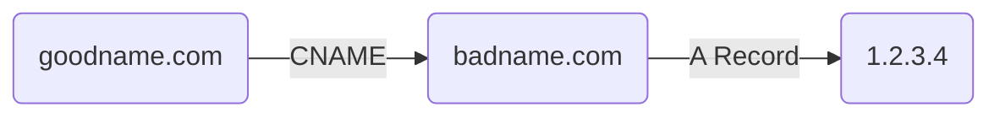

##### TL;DR

A record 用來設定 domain name 與 IP address 之間的 mapping；CNAME record 則是用來設定 domain name 的別稱。

無論是 A record 或 CNAME record，都無法指定 port，也就是說沒有「將 `mydomain.com:8888` 指向 `1.2.3.4`」 或 「將 `mydomain.com` 指向 `1.2.3.4:8888`」這類的操作，因爲 DNS 只做用在 IP address level。

# A Record

A record 的 A 指的是 "**Address**"。

一個 domain name 可以指向一個或多個 IP address(es)，多個不同的 domain names 也可以指向同一個 IP address。

### 什麼時候需要一個 Domain Name 指向多個 IP Addresses

一個大型服務為了避免因故出現 downtime，可能同時有很多 servers 在提供服務，若這些 servers 前方沒有 [[Forward Proxy & Reverse Proxy#Reverse Proxy|proxy]] 或 load balancer ，就須要將同一個 domain name 指向所有的 servers。

當 client 查詢一個指向多個 IP addresses 的 domain name 時，DNS resolver 會回傳一個包含所有 IP addresses 的列表，若發現 request 打向列表中的第一個 IP address 沒有回應，就嘗試打向下一個，直到有回應為止。

##### Round-Robin DNS

每一次 DNS resolver 所回傳的列表的 IP addresses 的順序有可能不同，此現象即 Round-Robin DNS（DNS 輪詢），這某種程度上可以達到 load balance 的效果，但須注意此順序並非完全隨機，也不會由 server 忙碌程度排序（關於 round-robin DNS 的細節可以參考[本文](https://www.cloudflare.com/learning/dns/glossary/round-robin-dns/)）。

### Wildcard Record

如果用 A record 將 `*.mydomain.com` 指向 IP address `1.2.3.4`，則 `123.mydomain.com`, `asdf.mydomain.com` 以及其他所有 `mydomain.com` 的 sub-domain 都會被 DNS resolver 解析為 `1.2.3.4`。不過此時向 DNS resolver 查詢 `mydomain.com` 反而會沒有結果，須另外將 `mydomain.com` 也用  A record 指向 `1.2.3.4` 才會有結果。

##### Wildcard 的順位在後面

承接上面的情境，若已經明確用 A record 將 `dev.mydomain.com` 指向 `5.6.7.8`，則會因為 `dev.mydomain.com` 優先於 `*.mydomain.com`，所以向 DNS resolver 查詢 `dev.mydomain.com` 時得到的結果會是 `5.6.7.8`。

# CNAME Record

CNAME record 的 C 指的是 "**Conanical**"。

如果你已經有一個指向 IP address `1.2.3.4` 的 domain name (`badname.com`)，但你不喜歡這個 domain name，想用另一個 domain name  (`goodname.com`) 取代之，此時你有兩種選擇，第一是使用 A record 將 `goodname.com` 指向 `1.2.3.4`，第二種選擇是使用 CNAME 將 `goodname.com` 指向 `badname.com`。

##### A Record

##### CNAME Record

### CNANE 的優點

##### 換 IP 時比較好處理

如果只有一個 domain name (d1) 是直接用 A record 指向 IP address 的，那當某天 IP address 有所更動時就只要改那一個 A record 即可，其他所有指向 d1 的 CNAME records 都不用動。

### CNAME 的缺點

##### DNS 解析時間變成兩倍

以下圖為例，client 若對 `goodname.com` 發出請求，則須先經過第一次 DNS lookup 得知 `goodname.com` 指向 `badname.com`，再經過第二次 DNS lookup 得知 `badname.com` 指向 `1.2.3.4`。

# 參考資料

- <https://www.youtube.com/watch?v=ZXCQwdVgDno>
- <https://support.dnsimple.com/articles/differences-a-cname-records/>
- <https://kb.porkbun.com/article/94-what-is-a-wildcard-dns-record>
- <https://www.quora.com/Why-can-one-domain-name-correspond-with-multiple-IP-addresses-How-does-it-work>
- <https://pala.tw/https-a-record-cname/>
