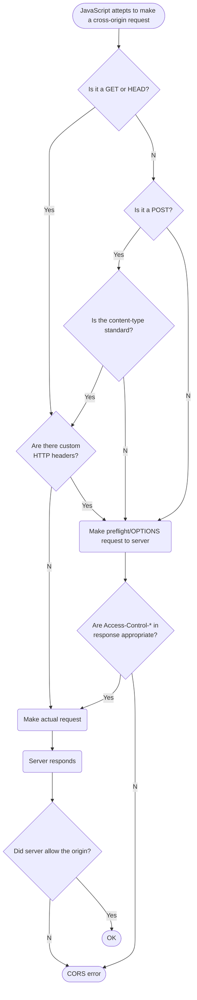
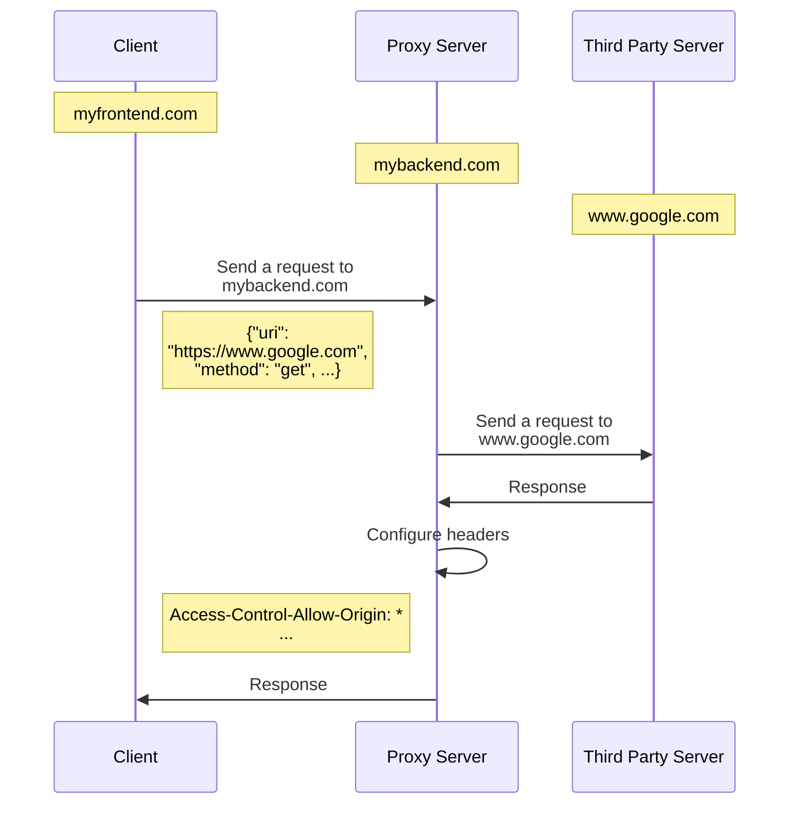

CORS 為 Cross-Origin Resource Sharing 的縮寫，是一種建立在 HTTP header 上的機制。

Response 中與 CORS 相關的 headers 包含：

- `Access-Control-Allow-Origin`
- `Access-Control-Allow-Methods`
- `Access-Control-Allow-Headers`
- `Access-Control-Expose-Headers`
- `Access-Control-Allow-Credentials`

這些 headers 的主要用途是告訴 client 它 (server) 所接受的 request 應符合什麼規格，有些時候 browser 會透過 [[Preflight Request (預檢請求)]] 來取得這些資訊，然後核對「真正要送出的 request」是否符合這些規格，符合才會送出真正的 request。

針對不需要 preflight request 的 request，browser 雖無法預先核對規格，但 browser 還是會去檢查 response 裡是否有 `Access-Control-Allow-Origin`  header，且其值是否等於 request 的 `Origin` header，==若發現兩者的 protocol/scheme、IP address/domain、port 任一項不相等，則即使收到 response 也不可以打開來看裡面的內容==。

# Same-Origin Policy (SOP)

Browser 之所以會那麼雞婆，是為了要遵循 same-origin policy。

須注意的是，在不需要 Preflight Request 的情境中，==SOP 並沒辦法阻止 request 對資料庫內容進行異動或造成其他 server-side 的 side effects==，因為 request 實際上是成功的，只是 browser 不給看 response 而已。

同樣地，==SOP 也不能用來阻擋 [[CSRF Attack 與 XSS Attack#CSRF Attack|CSRF Attack]]==，因為只要攻擊者意圖送出的是 [[Preflight Request (預檢請求)#Simple Request|Simple Request]]，那就還是可以送出真正的 request，[[Cookies (1)：設置與存取|Cookies]] 也就還是會被夾帶其中。

# CORS 流程圖

# CORS Errors

### Method 不被 Server 接受時

![[cors-error-access-control-allow-methods.png]]

**解決方法：**調整 `Access-Control-Allow-Methods` header。

### Origin 不被 Server 接受時

![[cors-error-access-control-allow-origin.png]]

**解決方法：**調整 `Access-Control-Allow-Origin` header，看是要設為 "\*" 或設為 Request 的 Origin。

### Request 中包含不被 Server 接受的 Header(s) 時

![[cors-error-access-control-allow-headers.png]]

**解決方法：**調整 `Access-Control-Allow-Headers` header。

### Response 中包含自定義的 Header(s) 時

這種情況下不會有 CORS Error，只會發現使用 JavaScript 讀取該 header 時，總是讀到 `null`

**解決方法：**調整 `Access-Control-Expose-Headers` header。

### Request 的 `credentials: include`，同時 Response 的 `Access-Control-Allow-Origin: *` 時

![[cors-error-access-control-allow-origin-wildcard.png]]

**解決方法：**將 `Access-Control-Allow-Origin` header 設為與 Request 的 `Origin` header 相同的值。

**補充說明**

這個規則的用意是，因為 `Access-Control-Allow-Origin: *` 代表所有 origin 的 clients 都可以呼叫 API 並打開 response，是一個相對不安全的設定；而 `credential: include` 代表 client 送出該 request 時會攜帶 cookies、收到 response 時也會接受並設置 cookies（若 response 上有 `Set-cookie` header），是一個會洩漏 client 隱私的設定。兩個不安全的設定不能同時存在，合理吧？

### Request 的 `credentials: include`，但 Response 的 `Access-Control-Allow-Credentials: false` 時

![[cors-error-access-control-allow-credentials.png]]

**解決方法：**調整 `Access-Control-Allow-Credentials` header。

# 何時需要 Proxy Server

如果後端是自己開發的，那是否要進行上述 Response header 的調整是由自己掌控的，但若現在是想向 www.google.com 或 en.wikipedia.org 這樣的第三方網站要求資料，那 Response header 就不是我們能控制的了。

這種情況下，我們可以透過另外架一個自己後端應用程式，透過這個後端向第三方網站要資料，再將要來的資料轉交給前端，而這個另外架的後端應用程式就是所謂的 Proxy，因為 Proxy 是自己架的，所以 Response header 又掌握在自己手中了。

# 參考資料

- <https://github.com/aszx87410/blog/issues/68>
- <https://en.wikipedia.org/wiki/Cross-origin_resource_sharing>
- <https://developer.mozilla.org/en-US/docs/Web/HTTP/CORS>
- <https://developer.mozilla.org/en-US/docs/Web/HTTP/Headers/Access-Control-Allow-Origin>
- <https://developer.mozilla.org/en-US/docs/Web/HTTP/Headers/Access-Control-Allow-Methods>
- <https://developer.mozilla.org/en-US/docs/Web/HTTP/Headers/Access-Control-Allow-Headers>
- <https://developer.mozilla.org/en-US/docs/Web/HTTP/Headers/Access-Control-Allow-Credentials>
- <https://developer.mozilla.org/en-US/docs/Web/HTTP/Headers/Origin>
