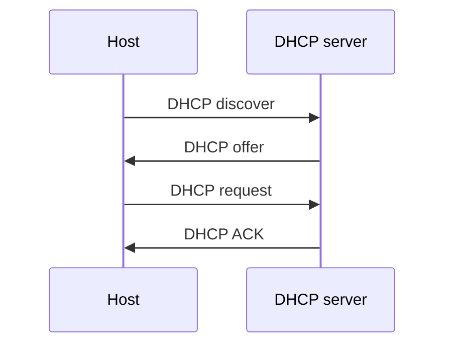
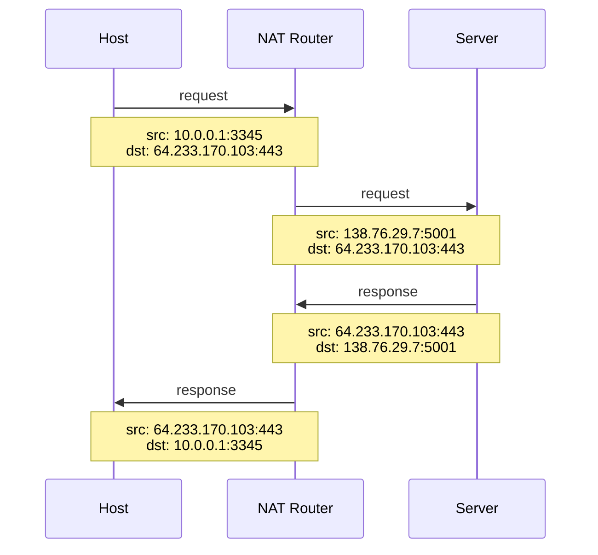

- IP 是 Internet Protocol 的簡稱，是 [[OSI Model.draft|network layer (L3)]] 的協定。
- 資料在 network layer 中傳遞時的最小單位叫做 **datagram**。

# IP Fragmentation & Reassembly

因為不同的 data link protocol 有不同的 maximum frame size，所以在 network layer 也要設定對應的 MTU (maximum transmission unit) 避免 datagram 的大小超過 data link 的負荷，所以若 datagram 太大就須要被分割。

Router 只會在必要的時候把 datagram 分割，而且不會中途將它們組起來（即使中間 routers 的 MTU 很大），只有 destination host 自己會把被分割的 datagrams 組起來。

當一個大 datagram 被分割成 n 份後，這 n 個 datagrams 上都會有 L3 的 header（所以其實分割越多份越浪費空間）。

# IP Address

IP address 是 host 在網路上的地址，但一台 host 上通常會有不只一個 [[MAC Address & ARP#NIC|NIC]]，而每個 NIC 上又通常會有不只一個 network interface，而每個 network interface 都可以被分配到一個 IP address，所以通常一個 host 可以有多個 IP addresses。

因為 IP 是 L3 的協定，所以只有 L3 以上的裝置會有 IP address，L1 和 L2 的裝置如 [[Network Devices|Hub、Bridge、Switch]] 是沒有 IP address 的。

# IPv4 vs. IPv6

### Datagram Format

- IPv4

    ![[ipv4-datagram-format.png]]

- IPv6

    ![[ipv6-datagram-format.png]]

### Address Length

IPv4 與 IPv6 主要的差異在於 address 的長度，IPv6 比較晚出現，目的是為了要解決 IPv4 不夠用的問題。

- IPv4

    一個 IPv4 address 的長度為 32 bits，通常使用 dotted-decimal notation，由四段 0~255 的數字組成，中間以 `.` 分隔，比如：

    $$
    192.168.50.1 = \underbrace{11000000}_{192}\underbrace{10101000}_{168}\underbrace{00110010}_{50}\underbrace{00000001}_{1}
    $$

- IPv6

    一個 IPv6 address 的長度為 128 bits，通常使用 `xxxx:xxxxx:xxxxx:xxxxx:xxxxx` 的形式表示，比如：2001:0db8:0000:0000:0000:ff00:0042:8329

IPv6 也順便改善了 IPv4 的效能問題，比如：

### Fixed-Length Header

IPv4 header 中因為有 "options" field，導致 header 大小不一；IPv6 header 中沒有 "options"，所以大小是固定的。這可以加快 router 傳遞 datagram 的速度。

### No Checksum Field

IPv6 的 datagram header 中省略了 checksum，如此一來就不用在每一站 router 都計算與比對 checksum（如果有需要的話 TCP 會幫我們做好），速度 up up。

### No Fragmentation Allowed

IPv6 不允許 fragmentation，這也能加快效能。當 router 收到過大且無法傳送的 datagram 時，會直接回覆 "Packet Too Big" 的 [[ICMP#ICMPv4 vs. ICMPv6|ICMPv6]] 錯誤訊息。

---

雖然上面說的這麽多 IPv6 的優點，但其時我們到目前為止其實無法完全享受到！因為有許多 router 目前都還不支援 IPv6。

### Tunneling

即使 host 可以收發 IPv6 datagram，但若下一站的 router 不支援 IPv6，那麼 host 就只能傳 IPv4 datagram，但此時 host 可以選擇將 IPv6 datagram 放在 IPv4 datagram 的 payload 中，這樣若之後有相鄰的 router 都使用 IPv6，那他們就可以把包在 IPv4 裡面的 IPv6 datagram 拿出來傳，直到下一站不支援 IPv6 時，再將 IPv6 datagram 包進 IPv4 datagram 中。這種將 IPv6 datagram 包進 IPv4 datagram 的動作叫做 tunneling。

![[ipv4tunnel.jpg]]

Router 可以透過 DNS lookup 時所拿到的 IP address 的版本來判斷下一站 router 使用的 IP 版本。

### 為什麼 IPv4 很難被完全取代？

既然 IPv4 明顯不夠用，又已經有可以解決這個問題的 IPv6 存在了，那為什麼 IPv4 還是這麼盛行呢？這是因為若在 L3 要全面棄用舊的 protocol，就必須對所有支援 L3 通訊的裝置進行軟體升級，這些裝置包含世界各地的 router 與可連網的 host，其中不乏一些很老舊的，且 NAT 出現後已經大幅舒緩了 IPv4 address 不夠用的問題了，所以「全面棄用 IPv4」相對變成一件不符合成本效益的事情。

# Subnet

既然 IP address 是有限的，有限的資源就可以賣錢，以 IPv4 為例，所有 IP addresses 從 0.0.0.0 到 255.255.255.255 可以被切分成多個區間販售，每個區間就是一個 subnet。（所以一個 subnet 中的 IP address 是連續的）

![[subnet.jpg]]

### Subnet Mask

Subnet mask 用來表示一個 subnet 中從 IP address 的第幾位開始可以自由配置。Subnet mask 的表示法有兩種：

- dotted-decimal annotation

    e.g. 255.255.255.0

- CIDR annotation

    e.g. /24

上面的例子是一個 /24 的 subnet mask，這代表該 subnet 的「前 24 bits 是固定的，後 8 bits 是可以自由分配的」，其中，可以自由分配的部分叫做 "host part"。

$$
\underbrace{111111111111111111111111}_\textnormal{subnet part}\underbrace{00000000}_\textnormal{host part}
$$

# 分配 IPv4 Address 的方式

IP addresses 由 [ICANN](https://www.icann.org/) 分發給 ISP，再由 ISP 分發給機構或家戶。主要有兩種分配法：

- Classful Addressing
- CIDR (Classless Inter-Domain Routing)

### Classful Addressing

將 IPv4 address ranges 分為 A、B、C 三類：

|類別|描述|
|---|---|
|A 類|這類的 IPv4 address 的前 8 個 bits 固定 (被稱爲 prefix)，因為 IP address 共有 32 bits，所以 A 類的 IP address range 會有 $2^{32-8} = 2^{24} = 16,777,216$ 個 IP addresses|
|B 類|前 16 個 bits 固定，每個 B 類的 IP address range 會有 $2^{32-16} = 2^{16} = 65,536$ 個 IP addresses|
|C 類|前 24 個 bits 固定，每個 IP address range 會有 $2^{32-24} = 2^{8} = 256$ 個 IP addresses|

在 1990 年代（CIDR 還未出現）以前，classful addressing 是主流。

但這種分配法現在已經不被採用了，主因是會造成很多 IP addresses 被浪費，比如當有一個機構需要 260 個 IP addresses，那這個機構如果只購買 C 類的 IP address block 就會不夠用，所以它必須買 B 類的，但這樣就會造成六萬多個 IP addresses 被閒置。

>[!Note]
>一個 IP address range 就是一個 subnet。

### CIDR

前面介紹過 subnet mask 有一種 CIDR annotation，形如 `/x`，其中 x 可以是介於 1 ~ 31 間的任何整數，可見 CIDR 可以更細緻地分割 subnet，避免造成浪費。

若要以 CIDR annotation 來表示一個 subnet，結構會是 `ip_address/x`：

e.g. `30.123.45.0/8`

---

### Special IPv4 Address Blocks

下表為常見的有特殊用途的網段（完整請見[維基百科](https://en.wikipedia.org/wiki/Reserved_IP_addresses)）：

|Address Block|Address Range|# of Addresses|Scope|Description|
|---|---|---|---|---|
|0.0.0.0/8|0.0.0.0 ~ 0.255.255.255|$2^{24}$|Software|當前網域|
|10.0.0.0/8|10.0.0.0 ~ 10.255.255.255|$2^{24}$|Private network|內網溝通用，通常給有線網路|
|127.0.0.0/8|127.0.0.0 ~ 127.255.255.255|$2^{24}$|Host|本機|
|172.16.0.0/12|172.16.0.0 ~ 172.31.255.255|$2^{20}$|Private network|內網溝通用|
|192.168.0.0/16|192.168.0.0 ~ 192.168.255.255|$2^{16}$|Private network|內網溝通用，通常給無線網路|
|255.255.255.255/32|255.255.255.255|1|Subnet|廣播用|

- 0.0.0.0: 代表 "any address"，如果有服務 bind to 0.0.0.0，那他就會收到當前 host 上所有 available network interfaces（也就是所有分發給當前 host 的 IP address）所收到的請求
- 127.0.0.1: 代表本機
- 255.255.255.255: 在 subnet 中廣播，通常 client 會透過向 255.255.255.255 發送訊號，來探索附近的 [[#DHCP]] server，這個過程叫做 DHCP discovery

# DHCP

DHCP 的全名為 Dynamic Host Configuration Protocol，是一種用來取得／分配 IP 的 protocol，由 client 向 DHCP server 的 port 67 發起請求，server 將 IP address 分配給 hosts。

DHCP 的特色是 host 每次重新連線時，拿到的 IP address 都有可能不一樣，這就是 "dynamic" 這個字的意思，所以 host 拿到的 IP address 又叫做「浮動 IP address」；相反地，若將某些 IP addresses 與要分發給的 NIC MAC address 寫死，則這些 IP addresses 為「固定 IP address」。

ISP 理論上也可以用 DHCP 來決定要分配給每個客戶什麼 IP address。舉例來說，若一個 ISP 的客戶有 5,000 個，看起來好像會需要一個 /19 的 subnet（有 8,192 個 IP addresses），但若過往的統計顯示同時連網的客戶數最多不會超過 500，這時後其實 ISP 可以只用一個 /23 的 subnet（有 512 個 IP addresses），然後動態分配給當下連線的客戶即可。

### DHCP 運作流程

- 通常整個 DHCP 的流程中都是使用 broadcast 完成的 (to 255.255.255.255)
- DHCP discover 的封包中，from 會是 0.0.0.0，因為此時 host 還沒有 IP address
- DHCP offer 的封包中會夾帶要分配給 host 的 IP address
- DHCP request 的用意是 host 要告訴 DHCP server 自己確定要使用被分配到的 IP address，此時 DHCP server 會將 host 的 MAC address 與剛分配出去的 IP address 綁定

### DHCP 租約

Host 拿到的 IP address 會有一個有效期限，時間到了就必須向 DHCP server 重新申請 IP address，所以即使 host 一直沒有離開，IP address 還是可能會變，這時就會影響到正在進行中的連線，但這種情況現在已經非常少見了，因==大多數 DHCP servers 會自動更新租約，確保 IP address 穩定==。

### DCHP Server 能提供的資訊

DHCP server 除了可以分配 IP address，也可以提供以下資訊：

- Firs-hop router 的 IP address（因為通常一般市售的 Wifi base station 同時也會有 DHCP server 的功能，也同時是 router，所以 first-hop router 就會是自己。）
- [[DNS]] server 的 IP address
- Subnet mask

>[!Note]
>雖然 DHCP 是一個跟取得 IP 有關的 protocol，但 DHCP 本身不是 network-layer 的而是 [[OSI Model.draft|application-layer]] 的 protocol，其 transport layer 使用的是 UDP。

# NAT

NAT 是 Network Address Translation 的縮寫。IPv4 中有一些網段是給 local area network (LAN) 內部用的，這些網段中的 IP addresses 在每個 LAN 中都是代表其內部的某個 host，這種 IP address 叫做 **local IP address**，local IP addresses 只有在 LAN 中有意義，對 Internet 來說是沒有意義的，可以把 local IP address 類比為電話世界中的內部分機號碼，總機號碼則像是對外的 router 的 public IP address。

==NAT 可以大幅舒緩 IPv4 address 不夠用的問題==。

最常見的 local IP addresses 網段為 10.0.0.0/8（通常給有線網路用）跟 192.168.0.0/16（通常給無線網路用）。

### NAT Router & NAT Translation Table

實現 NAT 的方式是在 local network 中設置一個 NAT router，NAT router 身上會有對外的 public IP address（向 ISP 購買的），還有很多 ports，每個 port number 對應一個 LAN 內的 local IP address + host's port number，NAT translation table 就是用來紀錄這個對應關係的 map：

**NAT Translation Table**

|WAN Side Address|LAN Side Address|
|:-:|:-:|
|138.76.29.7:5001|10.0.0.1:3345|
|138.76.29.7:5002|10.0.0.2:8001|

**運作流程**

- Request 出去時，換 source address，destination address 不變
- Response 回來時，換 destination address，source address 不變

### Port Forwarding

前面的流程圖描述的是 NAT 內的 host 作為 client 對 WAN 中的 server 溝通的流程；若 NAT 中有想要對外提供服務的 server，預設是不行的，須要額外做 **port forwarding** 才能讓外來的 request 可以透過 NAT 的 public IP address + port number 找到 NAT 裡的 server。

由於外部 client 原則上不能透過 NAT router 的 public IP address 找到 NAT 中的 host，因此可以說 NAT 提供了內部的 host 多了一層的安全措施。

### 反對 NAT 的聲音

- Router 應該只能管道 network layer 的事，但 [[Socket & Port#Port|port number]] 是 application layer 的事
- 若兩個不同 LAN 中的 hosts 彼此都想要能主動傳訊息給彼此，但有人使用 NAT，則除非他先告訴另一方自己 NAT router 的 public IP address + port，否則無法達成連線（沒有 NAT 的話，雙方須要知道彼此的 IP address 就可以連線）
- IPv6 就可以解決 IPv4 address 不夠用的問題了，不需要 NAT

# 延伸閱讀

- [[與網路相關的指令#可以給我你的 IP Address 嗎？|查詢 IP address 的方法]]
- [[DNS]]

# 參考資料

- <https://en.wikipedia.org/wiki/Reserved_IP_addresses>
