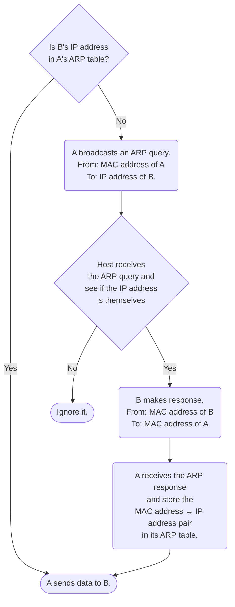

# MAC Address

一台能夠連上網路的裝置 (host)，其 IP address 會因為其所處的 [[Subnet vs. Autonomous System.draft|subnet]] 不同（白話文：連上不同的網路）而不同，比如你的手機連上家裡網路時跟連上公司網路時的 IP address 就不一樣；而 MAC address 則是跟這台可連網裝置綁定、無論走到哪裡都不變，且也具有唯一性的一串編號。MAC 是 medium access control 的縮寫。

你可以想像 IP address 就像是你的通訊地址，如果你今天搬家了，通訊地址就會換；而 MAC address 就像是你的身分證字號，會跟著你一輩子。

### NIC

一個可連網裝置是因為具有 **NIC**（"network interface controller" or "network interface card"，中文叫「網卡」）才可以連網，而其實 ==MAC address 並不是跟著裝置本身，而是跟著 NIC，一個 NIC 會有一個 MAC address==。

一個 NIC 上可以有多個 network interfaces，每個 network interface 可以被分配到一個 [[IP & IP Address|IP address]]，所以一個 NIC 可以有多個 IP addresses。

不同種類的 L2 協定會需要一個專屬的 NIC，所以以一台可以連有線網路、無線網路、藍芽的電腦為例，它至少會有三個 NICs：

- 一個 NIC 提供 interface 給有線網路
- 一個 NIC 提供 interface 給無線網路
- 一個 NIC 提供 interface 給藍芽

MAC address 是由 [IEEE](https://www.ieee.org/) 分配給 NIC 製造商，然後由製造商在製造過程中將其儲存在 NIC 的 ROM (read-only memory) 中，由於 MAC address 是跟著實體的 NIC，所以 MAC address 又叫 **physical address**。

早期的 NIC 都是外接在裝置外，但現在大多數可連網裝置都會把 NIC 直接焊接在 mainboard 上，於是 NIC 現在有時也被叫 **LoM** (LAN on mainboard)，而 MAC address 也多了 **burned-in address** 這個別稱。

### MAC Address 的表示方式

一個 MAC address 的長度為 48 bits，這意味著全世界總共可以有 $2^{48}$ 個 MAC addresses，通常會以 16 進制表示，比如 `1A:2B:3C:4D:5E:6F`。

### Address for Data-Link Layer

雖然 MAC address 具有唯一性且不變，可以透過它來精準地指定要溝通的對象，但在 network routing 的過程中，client/server 卻是使用 IP address 而非 MAC address 來指定溝通對象，這是因為 MAC address 是 data-link layer (L2) 所使用的資料，而 network routing 是在 network layer (L3) 進行，根據 [[OSI Model.draft|OSI model]]，上層的裝置不會去看下層 protocol 所使用的資料，所以無法在 network routing 時使用 MAC address 找到要溝通的對象。

那 MAC address 的用途是什麼呢？

### Multiple Access Protocol

當一個要送給你的封包被送到離你最近的 router (**first-hop router**) 後，整個 [[OSI Model.draft#Network Layer (Layer 3)|network layer]] 的旅程 (routing) 就結束了，接著「從 router 到你的裝置」這段路就是屬於 [[OSI Model.draft#Data-Link Layer (Layer 2)|data-link layer]] 的工作範圍，而 MAC address 就是 router 用來找到 host 的根據。但其實嚴格說並不是 router 找到 host，而是 router 將封包發送給所有與它連上的 hosts，所有收到封包的 hosts 再看封包上指名的 MAC address 是不是自己，是的話再拆開來看。 

這種將封包無差別發送給所有 hosts 的 L2 protocol 就屬於 **multiple access protocol**，包括：

- 802.3 (Ethernet)
- 802.11 (Wi-Fi)
- 802.15 (Bluetooth)（不是 `router → host`，而是 `host → host`）

而 MAC address 就是用來實現 multiple access protocol 的關鍵。

你可能會好奇：「Router 難道不能只把封包送給指定的裝置嗎？」

答案是「可以，但只有在特定條件下才可以。」首先如果是無線傳輸（Wi-Fi、Bluetooth）那絕對只能無差別發送；==只有在使用有線網路 (Ethernet) 且 [[Network Topology.draft|network topology]] 為 star topology 時，才可以由 [[Network Devices#Switch|switch]] 直接根據 MAC address 決定要將封包往哪個 port 送==，其它條件下都不行。

>[!Note]
>這裡特別使用「無差別發送」而不用「廣播」是因為「廣播」(broadcast) 另有其它含義（見後續）。

# ARP

ARP 的全名為 address resolution protocol，是一個介於 [[OSI Model.draft#Network Layer (Layer 3)|network layer ]] 與 [[OSI Model.draft#Data-Link Layer (Layer 2)|data-link layer]] 之間的 protocol（到底是屬於哪一層目前有爭議）。

### ARP Table

ARP 的核心即 ARP table，是一個可以透過 IP address 查詢到 MAC address 的表，在所有 host、[[Network Devices#Router|router]]、[[Network Devices#Switch|switch]] 上都可以看到。

### 情境一：Routing within a LAN

當同一個 LAN (local area network) 中有裝置 A 要透過網路傳資料給裝置 B 時，A 除了要知道 B 的 IP address，還須要知道 B 的 MAC address 才能開始傳送資料。

如果 A 不知道 B 的 MAC address，則須要在 LAN 中「廣播」一個 ARP query（`target IP address`: `IP address of B`, `sender MAC address`: `MAC address of A`）此時 LAN 中的所有裝置會拆開封包來看看 query 裡面寫的 `target IP address` 是不是自己，如果是的話就回傳 ARP response 給 A（`sender MAC address`: `MAC address of B`, `target MAC address`: `MAC address of A`）。

A 收到 B 的 ARP response 後會將 B 的 MAC address ↔ IP address mapping 記在自己的 ARP table 裡，現在 A 就可以開始傳資料給 B 了。



- **ARP Query**

    ```plaintext
    Sender MAC address: <MAC address of A>
    Sneder IP address: <IP address of A>
    Target MAC address: FF:FF:FF:FF:FF:FF
    Target IP address: <IP address of B>
    ```

    >[!Note] 廣播用的 MAC Address
    >在所有 LAN 中都是用 `FF:FF:FF:FF:FF:FF` 這個 MAC address 來廣播，所有 L2 裝置收到廣播訊息後都會打開看裡面的資料。

- **ARP Response**

    ```plaintext
    Sender MAC address: <MAC address of B>
    Sneder IP address: <IP address of B>
    Target MAC address: <MAC address of A>
    Target IP address: <IP address of A>
    ```

### 情境二：Routing to Another LAN

當裝置 A 要傳資料給位在不同的 LAN 的裝置 B 時，就必須透過 router 進行 network routing 了，所以 A 此時必須知道 B 的 IP address 以及 first-hop router 的 MAC address。請注意這裡與情境一的差別：情境一中 A 要知道的 MAC address 是 B 的。

如果 A 不知道 first-hop router 的 MAC address，也是透過廣播 ARP query 的方式等待 router 的回覆，拿到後存進自己的 ARP table，然後開始傳資料給 router。

Router 的左手收到 A 送的資料後，會打開看封包中的 target IP address，並查詢自己的 forwarding table，找到該 target IP address 應送往哪個 network interface（右手），然後送過去。（這個動作稱為 packet switching 或 forwarding，是 L3 的機制）

Router 會將封包的 `MAC address src` 從 MAC address of A 改成自己右手 (output network interface) 的 MAC address；同時 router 也會查詢自己的 ARP table，找到下一站 router（也有可能直接找到 B）的 MAC address，然後把 `MAC address dest` 從自己左手的 MAC address 改成下一站 router（或 B）的 MAC address。

- **A 送的資料剛進到 First-Hop Router 時**

    ```plaintext
    MAC address src: <MAC address of A>
    MAC address dest: <MAC address of router's interface that connects to A>
    IP address src: <IP address of A>
    IP address dest: <IP address of B>
    ```

- **A 送的資料要離開 First-Hop Router 前**

    ```plaintext
    MAC address src: <MAC address of router's interface that connects to B>
    MAC address dest: <MAC address of next-hop router>
    IP address src: <IP address of A>
    IP address dest: <IP address of B>
    ```

### ARP 之於 DNS

ARP 是一個「可以透過 IP address 查詢到 MAC address 的協定」，就好比 [[DNS]] 是一個「可以透過 domain name 查詢到 IP address 的系統」的概念，但這兩個名詞其實不一樣的地方更多，下面是它們的比較表：

| |DNS|ARP|
|:-:|:-:|:-:|
|**Input**|Domain name|IP address|
|**Output**|IP address|MAC address|
|**作用範圍**|整個 Internet|Local (within a LAN)|
|**OSI Layer**|Application layer (L7)|Data-link layer (L2)|
|**架構**|Hierarchical|Flat（一台機器紀錄所有東西）|
|**儲存位置**|Host、router、DNS server|ARP table（host、switch 與 router 上都有）|

### 查詢本機的 ARP Table

```bash
arp -a
```

Example output:

```plaintext
router.asus.com (192.168.50.1) at 24:4b:fe:35:13:7c on en0 ifscope [ethernet]
```

>[!Note]
>更多與網路相關的指令請見[[與網路相關的指令|本文]]。

# 參考資料

- <https://en.wikipedia.org/wiki/MAC_address>
- <https://en.wikipedia.org/wiki/Address_Resolution_Protocol>
