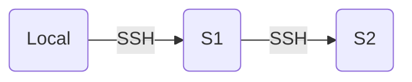

#SSH

> [!Info]
> 閱讀本文前，我們預期你已理解 [[SSH 基本概念]]。

---

假設你現在想要用手邊的電腦 (Local) SSH 連上 remote server (S1)，然後想在 local 操作 S1 來進一步 SSH 連上另一台 remote server (S2)，示意圖如下：



一般而言，S1 連線 S2 時使用的就是 S1 的 SSH agent、攜帶的是 S1 自己的 private key、S2 上的 `~/.ssh/authorized_keys` 要有的也是 S1 的 public key，但有時候我們會選擇使用 S1 來連線 S2，可能是因為以下幾種原因：

1. S1 是對方服務的 **Bastion Host**，也就是只有 S1 有辦法觸及 S2（比如 S2 限制能連線的 IP），但你還是想「以自己 (Local) 的身份」連線 S2

2. 你不希望 S2 允許 S1 連線，只是希望 S1 在有 Local 「帶路」的情況下暫時可以連線 S2

SSH Agent Forwarding 的用處即：在上述情境中，即使是用 S1 的 terminal 在與 S2 進行 SSH 連線，中間的 SSH Agent 卻仍是 Local 的 SSH Agent 而非在 S1 上建立新的 SSH Agent，所以需要被驗證身份的也是 Local 而非 S1。

如果沒有 SSH Agent Forwarding，但你又想要「以 Local 的名義透過 S1 連線 S2」，那就會需要想辦法把 Local 的 private key 傳給 S1 並存在 S1 的 `~/.ssh` 底下，但「把自己的 private key 存在陌生的地方」這個動作其實是非常不安全的，因為如此一來其他路過且有權限的人就有可能竊取或竄改你的 private key。

---

舉一個實際會用到 Agent Forwarding 的例子：

你在 AWS 上租了一個 server 準備用來當作 API server，你的 code 放在 GitHub，因此需要在 AWS server 上將 code 從 GitHub 上 pull 下來。

AWS server 就是開頭情境裡的 S1，而 GitHub service 就是 S2，此時應該只有你手邊的電腦 (Local) 會存有可以用來存取你 GitHub repo 的 private key，所以就需要用 SSH Agent Forwarding 才能在 AWS server 上對你的 GitHub repo 進行 `git pull`。

請注意，或許有些人會覺得，也可以直接在 AWS server 上生成一組新的 key pair，然後在 GitHub 的設定裡填入 AWS server 的 public key，讓你租用的 AWS server 可以直接存取你的 GitHub Repo，不過這麼做會多一個安全上的疑慮：你無法確定你租用的 server 會不會有其他人也可以 access，或者會不會哪一天被駭。所以不建議這麼做。

# 如何啟用 SSH Agent Forwarding

### Client Side

- 法一：每次 Client 要 `ssh` Server 時都加上 `-A`

    ```bash
    ssh -A <USERNAME>@<IP>
    ```

- 法二：在 `~/.ssh/config` 加上 `ForwardAgent yes`

    ```plaintext
    Host <NICKNAME>
        HostName <IP>
        User <USERNAME>
        ForwardAgent yes
        …
    ```

    若使用這個方法，則每次 `ssh <NICKNAME>` 時都會自動帶入相關設定，詳見 [[SSH 基本概念#SSH 設定檔]]。

### Server Side

在做為中間人的 Server (S1) 中，`/etc/ssh` 底下的 `sshd_config` 檔案中要允許 Agent Forwarding：

```plaintext
…
AllowAgentForwarding yes
…
```

# 參考資料

- <https://ihower.tw/blog/archives/7837>
- <https://docs.github.com/en/authentication/connecting-to-github-with-ssh/using-ssh-agent-forwarding>
