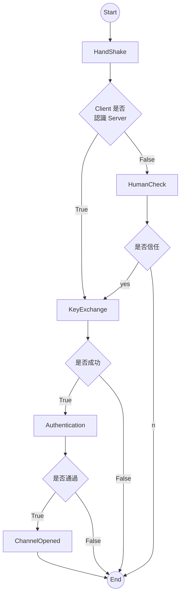
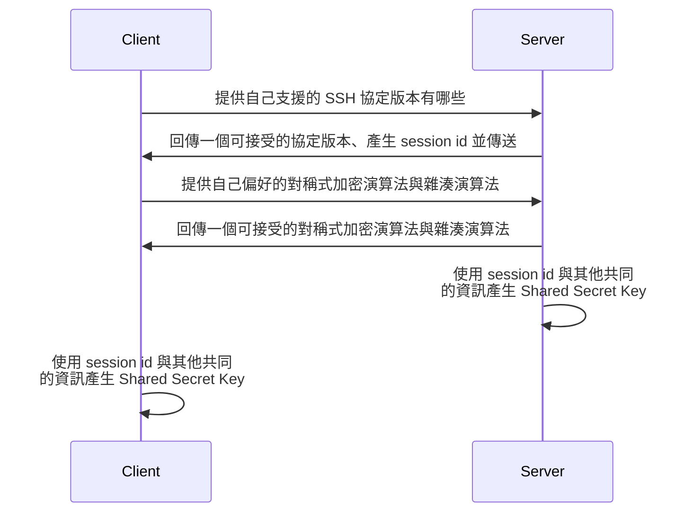

#SSH

SSH 為 Secure Socket Shell 的縮寫，是一種網路通訊協定，主要功能是讓使用者可以透過 A 裝置 (SSH client) 遠端登入／存取／操縱 B 裝置 (SSH server)，前提是 client 與 server 皆要開機且連上網。

SSH server 與 client 預設皆使用 ==port 22== (TCP port)。

SSH 會將訊息加密，因此即使 client 與 server 所連上的網路不安全，兩個裝置也可以安全地溝通，這點是其他類似工具（如 Telnet 與 rlogin）所欠缺的。

# 從建立連線到結束連線



# Hand Shake

每當 client 向 server 發出連線請求時，第一個環節就是 Hand Shake，在這個環節中，server 會將自己的 public key (host key) 傳給 client。

Client 會希望自己準備連上的 server 是值得信任的，因此 client side 會有一個叫做 `known_hosts` 的白名單，通常放在 `~/.ssh` 底下，這個白名單會記錄信任（連線過）的 server 的 IP 與 host key。

當 client 使用 terminal 嘗試連線一個不存在於 `~/.ssh/known_host` 的 server 時，terminal 會跳出以下訊息：

```plaintext
The authenticity of host '<ip>' can't be established.
ECDSA key fingerprint is <key>.
Are you sure you want to continue connecting (yes/no)?
```

若輸入 `yes`， 則 client 會新增一筆 IP 與 host key 於 `~/.ssh/known_host`，且下次連線同一台 server 時就不會跳出相同的提示了。

Server 的 host key 通常會在 install SSH server 時自動產生，且不同演算法的版本都各有一份，會存在 `/etc/ssh` 底下，可以重新生成，只是當 SSH server 換 key 時，client 須重新決定是否信任這個 host key。

# Key Exchange



產生 Shared Secret Key 的方法（client 與 server 的最後一個步驟）叫做 [[Diffie-Hellman Key Exchange Algorithm]]，client 與 server 不用將 secret key 傳給對方就可以得到一模一樣的 secret key。

由於每次的 SSH session 都有唯一的 session id，因此每一次的 SSH session 都會產生出不同的 Shared Secret Key。

# SSH 為什麼安全

SSH 幾乎把所有可以使用的加密機制都用了一輪，包括 Asymmetric Encryption、Symmetric Encryption 以及 Hashing，以下將分別介紹他們的使用場景：

- Asymmetric Encryption 主要用在 Key Exchange 這個階段

- 當雙方產生 Shared Secret Key 後，往後的溝通都使用 Symmetric Encryption

- Hashing

    雙方通訊時的每則訊息除了會被對稱加密以外，還會額外對訊息計算出一個 hash value（hash value 不會被加密），收到訊息的一方將解密完的訊息丟進相同的 hash function 計算出的 hash value 應該要與送來的 hash value 相同，這可以用來確保資訊沒有被篡改。

# 各種 SSH Authentication 的方法

SSH client 連線到 SSH server 時都須要登入 server，登入的方式有很多，也可以疊加使用，以下將逐一介紹：

### Password Authentication

當 Client 要求連線時，要求其輸入欲連線的 user password，就和直接在 server 登入做的事一樣。

### Host-Based Authentication

在 Server 上設定允許連線的 IP address 與 hostname 白名單（寫在 `/etc/ssh/sshd_config` 中），可以使用 wildcard，只有透過被允許的 IP address 或 hostname 要求的連線才會被允許。

### Public-Key Authentication

Public-Key Authentication 比前面兩者來的安全，主要分為兩個環節：

1. SSH Client 讓自己被記錄於 SSH Server 的白名單中

    ```mermaid
    sequenceDiagram
        Client->>Client: 產生 public-private key pair
        Client->>Server: 使用各種管道將 public key 交給 server
        Server->>Server: 將 client 的 public key 寫進白名單中<br/>通常是 ~/.ssh/authorized_keys 這個檔案
    ```

2. SSH Client 向 SSH Server 請求連線

    ```mermaid
    sequenceDiagram
        Client->>Server: 拿著 public key 發送 Connection Request
        Server->>Server: 隨機產生一段訊息<br/>並用 client 的 public key 加密
        Server->>Client: "Challenge" the client
        Client->>Client: 使用對應的 private key 解密
        Client->>Client: 將解密的結果結尾加上 session id<br/>然後用一個雙方約定好的 hash<br/>function 計算出一個 hash value
        Client->>Server: 回傳 hash value
        Server->>Server: 將原本的隨機訊息結尾也加上<br/>session id，然後也用雙方約定好的<br/>hash function 計算出 hash value
        Server->>Client: 若結果相符則允許連線，否則拒絕連線
    ```

Client 在產生 key 時可以額外設定一個 passphrase，往後重新連線至 server 時，除了要有 private key，還會被要求輸入 passphrase，這可以進一步提高安全性，比如當別人使用你做為 client 的電腦時，就會因為不知道 passphrase 而無法連線至 server。

### Certificate-Based Authentication

Certificate-Based Authentication 是 Public-Key Authentication 的變體，因為有公正第三方（Certificate Authority, CA）認證所以比較安全，但設定起來也比較麻煩，主要可分為以下三個環節：

1. SSH Server 向信任的 CA 索取 Public Key

    ```mermaid
    sequenceDiagram
        Server->>CA: 要求 CA public key
        CA->>Server: 回傳 public key
        Server->>Server: 將 CA public key<br/>寫進 ssh 設定檔中
    ```

2. SSH Client 要求相同的 CA 核發並簽署憑證

    ```mermaid
    sequenceDiagram
        Client->>Client: 產生 public-private key pair
        Client->>CA: 發送 Certificate Signing Request (CSR)<br>須提供 public key, client name, email 等
        CA->>CA: 檢查拿到的 client 資訊<br/>沒問題就核發憑證<br/>並使用 CA private key 簽署
        CA->>Client: 回傳簽署後的憑證（通常是 .pem 檔）
    ```

3. SSH Client 向 SSH Server 請求連線

    ```mermaid
    sequenceDiagram
        Client->>Server: 提供經簽署的憑證（.pem）
        Server->>Server: 嘗試使用 CA public key 解密<br/>若可以解密則代表 client<br/>有經信任的 CA 認證過<br/>解密後可以得到 client 的 public key<br/>
        Server->>Server: 隨機產生一段訊息<br/>並用 client 的 public key 加密
        Server->>Client: "Challenge" the client
        Client->>Client: 使用對應的 private key 解密
        Client->>Client: 將解密的結果結尾加上 session id<br/>然後用一個雙方約定好的 hash<br/>function 計算出一個 hash value
        Client->>Server: 回傳 hash value
        Server->>Server: 將原本的隨機訊息結尾也加上<br/>session id，然後也用雙方約定好的<br/>hash function 計算出 hash value
        Server->>Client: 若結果相符則允許連線，否則拒絕連線
    ```

    Certificate-Base Authentication 透過第三方認證的方式取代了 Public-Key Authentication 中「將 Client 的 Public Key 手動加入 Server 的白名單中」這個動作。

還有其它較少見的認證方式，比如 Keyboard-Interactive Authentication 與 GSSAPI Authentication，此處不詳述。

# 如何成為 SSH Server

### Linux

- **Step1: 安裝 openssh-server**

    ```bash
    sudo apt-get install openssh-server
    ```

- **Step2: 調整設定檔（`sshd_config`）以允許 SSH connection**

    ```bash
    # 開啟設定檔
    sudo nano /etc/ssh/sshd_config
    
    # 將 `#Port 22` 這行取消註解
    # 可以順便改其他設定，比如是否允許 Password Authentication
    ```

- **Step3: 重啟 openssh-server** ^7f2f0c

    ```bash
    sudo systemctl restart sshd
    ```

>[!Note]
>在 `/etc/ssh` 中，除了 `sshd_config` 外，還有另一個長得很像的檔案叫 `ssh_config`，前者是用來設定 SSH Server，後者則是用來設定 SSH Client。

### MacOS

只須至 System Settings > General > Sharing，然後將 Remote Login 選項開啟，client 即可連線，如下圖所示：


> [!Note]
> MacOS 也是使用 `sshd_config` 來設定 SSH Server，只是不需要額外將 `#Port 22` 取消註解就可以提供連線。

---

### `sshd_config` 中的常用設定

- 防止 SSH Client 透過「輸入密碼」的方式登入

    ```plaintext
    PasswordAuthentication no
    KbdInteractiveAuthentication no
    ```

- 設定 Certificate Authority 的 Public Key

    ```plaintext
    TrustedUserCAKeys /etc/ssh/ca.pub
    ```

當有更動到 `sshd_config` 的內容時，就必須重啟 ssh service：

**In Linux**

```bash
sudo systemctl restart sshd
```

**In MacOS**

```bash
sudo launchctl unload /System/Library/LaunchDaemons/ssh.plist
sudo launchctl load -w /System/Library/LaunchDaemons/ssh.plis
```

# 如何成為 SSH Client

MacOS 與 Linux 無須額外安裝程式即可扮演 SSH Client，Windows 則必須至 Settings > Apps & Features > Manage optional features 找到 SSH Client 並將其安裝。

### SSH Agent

^2621ab

SSH Agent 是運行在 client side 的 background program，其功能包括：

1. 攜帶 private key（暫存在 RAM）
2. 檢查準備連線的 host 是否是信任的 host

SSH Agent 還有一個功能，就是如果 client 的 private key 需要輸入 passphrase，則只須在「指定攜帶該 key (`ssh-add`) 的時候」輸入 passphrase，後續 SSH Agent 就會記住這個 passphrase（一樣是存在 RAM）並在需要用到 private key 的時候自動幫你輸入 passphrase。

啟動 SSH Agent 的指令為：`ssh-agent`（Linux OS 中通常開機時會自動開啟）；可以用 `echo "$SSH_AUTH_SOCK"` 來確認 SSH Agent 是否為開啟狀態。

# 常用的 SSH 相關指令

### `ssh`：連線

**Pattern**

```bash
ssh [OPTIONS] <USERNAME>@<HOSTNAME> [-p <PORT>]
```

其中 `<USERNAME>` 指的是一個已存在於 server 上的使用者的名稱；`<HOSTNAME>` 可以是 Server 的 IP address 或 domain name，若 client 與 server 處在同一個 [[NAT]] Router 後面，則 `<HOSTNAME>` 應為 Local IP address，否則應為 Public IP address。

若要連線的不是預設的 port 22，則需要 `-p` option 來聲明。

若有找到指定 IP 以及指定 User，則進入 Authentication 階段。

**常用的 Options**

- `-v`：將 client 與 server 溝通的過程放到 standard output（印出來）
- `-J jump_server`：當要連線的服務只能透過特定 server 做為窗口／跳板（又被稱為 bastion host 或 jump server）聯繫時，`-J` option 可以讓 client 直接跳到最終要連線的 server，省去在 jump server 上額外輸入 ssh 指令的動作

    ```bash
    ssh -J root@jump_server root@main_service
    ```

- `-A`：使用 [[SSH Agent Forwarding]]
- `-D`：使用 [[SSH Tunneling#Dynamic Port Forwarding]]

### `ssh-keygen`：產生 Key

^9ea834

用於產生一對 public-private key pair，可以選擇不同的加密演算法，包括 *rsa*, *dsa*, *ecdsa* 與 *ec25519*。

**Pattern**

```bash
ssh-keygen [-t <ALGO> [-b <BIT_LENGTH>]] [-f <PATH_TO_FILE>]
```

`-t` option 用來選擇加密演算法，可選的選項包括 *rsa*, *dsa*, *ecdsa* 與 *ec25519*，預設為 *rsa*，但 *rsa* 與 *dsa* 現在已經普遍被認為不夠安全了。若選擇使用 *rsa* 或 *ecdsa*，則可以另外選擇 key 的長度，長度越長越安全，但並不是任何長度都可以，以下提供他們的長度選項（單位為 bit，故要除以 8 才是文字的長度）：

- **rsa**: 1024, 2048 *(recommended)*, 4096 *(better)*
- **ecdsa**: 256, 384, 521 *(recommended)*

`-f` option 用來聲明產生的 key 儲存為檔案後要叫做什麼名字，以及要存在哪裡。若不提供，則預設為存在 `~/.ssh`，預設檔名為 "`id_` + *演算法名稱*"（比如 `id_rsa`）。檔案名稱無須副檔名，此指令執行完畢後會產生兩個同名的檔案，分別是 public key 以及 private key，儲存 public key 的那個檔案會被加上 `.pub` 副檔名。

e.g.

```bash
ssh-keygen -t ecdsa -b 521 -f ~/Desktop/id_test
```

輸入指令後會被要求設定 passphrase，也可以不設定。passphrase 用途是防止 private key 被盜用，因為之後使用 private key 時都會被要求輸入 passphrase。

### `ssh-agent`：啟動 [[#^2621ab|SSH Agent]]

### `ssh-add`

此指令可以用來控制 SSH Agent 要攜帶哪些 keys，以及更改 SSH Agent 要用哪個白名單來判斷一個 host 是否是信任的 host。

- **攜帶一個新 key**

    ```bash
    ssh-add [<PATH_TO_FILE_OF_PRIVATE_KEY>]
    ```

    若不給 `<PATH_TO_FILE_OF_PRIVATE_KEY>`，則預設加入 `~/.ssh/id_rsa`, `~/.ssh/id_ecdsa`, `~/.ssh/id_ecdsa_sk`, `~/.ssh/id_ed25519`, `~/.ssh/id_ed25519_sk`, `~/.ssh/id_dsa` 所有 keys。

- **列出所有已攜帶的 keys**

    ```bash
    ssh-add -l
    ```

- **卸下的指定的 key**

    ```bash
    ssh-add -d <PATH_TO_FILE_OF_PRIVATE_KEY>
    ```

- **卸下所有 keys**

    ```bash
    ssh-add -D
    ```

- **設定要用哪個檔案作為信任的 hosts 的白名單**

    ```bash
    ssh-add -H <PATH_TO_WHITELIST_FILE>
    ```

# SSH Client 設定檔

在 SSH Client 端可以建立一個叫做 `config` 的設定檔在 `~/.ssh` 底下，這樣可以免去每次執行連線 SSH Server 時都要加上一堆 options 與 arguments，示範如下：

```plaintext
Host myserver
    Host 192.168.50.88
    User jamison
    Port 2345
    AddKeysToAgent yes
    IdentityFile ~/.ssh/id_rsa

Host <NICKNAME>
    <OPTION> <VALUE>
    ...
```

有了這個 `config` 檔案，只要執行 `ssh myserver` 就等同於執行了以下動作：

```bash
ssh-add ~/.ssh/id_rsa
ssh jamison@192.168.50.88 -p 2345
```

> [!Info]
> 可以在 `<NICKNAME>` 的部分使用 wildcard (`*`)，將某些設定套用到所有 hosts。

# 其它進階概念

- [[SSH Agent Forwarding]]
- [[SSH Tunneling]]
- [[與檔案傳輸相關的 Protocol#SCP|SCP 檔案傳輸]]

# 參考資料

- <https://www.youtube.com/watch?v=qWKK_PNHnnA>
- <https://www.hostinger.com/tutorials/ssh-tutorial-how-does-ssh-work>
- <https://www.ssh.com/academy>
