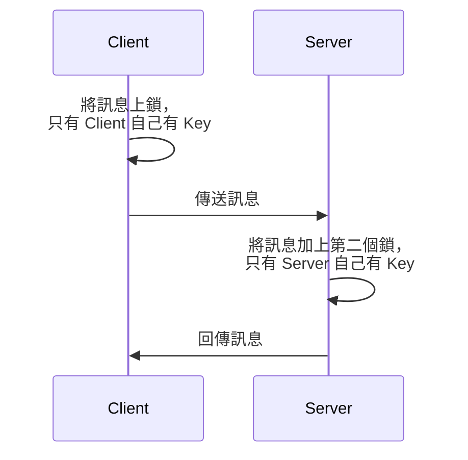

SSH 為 Secure Socket Shell 的縮寫，是一種網路通訊協定，主要功能是讓使用者可以透過 A 裝置 (SSH client) 遠端登入／存取／操縱 B 裝置 (SSH server)，前提是 client 與 server 皆要開機且連上網。

SSH 會將訊息加密，因此即使 client 與 server 所連上的網路不安全，兩個裝置也可以安全地溝通，這點是其他類似工具（如 Telnet 與 rlogin）所欠缺的。

# SSH 的運作方式

SSH server 預設監聽 port 22 (TCP port)。



<iframe style="aspect-ratio: 16/9" src="https://www.youtube.com/embed/Atbl7D_yPug" title="YouTube video player" frameborder="0" allow="accelerometer; autoplay; clipboard-write; encrypted-media; gyroscope; picture-in-picture; web-share" allowfullscreen></iframe>

# 如何成為 SSH Server

### MacOS

須至 System Settings > General > Sharing，然後將 Remote Login 選項開啟，如下圖所示：

![[Screenshot 2023-04-13 at 8.17.23 AM.png]]

### Linux

- Step1: 安裝 openssh-server

    ```bash
    sudo apt-get install openssh-server
    ```

- Step2: 調整設定檔以允許 SSH connection

    ```bash
    # 開啟設定檔
    sudo nano /etc/ssh/sshd_config
    
    # 將 `#Port 22` 這行取消註解
    
    # 可以順便改其他設定，比如是否允許 Password Authentication
    ```

    >[!Note] 補充
    >在 MacOS 的相同路徑中也有相同的檔案。其實除了 `sshd_config` 外，還有另一個長得很像的檔案：`ssh_config`，前者是用來設定 SSH Server，後者則是用來設定 SSH Client。

- Step3: 重啟 openssh-server

    ```bash
    sudo systemctl restart sshd
    ```

    完成！

# SSH Key

#TODO 

# 指令

### 連線

Client 開啟終端機，輸入以下指令：

```bash
ssh <username>@<host>
```

其中 `<username>` 指的是一個已存在於 server 上的使用者的名稱；`<host>` 可以是 Server 的 IP address 或 domain name。若 client 與 server 處在同一個 [[NAT]] Router 後面，則 `<host>` 應為 Local IP address，否則應為 Public IP address

### `scp`

將 Client 的檔案複製到 server，使用方法與 `cp` 相同：

```bash
scp <file-to-copy> <destination-absolute-path>
```

# SSH Tunneling

SSH Tunneling 又叫做 SSH Port Forwarding。

# 參考資料

- [Biginner Guide to SSH (YouTube)](https://www.youtube.com/watch?v=qWKK_PNHnnA)
- <https://www.hostinger.com/tutorials/ssh-tutorial-how-does-ssh-work>