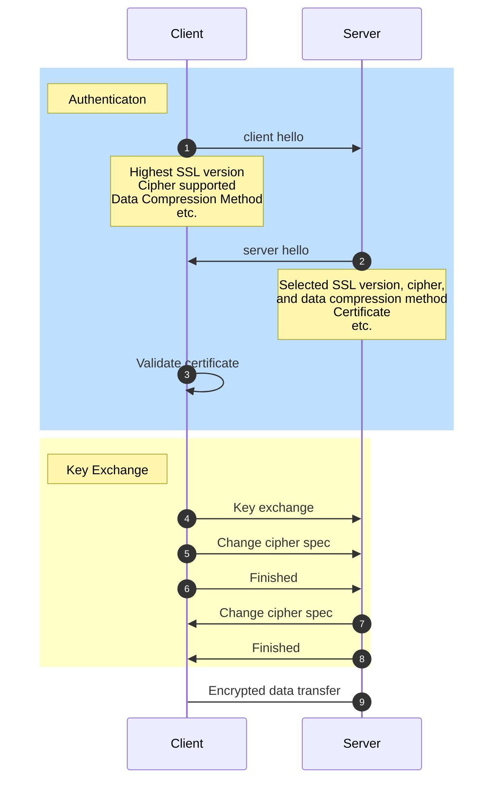

SSL 是 Secure Sockets Layer 的縮寫，是網路通訊中用來加密訊息的 protocol 之一，是附加在 [[The OSI Model#Transport Layer (Layer 4)|Transport Layer (L4)]] 與 [[The OSI Model#Application Layer (Layer 7)|Application Layer (L7)]] 之間的一層 layer。

![[with-ssl-and-without-ssl.png]]

TLS 是 Transport Layer Security 的縮寫，是 SSL 的改良版本，自 1999 年開始取代 SSL，其運作方式與 SSL 大致相同，這兩個詞常常被交替使用（SSL 更常見一點），但目前實際上運作的大多是 TLS。

[[HTTP]]、[[檔案傳輸#FTP|FTP]] 與 SMTP 都可以透過 SSL/TLS 加密，受到 SSL/TLS 的保護的 HTTP，其網址會以 ==https== 開頭而不再是 http；受到 SSL/TLS 的保護的 FTP，其網址會以 ==ftps== 開頭而不再是 ftp，"s" for "secure"。

自從 2014 年開始，受 SSL/TLS 保護（網址以 https 開頭）的網站會在 [[Web Development/SEO/Introduction]] 中獲得較高的分數。

# SSL/TLS 提供的好處

### Authentication

SSL/TLS 使得 client 與 server 彼此可以驗證對方是否真的是自己想找的人，以一個 browser client 為例，browser 會要求 server 提供經第三方 Certificate Authority (CA) 認證過的 ==SSL Certificate（憑證）==，並驗證其真實性。

其實不只 client 可以驗證 server 的真實性，server 也可以驗證 client 的真實性，只是這在對外開放的網站比較少見，但是在公司或組織內部的網站就很常看到了，它們可以透過這個方式確保來存取網站的人都是經過認證的，避免內部資訊外洩。

### Encryption

SSL/TLS 會將 server 與 client 間傳遞的所有訊息加密，因此即使訊息在傳送的過程中被竊聽，也不容易被理解（防止 Man-in-the-middle attacks）。

其中 Authentication 與 Key Exchange 這些過程所使用的都是[[非對稱式加密]]，後續的[[#SSL/TLS 如何加密資訊|資料傳輸階段]]使用的則是[[對稱式加密]]。

### Data Integrity

SSL/TLS 會使用 hash function 為傳輸的資料算出一個 hash value 並一同傳給接收資訊的一方，接收者用相同的 hash function 對原始資料進行 hash 後若得到相同的 hash value 則代表資料沒有被竄改過。

# SSL 的運作方式

![[how-ssl-works.webp]]

- Step1

    CA 公開 public key (public certificate, root certificate) 給所有主流 browser 供應商。有名的 CA 包含：DigiCert, Let's Encrypt, GeoTrust, GoDaddy …等。

- Step2: Browser 供應商確保自己的產品上有所有主流 CAs 的 public keys

- Step3: **Certificate Signing Request (CSR)**

    Domain owner 向任一 CA 請求對憑進行[[數位簽章]]。

- Step4

    若 CA 審核沒問題，就會簽署憑證並交給 domain owner，憑證中包括：

    1. 憑證序號
    2. Domain owner 的名稱
    3. 此 domain 專屬的 public key
    5. Digital signature（將 3. 的 public key 使用 private key 加密）

    Domain owner 須將此憑證保管好，並將憑證的儲存位置加入 server config。

- Step5, 6, 7

    當網址以 `https` 開頭時，client 會在向 server 索取資源前，先開啟 [[#SSL Handshake]] 流程。

# SSL Handshake

在 TCP Three-way Handshake 結束後，若 client 希望 server 使用 SSL/TSL 加密管道來傳出資料，就會接著進行 SSL Handshake，流程如下：



### Client Hello 中有哪些資訊？

- 其所支援的 SSL protocol 最高版本
- 其所支援的所有 **Cipher Suites**

    一個 cipher suite 就是一個字串，其結構如下：

    ![[cipher-suite.png]]

    - SSL protocol
    - 交換 session key 所需的 key-exchange algorithm（常見的有 [[RSA]] 與 [[Diffie-Hellman Key Exchange Algorithm|DH]]）
    - Signature algorithm（常見的有 RSA、DSA 與 [[ECDSA]]）
    - 對實際資料進行加密時所使用的（對稱式）encryption algorithm
    - 確保 data integrity 所需的 hashed algorithm
- 要使用哪種 data compression method
- （若要採用 RSA 做為 key-exchange algorithm 的話）一個隨機數

### 如何 Validate Certificate？

Server 傳送憑證給 client 後，client 的 browser 會讀取簽署此份憑證的 CA 的資訊，並找到此 CA 的 public key（Recall: Browser 會有所有主流 CAs 的 public key），用此 key 解密憑證中的 digital signature，看結果是否與 server 送來的 public key 相同，若相同則代表認證成功。

![[signing-and-validating-certificate.png]]

以 Google Chrome 為例，當驗證成功時，點擊網址列右側的鎖頭會顯示 "Connection is secure"，進一步點擊可以查看憑證內容：

![[chrome-ssl-certificate.png]]

當 validation 失敗時，Chrome 會中斷連線並跳出警告，此時網址列會顯示 Not Secure:

![[chrome-https-not-secure.png]]

若 server 也需要 client 提供憑證，則會在 step 2 時告知 client，client 則會在驗證完 server 的憑證後提供自己憑證。 

>[!Tip] Tip: 使用 CLI 取得指定網站的 SSL 憑證
>
>以 google.com 為例：
>
>```sh
>openssl s_client -connect google.com:443 < /dev/null | openssl x509 -in /dev/stdin -text -noout
>```

# SSL/TLS 如何加密資訊

下圖說明了在有 SSL/TLS layer 的情況下，應用程式的資料是如何傳輸的：

![[how-ssl-encrypt-data.png]]

>[!Note]
>上圖中的 **MAC** 不是 MAC address (Media Access Control)，而是 **Message Authentication Code**，是 compressed data 經過 Hash-Based MAC Function (HMAC Function) 計算的結果，簡言之就是 compressed data 的 hash value。
>
>想了解 HMAC Function 的詳細運作方式，請見[本影片](https://www.youtube.com/watch?v=wlSG3pEiQdc)。

# 不同等級的 SSL 憑證

SSL 憑證分為三種等級：

### DV (Domain Validation)

是最基礎的版本，只能說明「此 domain 有人來申請過簽章」以及「資料傳輸會加密」，其它關於 domain owner 的資訊都沒有。這種憑證幾乎在 domain owner 提出申請後會立即簽發。

### OV (Organization Validation)

商業級別的版本，會要求提出申請的組織提供關於組織的資訊（比如營利事業登記證），並對這些資訊進行診斷，相比於 DV 更具有公信力，但申請過程會需要一點時間。

### EV (Extended Validation)

最高級也最嚴格的版本，除了 OV 的驗證流程之外，還會有其他的徵信措施。

# 延伸閱讀

- [[申請 SSL Certificate]]
- [Certificate Chain of Trust](https://www.keyfactor.com/blog/certificate-chain-of-trust/)

# 參考資料

- <https://kinsta.com/knowledgebase/how-ssl-works/>
- <https://www.websecurity.digicert.com/zh/tw/security-topics/what-is-ssl-tls-https>
- <https://medium.com/@clu1022/a9d6720bdd48>
- <https://medium.com/@clu1022/31a2a8a888a6>
- <https://sectigostore.com/blog/what-is-an-ssl-tls-cipher-suite/>
