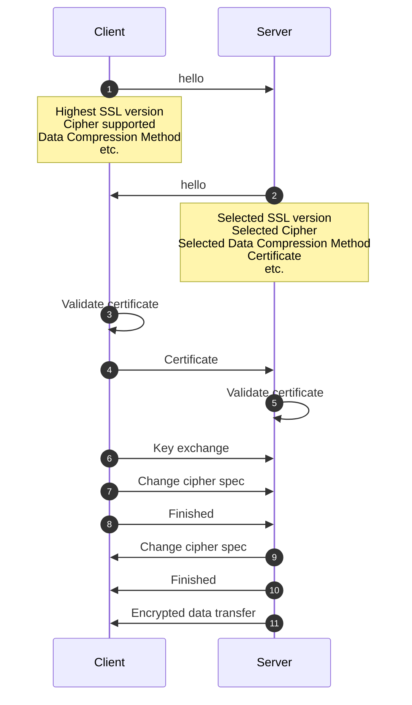

SSL 是 Secure Sockets Layer 的縮寫，是網路通訊中用來加密訊息的 protocol 之一，是附加在 [[The OSI Model#Transport Layer (Layer 4)|Transport Layer (L4)]] 與 [[The OSI Model#Application Layer (Layer 7)|Application Layer (L7)]] 間的一層 layer。

TLS 是 Transport Layer Security 的縮寫，是 SSL 的改良版本，自 1999 年開始取代 SSL，其運作方式與 SSL 大致相同，這兩個詞常常被交替使用（SSL 更常見一點），但目前實際上運作的大多是 TLS。

[[HTTP]]、[[與檔案傳輸相關的 Protocol#FTP|FTP]] 與 SMTP 都可以透過 SSL/TLS 加密，受到 SSL/TLS 的保護的 HTTP，其網址會以 ==https== 開頭而不再是 http；受到 SSL/TLS 的保護的 FTP，其網址會以 ==ftps== 開頭而不再是 ftp，"s" for "secure"。

自從 2014 年開始，受 SSL/TLS 保護（網址以 https 開頭）的網站會在 [[SEO]] 中獲得較高的分數。

# SSL/TLS 的功能

### Encryption

SSL/TLS 會將訊息加密，因此即使訊息在傳送的過程中被竊聽，也不容易被理解與偽造 (Man-in-the-middle attacks)。

SSL/TLS 使用的是[[非對稱式加密]]，且每個 session 的 secret key 都不同。

### Authentication

SSL/TLS 使得 client 與 server 彼此可以驗證對方是否真的是自己想找的人，以一個 browser client 為例，browser 會要求 server 提供經第三方 Certificate Authority (CA) 認證過的 ==SSL Certificate（憑證）==，並驗證其真實性。

以 Google Chrome 為例，當驗證成功時，點擊網址列右側的鎖頭會顯示 "Connection is secure"，進一步點擊會顯示以下資訊：

![[chrome-ssl-certificate.png]]

其實不只 client 可以驗證 server 的真實性，server 也可以驗證 client 的真實性，只是這在對外開放的網站比較少見，但是在公司或組織內部的網站就很常看到了，它們可以透過這個方式確保來存取網站的人都是經過認證的，避免內部資訊外洩。

### Data Integrity

#TODO 

# SSL 的運作方式

![[how-ssl-works.webp]]

- Step1

    CA 公開 public key (public certificate, root certificate) 給所有主要的 browser 供應商。有名的 CA 包含：DigiCert, Let's Encrypt, Buypass …等。

- Step2: Browser 供應商確保自己的產品上有所有 CAs 的 public keys
- Step3: Server 向任一 CA 請求「簽署」憑證
- Step4

    若 CA 審核沒問題，就會簽署憑證並交給 server，這個憑證中包括：

    1. 序號
    2. 網站擁有者名稱
    3. 網站專屬的 public key
    4. Digital signature（使用 private key 加密過的 public key）

    Server 須將此憑證保管好，並將憑證的儲存位置加入 server config。

- Step5: 當 client 要向 server 請求連線時，會先建立 SSL 連線
- Step6: Server 回覆憑證
- Step7

    Client 的 browser 會讀取簽署此份憑證的 CA 的資訊，並找到此 CA 的 public key，用此 key 解密憑證中的 digital signature，看結果是否與 server 送來的 public key 相同，若相同則代表認證成功。

### 使用 CLI 取得指定網站的憑證

以 google.com 為例：

```bash
openssl s_client -connect google.com:443 < /dev/null | openssl x509 -in /dev/stdin -text -noout
```

Output:

```plaintext
depth=0 OU = "No SNI provided; please fix your client.", CN = invalid2.invalid
verify error:num=18:self signed certificate
verify return:1
depth=0 OU = "No SNI provided; please fix your client.", CN = invalid2.invalid
verify return:1
poll errorCertificate:
    Data:
        Version: 3 (0x2)
        Serial Number:
            90:76:89:18:e9:33:93:a0
    Signature Algorithm: sha256WithRSAEncryption
        Issuer: OU=No SNI provided; please fix your client., CN=invalid2.invalid
        Validity
            Not Before: Jan  1 00:00:00 2015 GMT
            Not After : Jan  1 00:00:00 2030 GMT
        Subject: OU=No SNI provided; please fix your client., CN=invalid2.invalid
        Subject Public Key Info:
            Public Key Algorithm: rsaEncryption
                RSA Public-Key: (2048 bit)
                Modulus:
                    00:cd:62:4f:e5:c3:13:84:98:0c:05:e4:ef:44:a2:
                    a5:ec:de:99:71:90:1b:28:35:40:b4:d0:4d:9d:18:
                    48:81:28:ad:5f:10:b3:2a:db:7d:ae:9d:91:1e:42:
                    e7:ef:aa:19:8d:d3:4e:db:91:0f:a7:e4:20:32:25:
                    94:fe:b9:24:07:4d:18:d7:c3:9a:87:0e:5f:8b:cb:
                    3e:2b:d7:51:bf:a8:be:81:23:a2:bf:68:e5:21:e5:
                    bf:4b:48:4e:b3:05:14:0c:7d:09:5c:59:04:3c:a2:
                    0b:ce:99:79:30:be:f0:76:9e:64:b7:dd:ef:1f:16:
                    bb:1e:cc:0e:b4:0c:44:cf:65:ad:c4:c7:5e:ce:6f:
                    f7:0a:03:b7:b2:5b:36:d3:09:77:5b:4d:e2:23:e9:
                    02:b7:b1:f2:be:11:b2:d9:a4:4f:2e:12:5f:78:00:
                    69:42:bd:14:92:ed:ea:ea:6b:68:9b:2d:9c:80:56:
                    b0:7a:43:7f:5f:f6:87:f0:a9:27:5f:bf:7d:30:f7:
                    2e:5a:eb:4c:da:af:3c:9a:d5:04:06:cb:99:9b:2d:
                    a7:b2:32:bd:27:bf:f2:86:10:91:0f:33:95:ff:26:
                    3c:73:9f:a5:fe:ef:eb:5a:ec:30:91:9d:a5:83:31:
                    a9:e3:10:41:7e:15:dd:af:af:a6:f6:49:b0:58:25:
                    26:f5
                Exponent: 65537 (0x10001)
        X509v3 extensions:
            X509v3 Key Usage: critical
                Digital Signature, Key Encipherment, Certificate Sign
            X509v3 Extended Key Usage: 
                TLS Web Server Authentication, TLS Web Client Authentication
            X509v3 Basic Constraints: critical
                CA:TRUE
            X509v3 Subject Key Identifier: 
                BB:0F:38:96:6F:3E:BE:4F:2B:46:D0:41:6A:D4:AC:B5
    Signature Algorithm: sha256WithRSAEncryption
         b9:d9:e2:54:5c:f5:61:ed:69:f3:b8:63:ed:03:5a:9e:2a:81:
         27:5a:1b:28:33:4b:fc:2d:71:13:fe:4b:65:7e:1c:53:82:79:
         80:e6:79:9f:6a:b3:45:a9:36:5a:ed:c9:e0:4a:cc:11:fc:84:
         eb:7d:cb:c6:94:6d:90:70:d8:cd:45:d8:c8:b6:dd:0f:9d:84:
         01:14:7d:00:8e:29:b2:13:b6:e9:c1:b9:57:c3:4d:36:c0:1d:
         4b:8d:97:f7:b2:af:bf:2f:f0:48:22:d7:7d:f3:ef:35:60:c9:
         d5:46:d4:a0:34:00:e4:82:07:e0:7a:e6:09:5b:a7:1f:b1:30:
         2a:60:64:bb:b1:f5:31:f2:77:08:37:b4:fa:3f:2d:f6:1b:44:
         2a:1f:f8:c6:fc:23:76:42:63:d3:ba:15:f6:46:8e:ec:49:9f:
         ed:2e:c7:74:83:a2:b6:b7:35:7f:c5:98:9f:a2:91:30:93:b0:
         cb:48:15:68:47:de:1a:32:60:06:a6:38:eb:88:4e:93:d9:1c:
         3e:f2:3f:49:5f:6e:e9:dc:18:31:2a:01:0b:b6:61:66:d8:c5:
         18:b1:7e:ad:95:4b:18:2f:81:66:c5:72:69:20:04:b6:29:13:
         c8:83:59:3d:ca:76:5b:a8:d7:ee:8f:1d:a0:da:2e:0d:92:69:
         c3:98:e8:6a
```

# SSL Handshake

在 TCP Three-way Handshake 完後，若 client 希望 server 使用 SSL/TSL 加密管道來傳出資料，就會接著進行 SSL Handshake，流程如下：



# 參考資料

- <https://kinsta.com/knowledgebase/how-ssl-works/>
- <https://www.websecurity.digicert.com/zh/tw/security-topics/what-is-ssl-tls-https>
- <https://medium.com/@clu1022/a9d6720bdd48>
- <https://medium.com/@clu1022/31a2a8a888a6>
- <https://ithelp.ithome.com.tw/articles/10219106>
