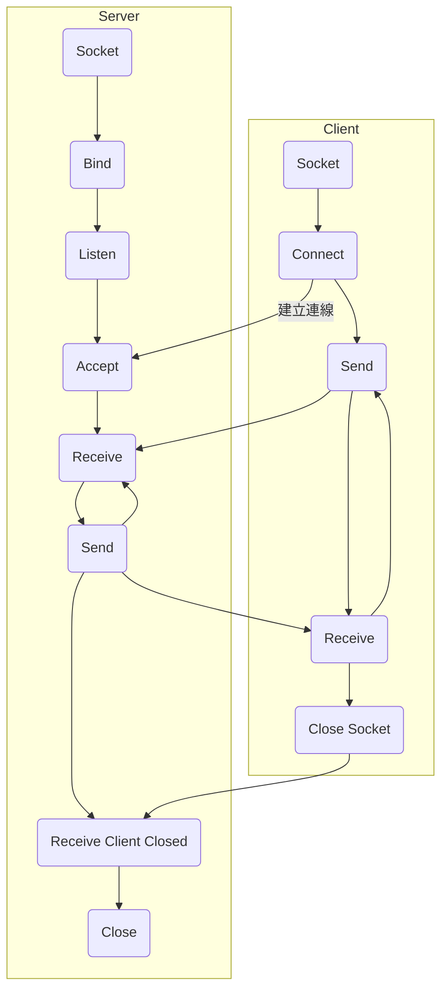

#TODO 

### TCP Socket 流程圖

---

```mermaid
flowchart TD
    subgraph Client
    c0(Socket)
    c1(Connect)
    c2(Send)
    c3(Receive)
    c4(Close Socket)
    c0 --> c1
    c1 --> c2
    c2 --> c3
    c3 --> c2
    c3 --> c4
    end
    subgraph Server
    s0(Socket)
    s1(Bind)
    s2(Listen)
    s3(Accept)
    s4(Receive)
    s5(Send)
    s6(Receive Client Closed)
    s7(Close)
    s0 --> s1
    s1 --> s2
    s2 --> s3
    s3 --> s4
    s4 --> s5
    s5 --> s4
    s5 --> s6
    s6 --> s7
    end
    c1 --建立連線--> s3
    c2 --> s4
    s5 --> c3
    c4 --> s6
```