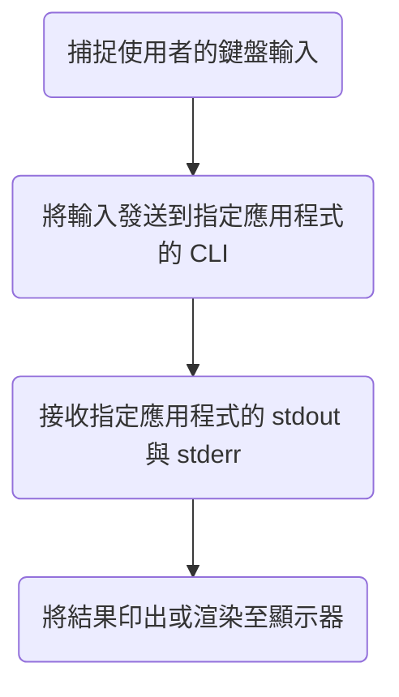
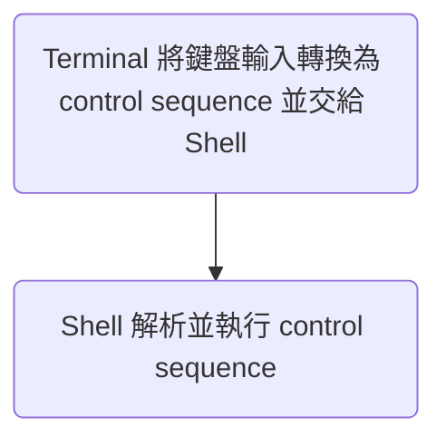

# CLI

與 CLI (command line interface) 相對的名詞是 GUI (graphical user interface)，它們都是應用程式的一部份，用途是「與使用者互動」。

若使用者選擇使用 CLI 與應用程式互動，則只能輸入文字形式的指令。 

# Terminal

終端機，泛指可以「接收使用者文字輸入」並「顯示計算機文字輸出」的工具，可以再被拆解成硬體與軟體兩個部分：

### 硬體

硬體部分的 terminal，又叫做「終端設備」，指的是一個可以連線主機、輸入文字與印出文字的設備，所以鍵盤和顯示器就是終端設備。

### 軟體

軟體部分的 terminal 又叫做 **terminal emulator** 或 **termianl application**，這類軟體（應用程式）會捕捉使用者的鍵盤輸入，也可以將其它應用程式的執行結果以文字的方式輸出。

>[!Note]
>GUI 形式的 terminal emulator 又叫做 terminal window，現在大多數的 terminal emulator（比如 iTerm2 或 MacOS 內建的 Terminal）都屬於 terminal window。

我們常說「使用某某應用程式的 CLI」，其實真正做的事情是「透過 terminal emulator 與應用程式的 CLI 溝通」，此時 terminal emulator 的工作流程如下：

---

>[!Info] What is "Console"?
>擁有 admin 權限的 terminal 又叫做 **console**。

# Shell

- [Shell](</Operating System/Shell/1 - Introduction.md>)（殼層）是一個 OS 的最外層，是一種應用程式，使用者須透過 Shell 與 OS 互動。
- Shell 有 CLI，使用者通常是透過 terminal emulator 將指令傳給 Shell。
- 有些 Shell 會自帶 GUI（比如 Windows 的 cmd.exe）雖然說是 GUI，但其實就只是個黑色且只能輸入文字指令的介面，看起來很像 terminal emulator，但其實操作這種 GUI 時並沒有 terminal emulator 的介入。
- Shell 可以轉譯並執行 [Shell script](</Operating System/Shell/2 - Shell Script.md>)（一種程式語言）。
- Shell 與 OS 並不是綁定的，也就是說你可以單獨更換 Shell，常見適用於 Unix 系統的 Shell 包括 sh、bash、zsh；適用於 Windows 系統的則有 cmd.exe 與 PowerShell。

# Shell 與 Terminal Emulator 的分工

### 非字元鍵

當使用者按下非字元鍵（比如方向鍵、Tab 鍵）時，terminal emulator 與 Shell 的分工如下：

### 快捷鍵

快捷鍵指的是如 `Control` + `C` 這類「可以觸發特殊事件的按鍵組合」，這項功能是由 terminal emulator 提供的。

在使用者使用快捷鍵時，terminal emulator 並不會直接將這些按鍵輸入逐一轉換為控制序列，而是會根據快捷鍵的設定，產生特定的控制序列或 Unix signal，比如當收到  `Control` + `C` 時，terminal emulator 會發送 `SIGINT` 訊號。

>[!Note]
>關於 Unix signal 的詳細介紹請看[這篇](</Operating System/Unix Signal & IPC.md>)。

### 瀏覽 Command History

- 瀏覽 command history 的功能由  提供
- Shell 會透過檔案來紀錄 command history
    - zsh 使用的檔案是 .zsh_history
    - bash 使用的則是 .bash_history
- 紀錄 command history 的檔案通常放在 user 的 home directory。

# 參考資料

- <https://segmentfault.com/a/1190000016129862>
