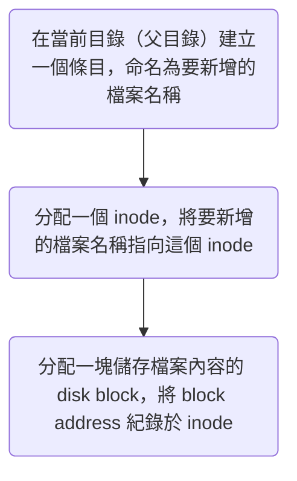
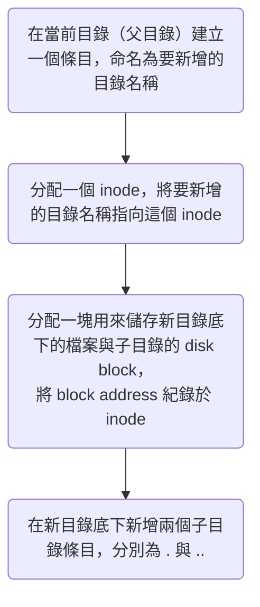

# Inode (Index Node)

- Inode 是 Linux OS 用來儲存檔案 metadata 的資料結構
- Inode 所存放的 metadata 包括：
    - 存放檔案內容的 disk block 位置
    - 檔案類型
    - 最後修改時間
    - owner
    - 存取權限… 等
- 所有 inodes 約佔整個 file system 1% 的空間
- 一個 inode 存放一個檔案的 metadata，所以：
    - 每個檔案都有一個 inode number，可以用指令 `ls -i` 查看
    - 一個 file system 能儲存的檔案數量取決於 inode 數量，在某些不能動態調整 inode 空間的 file system 中，有可能發生「disk 還有空間，卻無法新增檔案」的情況
- Inode 不會紀錄檔名，是檔名指向 inode
    - 指向 inode 的東西被稱為該 inode 的 [[#Hard Links]]，所以檔名是一個 hard link
- 一個檔案在同一個 file system 內移動時，其 inode number 不變，但儲存檔案內容的 disk block「可能」會變

# 建立檔案的流程



# Links

![[hard-link-and-soft-link.png]]

### Hard Links

- Hard link 是一個指向「檔案的 inode」的檔名／別名，所以指向同一個 inode 的所有 hard links 的 inode number 是相同的
- 其實原檔案本身的檔名也只是一個 hard link
- 指向同一個 inode 的 hard links A, B，由於控制的是同一份檔案內容，所以透過 A 打開檔案、修改內容並儲存後，再打開 B 就會看到修改過的內容
- 只有當指向同一個 inode 的所有 hard links 都被刪除時，該 inode 與其對應的 disk 儲存空間才會被回收並釋出，所以一個 hard link 不會因為另一個 hard link 被刪除而失效
- 現代的 file system 大多禁止對 directory 建立 hard link

### Soft (Symbolic) Links

- Soft link 是一個指向原檔案的檔案名稱的檔案
- 原檔案被刪除後，soft link 會因為找不到名為原檔案名稱的檔案而失效
- Soft link 有自己的 inode，與記錄原檔案的 inode 不同
- 透過 soft link 開啟檔案的流程：

    ```mermaid
    flowchart TD
        id0("找到該 soft link 所指向的原檔案名稱")
        id1("找到原檔案名稱所指向的 inode")
        id2("讀取該 inode 所指向的 disk block")
        id0 --> id1
        id1 --> id2
    ```

# Directory

>Directory（目錄）也是一種檔案，打開目錄就是在讀取該目錄檔案。

### 建立目錄的流程

由於目錄也是一種檔案，所以建立目錄的流程與建立檔案的流程很像，只是多了最後一個步驟：



### `.` 與 `..`

建立一個目錄時，OS 會在該目錄底下自動建立 `.` 與 `..` 兩個子目錄：

- `.` 的 inode number 就是目錄本人的 inode number，所以一個目錄底下的 `.` 就是目錄自己的其中一個 hard link
- `..` 的 inode number 是目錄的父目錄的 inode number，所以一個目錄底下的 `..` 就是目錄的父目錄的其中一個 hard link

>[!Note] 一個目錄的 hard links 數量 = 該目錄底下的子目錄數 (n) + 2
>- 目錄底下的每個子目錄會有 `..` 來指向目錄的 inode (n)
>- 目錄自己有 `.` 指向自己的 inode (1)
>- 目錄的父目錄底下會有一個條目（就是目錄的名字）指向目錄的 inode (1)

# File

### 檔案的類型

這裡的「檔案類型」就是 inode 中所記錄的檔案類型。

#TODO 

# 參考資料

- <https://zh.wikipedia.org/zh-tw/Inode>
