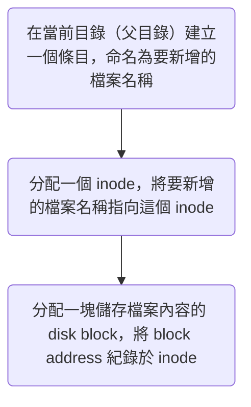
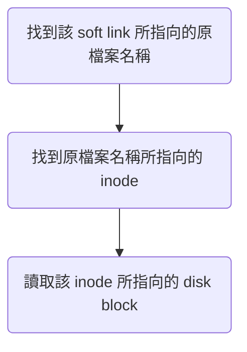
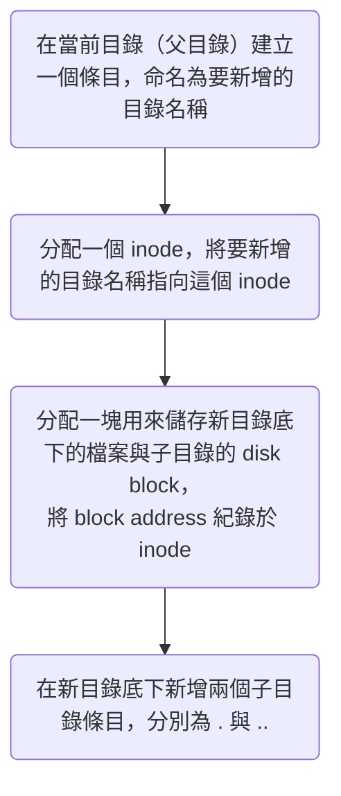

>[!Info]
>本文旨在介紹 file system，不包括與 file system 相關的指令，若要查看與 file system 相關的指令，請見[[9 - 與 File System 相關的指令|本文]]。

# File System 的種類

依「儲存檔案的方式」可以將 file systems 分為以下幾類：

- [[#Disk File Systems]]
- Flash file systems：使用 flash memory（快閃記憶體）儲存檔案的檔案系統
- Tape file systems：使用 tape（磁帶）儲存檔案的檔案系統
- Database file systems：使用 database（資料庫）儲存檔案的檔案系統（不要跟 [[Database/0 - Introduction#Flat-File Database|flat-file database]] 搞混了，flat-file database 是「用檔案當作資料庫」）
- [[#Network File Systems]]

### Disk File Systems

- 使用 disk（硬碟）儲存檔案的檔案系統。
- 在 Linux OS 中常見的 disk file systems 包括 XFS, ext4 等。

### Network File Systems

這種 file system 只是一個 interface/client，它和其他檔案系統一樣可以新增／編輯／刪除／移動檔案／目錄，但實際上是將這些檔案分散在網路中的各個 nodes (servers)，client 與 servers 再透過網路通訊完成以上操作。

其實這就是的「分散式檔案系統」。

# Inode (Index Node)

- Inode 是 Linux OS 用來儲存檔案 metadata 的資料結構
- Inode 所存放的 metadata 包括：
    - 存放檔案內容的 disk block 位置
    - 檔案類型
    - 最後修改時間
    - owner
    - 存取權限… 等
- 所有 inodes 約佔整個 file system 1% 的空間
- 一個 inode 存放一個檔案的 metadata，所以：
    - 每個檔案都有一個 inode number，可以用指令 `ls -i` 查看
    - 一個 file system 能儲存的檔案數量取決於 inode 數量，在某些不能動態調整 inode 空間的 file system 中，有可能發生「disk 還有空間，卻無法新增檔案」的情況
- Inode 不會紀錄檔名，是檔名指向 inode
    - 指向 inode 的東西被稱為該 inode 的 [[#Hard Links]]，所以檔名是一個 hard link
- 一個檔案在同一個 file system 內移動時，其 inode number 不變，但儲存檔案內容的 disk block「可能」會變

# What Happens When You Create A File?



# Links

![[hard-link-and-soft-link.png]]

### Hard Links

- Hard link 是一個指向「檔案的 inode」的檔名／別名，所以指向同一個 inode 的所有 hard links 的 inode number 是相同的
- 其實原檔案本身的檔名也只是一個 hard link
- 指向同一個 inode 的 hard links A, B，由於控制的是同一份檔案內容，所以透過 A 打開檔案、修改內容並儲存後，再打開 B 就會看到修改過的內容
- 只有當指向同一個 inode 的所有 hard links 都被刪除時，該 inode 與其對應的 disk 儲存空間才會被回收並釋出，所以一個 hard link 不會因為另一個 hard link 被刪除而失效
- 現代的 file system 大多禁止對 directory 建立 hard link
- Hard link 不能跨 file system（無法在一個 file system 中建立另一個 file system 中的檔案的 hard link）

### Soft (Symbolic) Links

- Soft link 是一個指向原檔案的檔案名稱的檔案
- 原檔案被刪除後，soft link 會因為找不到名為原檔案名稱的檔案而失效
- Soft link 有自己的 inode，與記錄原檔案的 inode 不同
- 可以對 directory 建立 soft link
- Soft link 可以跨 file system（可以在一個 file system 中建立另一個 file system 中的檔案的 soft link）
- 透過 soft link 開啟檔案的流程：



# Directory

>Directory（目錄）也是一種檔案，打開目錄就是在讀取該目錄檔案。

### 建立目錄的流程

由於目錄也是一種檔案，所以建立目錄的流程與建立檔案的流程很像，只是多了最後一個步驟：



### `.` 與 `..`

建立一個目錄時，OS 會在該目錄底下自動建立 `.` 與 `..` 兩個子目錄：

- `.` 的 inode number 就是目錄本人的 inode number，所以一個目錄底下的 `.` 就是目錄自己的其中一個 hard link
- `..` 的 inode number 是目錄的父目錄的 inode number，所以一個目錄底下的 `..` 就是目錄的父目錄的其中一個 hard link

>[!Note] 一個目錄的 hard links 數量 = 該目錄底下的子目錄數 (n) + 2
>- 目錄底下的每個子目錄會有 `..` 來指向目錄的 inode (n)
>- 目錄自己有 `.` 指向自己的 inode (1)
>- 目錄的父目錄底下會有一個條目（就是目錄的名字）指向目錄的 inode (1)

# File

### 檔案的類型 (Entry Type)

這裡的「檔案類型」就是 inode 中所記錄的檔案類型，下方為 Linux 中的所有檔案類型，以及 `ls -l` 時對應的符號：

|符號|檔案類型|
|:-:|:-:|
|`-`|一般檔案或執行檔|
|`d`|Directory|
|`l`|Soft (Symbolic) Links|
|`b`|外接儲存裝置（如 USB）|
|`c`|Character 裝置|
|`p`|Pipe 檔|
|`s`|Socket 檔|

### 一般檔案 vs 執行檔

若一個 user 對一個一般檔案有 [[7 - 與 Permission 相關的指令|execute 的權限]]，則該檔案對該 user 來說就是一個執行檔。

User 可以直接在 [[Operating System/Shell/1 - Introduction|shell]] 中輸入執行檔的檔名來執行該檔案，比如若要執行一個位在當前目錄的名為 myscript 的執行檔，則須輸入：

```bash
./myscript
```

>[!Note]
>即使執行檔位在當前目錄，也須要在檔名前面加上 `./`，因為若單純輸入檔名，會被 shell 認為是一個 command，此時 shell 只會從 [[Operating System/Shell/1 - Introduction#`PATH`|PATH 這個環境變數]]中所列的 paths 中尋找執行檔，反而不會找當前的目錄。

由於是透過 shell 執行，所以==執行檔的內容通常都會用 shell script 撰寫==。

一個內容為 shell script 的一般檔案（在還沒有變成執行檔前），若使用 `open` 指令打開，OS 會使用文字編輯器打開這個檔案；但若這個檔案變成一個執行檔，則使用 `open` 指令打開時，OS 會使用 [[CLI vs Terminal vs Console vs Shell#Terminal|terminal emulator]] + shell 打開，並直接執行檔案中的 script。

新建一個檔案時，所有 users 對該檔案都不會有 execute 的權限（即使是建立它的 user 也只會有 read 跟 write 權限），所以該檔案對所有 users 來說都只是一個「一般檔案」，若要讓該檔案成為一個執行檔，則須使用 [[7 - 與 Permission 相關的指令#用 Permission Code 設定|chmod]] 指令改變權限，比如：

```bash
chmod u+x myscript
```

### 檔案名稱大小寫

在 Linux 中，檔案名稱是 case-sensitive 的，也就是說 `test` 與 `Test` 對系統來說是兩個不同的檔名，可以同時存在在同一個 directory 底下；但在 MacOS 以及 Windows 中，檔案名稱是 case-insensitive 的，所以 `test` 及 `Test`、`TEST`… 等都會被視為相同的檔名，不能同時存在於同一個 directory 底下。

# 參考資料

- <https://en.wikipedia.org/wiki/File_system>
- <https://zh.wikipedia.org/zh-tw/Inode>
