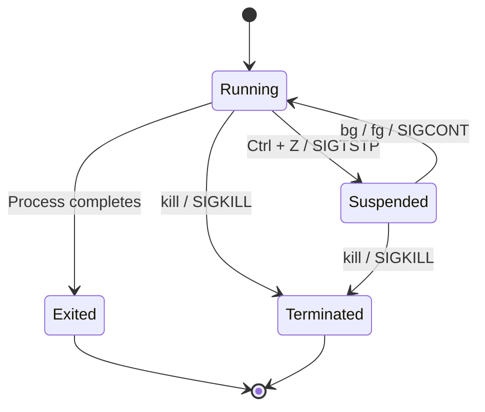

>A job is a set of processes, comprising a shell pipeline, and any processes descended from it, that are all in the same process group.

Job 是由 Shell 管理的 [process group](</Operating System/Process.draft.md#Process Group>)，所以一個 job 可以由一到多個 processes 組成，不同 Shell sessions 間無法知道彼此管理哪些 jobs。

原則上一個 Shell command 就是一個 job，但若使用 [Pipe](</Operating System/Shell/3 - Operators.md>) operator (`|`) 將多個 Shell commands 串接起來，那它們就會被視為一個 compound command，所以是一個 job，比如：

```bash
grep title somefile.txt | sort | less
```

*（註：用 `;`、`&&` 和 `||` 連接的 commands 仍然會被視為多個 commands/jobs。）*

# Foreground & Background

如果我們說一個 job「在前景運行」指的是該 job 佔用著 terminal 且可以與使用者互動（會接收來自 terminal 的 STDIN）；而「在背景運行」就是沒用佔用 terminal 也不會接收來自 terminal 的 STDIN。

# Job ID

在一個 Shell session 中，每個 job 都有 unique job ID，但不同 Shell session 間的 job ids 就有可能會重複了。

通常 job ID 只被用在 interactive Shell 中，不會用在 Shell script 中，在 Shell script 中會用 **PGID**（process group ID；Recall: 一個 job 就是一個 process group），因為用 PGID 來定位會比 job ID 更精準。

# Job Status

- Running
- Suspended (Stopped/Paused)
- Exit (Done)
- Terminated



# 列出所有當前 Shell 所管理的 Jobs

```bash
jobs
```

Example output:

```plaintext
[1]  - suspended  python -m http.server 8000
[2]  + running    nc -l localhost 3000
```

- 輸出的內容由左至右分別是 job ID、job status 與當初觸發 job 的指令。
- 只能列出當前 Shell session 所管理的 jobs。

**常用的 Options**

|Option|Description|
|:-:|---|
|`-l`|額外列出 job 的 pid|
|`-r`|只列出 status 為 running 的 jobs|
|`-s`|只列出 status 為 suspended 的 jobs|

# 將前景運行的 Job 丟到背景運行

先使用 Ctrl + Z 送出 `SIGTSTP` 訊號，此時該 job 的狀態會變成 "Suspended"（詳見[本文](</Operating System/Unix Signal & IPC.md#常見的 Signals>)），然後使用 `bg` 指令將這個 suspended job 恢復成 "Running" 的狀態：

```bash
# Ctrl + Z
bg
```

- 若要在一開始執行指令時就直接將它丟到背景運行，不是使用 `bg`，要用 `&`：

    ```bash
    {COMMAND} &
    ```

- 使用 `bg` 指令時，也可以搭配 job ID 來指定要將哪個 job 恢復運行：

    ```bash
    bg %{JOB_ID}
    ```

    *（記得 job ID 前有 `%`）*
# 把背景的 Job 拉回前景運行

```bash
fg [%{JOB_ID}]
```

- 記得 job ID 前有 `%`
- 如果背景目前只有一個 job，則可以不用寫 `{JOB_ID}`。
- 若指定的 job 的 status 原本是 suspended，拉到前景後 status 會變成 running。

# 讓 Job 脫離 Shell 的管理

```bash
disown [%{JOB_ID}]
```

- 記得 job ID 前有 `%`
- 如果背景目前只有一個 job，則可以不用寫 `{JOB_ID}`。
- Job 脫離 Shell 管理後，並不會停止，而是會變成 orphan process，此時若要停止該 process 就只能用 `kill {PID}`。

若單純使用 `bg` 或 `&` 將 job 丟到背景，則當使用者離開 Shell 時，這些 job 都會因為收到 `SIGHUP` 而終止（詳見[本文](</Operating System/Unix Signal & IPC.md#常見的 Signals>)），若希望一個 job 在使用者離開 Shell 後仍能繼續運行，則須讓這個 job 脫離目前 Shell 的管理。

e.g.

```bash
nc -l localhost 8000 & ; disown
```

# 參考資料

- <https://en.wikipedia.org/wiki/Job_control_(Unix)>
