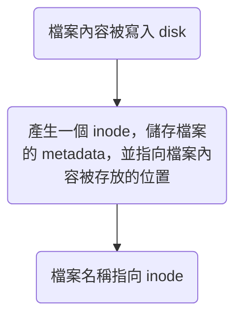

#Command 

# Inode

- Inode 是 Linux OS 用來紀錄檔案 metadata 的資料結構
- 所有 inode 約佔整個 file system 1% 的空間
- 一個 inode 存放一個檔案的 metadata，所以每個檔案都有自己的 inode number，可以使用 `ls -i` 查看
- Inode 所存放的 metadata 包括：
    - 存放檔案內容的 disk block 位置
    - 最後修改時間
    - owner
    - 讀寫權限… 等
- Inode 不會紀錄檔名，是檔名指向 inode，檔名就是 inode 的別名，一個 inode 可以有多個別名

# Directories

### 列出目錄內容 - `ls`

```sh
ls [<OPTIONS>] [<PATH>]
```

- `ls -F`: 為不同種類的物件的名稱結尾加上不同符號

    Example output:

    ```plaintext
    Applications/  Volumes/  etc@      sbin/
    Library/       bin/      home@     tmp@
    System/        cores/    opt/      usr/
    Users/         dev/      private/  var@
    ```

    |符號|意義|
    |:-:|:-:|
    |`/`|directory|
    |`*`|執行檔|
    |`@`|symbolic (soft) link|
    |沒有符號|一般檔案|

- `ls -R`: Recursively 列出所有 subdirectories
- `ls -a`: 把以 `.` 開頭的隱藏檔案也列出來
- `ls -l`: 針對每個 directories 顯示更完整的資訊，詳見 [[Operating System/Linux/權限管理]]

若在 `ls` 後加上 `<PATH>`，則只會列出該 path 底下的資訊，若 `<PATH>` 指向一個檔案，那就只列出該檔案的資訊，舉例來說：

```bash
ls -l /usr/bin/vim
```

### 取得目前目錄位置 - `pwd`

pwd 是 print working directory 的縮寫，會印出目前所在 directory 的絕對路徑。

```bash
pwd
```

### 切換目錄 - `cd`

cd 是 change directory 的縮寫。

```sh
cd <PATH>
```

- Path 間使用 `/` 前往下一層 directory
- `.` 代表目前的 directory
- `cd ..`：前往目前 directory 的上一層 directory
- `cd ~`：前往目前 user 的 home directory
- `cd /`：前往整台機器的 root directory
- `cd -`：回到上一個所在的 directory

### 建立新目錄

```sh
mkdir [-p] <PATH> [<PATH> ...]
```

- `<PATH>` 可以有多層

    比如 `mkdir test/test-sub`，但當有多層時，預設的行為是只有最後一層的 directory 會被建立，換句話說，path 中間的 directories 必須本來就存在，否則會報錯；若想要達到「若 path 中間的 directory 不存在，則一併建立」的效果，則須加上 `-p` option。

- `<PATH>` 可以有多個

    以空格分隔各個 `<PATH>`，效果是一次建立多個 directories，比如 `mkdir test01 test02` 就會一次建立 `test01` 與 `test02` 兩個 directories。

# Files & Directories

### 移動 - `mv`

- **「移動 directory」或「重新命名 directory」**

    ```sh
    mv <PATH_TO_DIR1> <PATH_TO_DIR2>
    ```

    - 若 `<PATH_TO_DIR1>` 指定的 directory 不存在，則會報錯
    - 若 `<PATH_TO_DIR2>` 指定的 directory 存在，則將 `<PATH_TO_DIR1>` 指定的 directory（及其底下所有東西）移到 `<PATH_TO_DIR2>` 底下
    - 若 `<PATH_TO_DIR2>` 指定的 directory 不存在，則將 `<PATH_TO_DIR1>` 指定的 directory（及其底下所有東西）移到 `<PATH_TO_DIR2>` 指定的 path，並重新命名為`<PATH_TO_DIR2>` 指定的 directory name
    - 若 `<PATH_TO_DIR2>` 指定的 directory 存在，但是是一個 file 而非 directory，則會報錯
    - `<PATH_TO_DIR1>` 與 `<PATH_TO_DIR2>` 都可以是相對或絕對路徑

- **移動 file 「並」重新命名**

    ```sh
    mv <PATH_TO_FILE1> <PATH_TO_FILE2>
    ```

    - 將 `<PATH_TO_FILE1>` 指定的 file 移到 `<PATH_TO_FILE2>` 指定的 path 底下，並將該檔案重新命名為 `<PATH_TO_FILE2>` 指定的 file name，若 `<PATH_TO_FILE1>` 與 `<PATH_TO_FILE2>` 指定的 path 一樣，則效果等同於原地重新命名檔案
    - 若 `<PATH_TO_FILE1>` 指定的 file 不存在，則會報錯
    - 若 `<PATH_TO_FILE2>` 指定的 file 已經存在，則會報錯
    - `<PATH_TO_FILE1>` 與 `<PATH_TO_FILE2>` 都可以是相對或絕對路徑

- **移動 file**

    ```sh
    mv <PATH_TO_FILE> <PATH_TO_DIR>
    ```

    - 若 `<PATH_TO_FILE>` 指定的 file 不存在，則會報錯
    - 若 `<PATH_TO_DIR>` 指定的 directory 不存在，則會報錯

### 複製 - `cp`

將指定檔案或目錄複製到指定位置。

```sh
cp [<OPTIONS>] <SRC> <DEST>
```

###### 常用 Options

- `-r` 只有在複製目錄時會用到，代表 "recursively"，也就是所有目錄裡的東西都複製
- `-f` 只有在複製檔案時會用到，代表 "force"，當指定的 `<DEST>` 檔案無法開啟時，就直接將其刪除並把 `<SRC>` 複製過去

### 刪除 - `rm`

```sh
rm [<OPTIONS>] <FILE | DIR>
```

#TODO 

# Files

### 建立檔案 - `touch`

```sh
touch <FILE>
```

若檔案已存在，則==不會==新增新的檔案把舊的檔案覆蓋掉，只會更新該檔案的 "last modified"。

### 顯示檔案內容

###### 顯示檔案所有內容 - `cat`

```sh
cat <FILE> [<FILE> ...]
```

將檔案內容放到 stdout，若有多個 `<FILE>`，則會依序 stdout。

###### 合併檔案內容 - `cat`

搭配 `>` 就可以用來將多個檔案合併並寫入一個檔案中：

```sh
cat <FILE_1> <FILE_2> [<FILE_3> ...] > <NEW_FILE>
```

###### 顯示檔案內容，但一次只顯示一頁 - `more`

```sh
more <FILE>
```

###### 顯示檔案的開頭若干行內容 - `head`

```sh
head [-n <LINE_NUM>] <FILE>
```

###### 顯示檔案的結尾若干行內容 - `tail`

```sh
tail [-n <LINE_NUM>] <FILE>
```

# Links

```sh
ln [-s] <SRC> <DEST>
```

若有 `-s` option，則建立的是 soft (symbolic) link，否則為 hard link。

### 建立檔案的流程



### Hard Links vs. Soft (Symbolic) Links

![[hard-link-and-soft-link.png]]

###### Soft (Symbolic) Links

- Soft link 是一個指向原檔案的檔案
- 若原檔案被刪除，則 soft link 失效
- Soft link 有自己的 inode，與原檔案的 inode 不是同一個
- 開啟 soft link 時，實際上會開啟的是原檔案

###### Hard Links

- Hard link 是一個指向「原檔案的 inode」的檔案，所以 hard link 的 inode number 會與原檔案相同
- 原檔案被刪除時，hard link 仍然有效
- 開啟 hard link 時，不會開啟原檔案，但兩者的內容是連動的
- 只有當所有指向 inode 的檔案都被刪除時，inode 與 disk 的儲存空間才會被釋出

# 參考資料

- <https://www.mropengate.com/2018/01/linuxunix-cheat-sheet-for-linuxunix.html>
