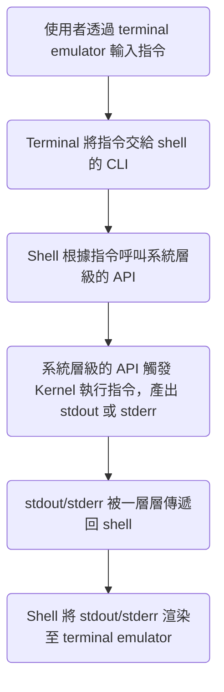

>[!Info]
>閱讀本文前，建議先讀 [[CLI vs Terminal vs Console vs Shell]]。

Shell（殼層）是 OS 的最外層，是一款應用程式，使用者必須透過 shell 與 OS 互動，shell 可以轉譯並執行一種叫做 **shell script** 的程式語言。

# 使用者如何透過 Shell 與 OS 互動？

Shell 有 CLI，使用者通常是透過 terminal emulator 操作 shell，shell 透過 CLI 接收到使用者的指令後，會根據指令去呼叫系統層級的 API，系統層級的 API 再觸發核心 (Kernel) 執行指令，最後將執行結果 stdout 或 stderr：



### Environment Variables

請注意上面流程中的第三個步驟：「Shell 根據指令呼叫系統層級的 API」，shell 怎麼知道每個指令對應到的是哪個系統層級的 API？

答案是：shell 其實不知道，shell 是透過==搜尋與指令名稱同名的執行檔==，並透過該執行檔來呼叫系統層級的 API。

那再進一步問，shell 搜尋同名執行檔的範圍是什麼？是整台電腦嗎？

答案是搜尋被列在 `$PATH` 這個 environment variable 的目錄

# 如何進入／離開 Shell？

### 進入 Shell

每當使用者打開 terminal emulator 時，terminal emulator 都會幫我們打開系統預設的 shell，所以通常使用者一打開 terminal emulator 就可以直接輸入 shell 指令，==不須要額外使用指令打開 shell==。

只有一個例外是 [[SSH 常用指令#`ssh`：連線|SSH]]，若要連線遠端的 server 並打開其 shell，必須使用指令：

```sh
ssh <USERNAME>@<HOSTNAME>
```

### 離開 Shell

```bash
exit
```

# Shell 設定檔

各種 shell 都可以透過設定檔進行設定，設定檔有三種，有不同用途，比如 zsh 所使用的設定檔叫做 `.zshrc`、bash 使用的設定檔叫做 `.bashrc`。

### `PATH`

一般情況下，若某個 path 底下有一個「執行檔」叫做 `mycommand`，那麼若要執行該檔案就要完整地在 terminal 打出 `<PATH>/mycommand`；不過若在設定檔中加入 `PATH=<PATH>`，那在 terminal 直接輸入 `mycommand` 就可以執行該檔案。

這是因為每次在 terminal 輸入指令並按下 enter 時，shell 都會「依序」搜尋所有列在設定檔中的 PATHs，直到找到有與輸入的指令同名的執行檔為止，若全部搜尋完了還是找不到，就會冒出下方錯誤訊息（以「在 zsh 執行 `mycommand`」為例）：

```plaintext
zsh: command not found: mycommand
```

# 參考資料

- <https://ss64.com/osx/syntax-profile.html>
