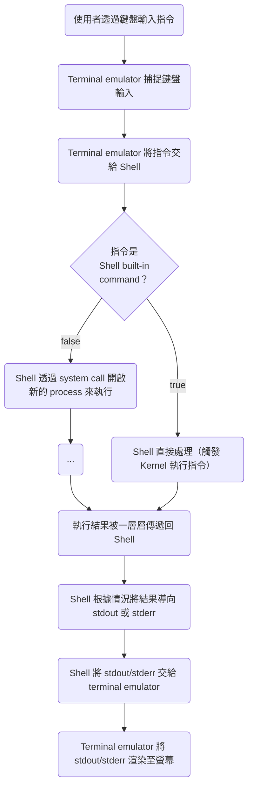

>[!Info]
>閱讀本文前，建議先讀 [[CLI vs. Terminal vs. Console vs. Shell]]。

Shell（殼層）是 OS 的最外層，是一款應用程式，使用者必須透過 Shell 才能與 OS 互動，Shell 可以轉譯並執行一種叫做 [[2 - Shell Script Overview|Shell script]] 的程式語言。

# 進入／離開 Shell

### 進入 Shell

每當使用者打開 terminal emulator 時，terminal emulator 都會幫我們打開 OS 預設的 Shell，所以使用者一打開 terminal emulator 就可以直接輸入 Shell 指令，不須要額外使用指令打開 Shell。

但若要連線遠端的 host 並打開其 Shell，就必須先使用 `ssh` 指令與遠端 host 進行 [[SSH 基本概念|SSH]] 連線並打開它的 Shell：

```bash
ssh {USERNAME}@{HOST_NAME}
```

### 離開 Shell

```bash
exit
```

### Sub-Shell

Sub-Shell 指的是 Shell 中的 Shell，由於 Shell 本身只是一個應用程式，所以可以在 Shell 中開啟 Shell 這個應用程式，此時開啟的 Shell 就是 sub-Shell，比如現在電腦中已安裝 zsh，則在 Shell 中輸入 `zsh` 就會進入 sub-Shell。

- ==Sub-Shell 與原 Shell 享有相同的環境變數==
- 使用 `exit` 離開 sub-Shell 後，就會回到原 Shell

# 使用者如何透過 Shell 與 OS 互動？

Shell 有 CLI，使用者透過 terminal emulator 與 Shell 互動，流程如下：



### Shell Built-in Command

- Shell 內建的 command，簡稱 Shell built-in。
- 可以直接由 Shell 執行，不須要呼叫外部程式。
- 有些 Shell built-in commands 單獨就是一個指令，有些則是 Shell script 中會用到的語法（所有 Shell script 中的語法都是 Shell built-in commands）。
- 可以透過 `man builtin` 查看所有 Shell built-in commands，常見的 Shell built-in commands 如：`alias`、`cd`、`echo`、`exec`、`exit`、`kill`、`pwd`、`source`... 等。

>[!Note]
>常用的 `ls` 不是 Shell built-in command！

# 系統層級的環境變數

>[!Note]
>關於環境變數 (environment variable) 與一般變數的差別，請見[[2 - Shell Script Overview#變數|這篇文章]]。

### `$PATH`

當使用者輸入的指令不是 Shell built-in command 時，Shell 是怎麼知道每個指令應該對應到哪個系統層級 API 的呢？

答案是：Shell 其實不知道。

Shell 實際上是==搜尋與指令名稱同名的[[File System#一般檔案 vs 執行檔|執行檔]]==，並執行它。

那再進一步問，Shell 搜尋同名執行檔的範圍是什麼？是搜尋整台電腦嗎？

答案是：Shell 會依序搜尋被列在 `PATH` 這個環境變數中的 directories。

如果尋遍了所有 `PATH` 中的目錄都沒有找到指定名稱的執行檔，就會 stderr `command not found`，比如當 zsh 找不到 `helloworld` 這個執行檔時，會有下方錯誤訊息：

```plaintext
command not found: helloworld
```

假設在 `{PATH}` 這個路徑底下有一個執行檔叫做 helloworld，若要執行它，就要完整地在 Shell 輸入`{PATH}/helloworld`；不過若在設定檔中加入 `export PATH={PATH}`，那在 Shell 直接輸入 `helloworld` 就可以執行該檔案，因為此時 Shell 可以在 `{PATH}` 中找到名為 helloworld 的檔案。

##### Colon-Separated String

`PATH` 變數可以儲存多個 paths，這些 paths 被 `:` 分隔，所以 `echo $PATH` 時你會看到類似下面的輸出值：

```plaintext
/Applications/Visual Studio Code.app/Contents/Resources/app/bin:/opt/homebrew/Cellar/postgresql@15/15.3/bin/:/Library/Frameworks/Python.framework/Versions/3.11/bin:/usr/local/bin:/System/Cryptexes/App/usr/bin:/usr/bin:/bin:/usr/sbin:/sbin:/opt/homebrew/bin:/usr/local/bin:/System/Cryptexes/App/usr/bin:/usr/bin:/bin:/usr/sbin:/sbin:/var/run/com.apple.security.cryptexd/codex.system/bootstrap/usr/local/bin:/var/run/com.apple.security.cryptexd/codex.system/bootstrap/usr/bin:/var/run/com.apple.security.cryptexd/codex.system/bootstrap/usr/appleinternal/bin
```

>[!Note]
>由於只要目標目錄的 path 沒有被列在 `PATH` 中，輸入的指令就必須是 `{PATH}/{FILE}` 的格式，所以當要執行位在「當前目錄」的執行檔 `helloworld` 時，就必須下 `./helloworld`。

>[!Danger]
>有些人為了達到「執行當前目錄的執行檔時，可以不用在前方加上 `./`」，而將 `./` 加入環境變數 `PATH` 中，這樣確實可行，不過也很危險，因為若下載到含有惡意程式的 directories，在那些 directories 中，你所熟知的指令可能就不再有你所預期的行為。
>
>比如，若攻擊者在目錄中寫了一個名為 `ls` 的執行檔，內容是 `rm -rf /`，那麼當你在該目錄底下執行 `ls` 指令時，就不是列出當前目錄的內容而是刪掉電腦中的所有檔案！

### 其它常見的系統層級的環境變數

- `USER`: 目前登入的 user
- `HOME`: 目前登入的 user 的 home directory 的絕對路徑
- `SHELL`: OS 預設的 Shell 的執行檔的絕對路徑

# Alias of Commands

若有關鍵字被設定為 alias，則當在 Shell 中輸入該關鍵字時，實際會執行的是該 alias 背後所代表的指令。

### 設定 Alias

```bash
alias {YOUR_ALIAS}={ACTUAL_COMMAND}
```

e.g.

```bash
alias lss='ls -FiGal'
```

當使用者在 Shell 輸入一個指令 `a` 時，Shell 其實不是直接去找名為 a 的執行檔，而是先去找有沒有叫做 a 的 alias，若有找到 `alias a=b`，則 Shell 會去執行指令 `b`，同樣地，Shell 會先先去找有沒有叫做 b 的 alias… 一直重複下去直到沒有找到 alias 後才去找執行檔。

Alias 的設定與 variables 類似，只有在當前的 Shell session 有效，若希望某些 alias 在每次進入 Shell 時都被自動設定，則一樣須將那些 alias 寫在 [[#Config File]] 中。

### 刪除 Alias

```bash
unalias {YOUR_ALIAS}
```

# Configuration File

- 各種 Shell 都可以透過設定檔進行設定
- 設定檔依照「被載入的時機點」大致可分為兩種，以 zsh 為例，就有 .zprofile 與 .zshrc 兩個設定檔：
    - .zprofile 只在使用者登入時被載入
    - .zshrc 會在每次進入新的 Shell session 時都被重新載入
- 設定檔通常被放在 user 的 home directory
- 當設定檔的內容有所改變時（比如修改變數或 alias）須重新載入設定檔，新的設定才會生效，所以當你更改 .zshrc 中的設定時，就必須離開當前的 Shell session 重新進入 Shell，才能讓新的設定生效

一個範例設定檔如下：

```bash
# Homebrew path
export PATH=/opt/homebrew/bin:$PATH

# PostgreSQL path
export PATH=/opt/homebrew/Cellar/postgresql@15/15.3/bin/:$PATH

# PostgreSQL default database
export PGDATABASE=postgres

# alias
alias lss='ls -FiGal'
alias push='./push || ./push.sh || sh ./push || sh ./push.sh'
```

# `stdin`, `stdout` & `stderr`

|Name|File Stream|Description|FD|
|---|:-:|---|:-:|
|Standard Input|`stdin`|一個指令所接收的 input|0|
|Standard Output|`stdout`|一個指令正常執行時的輸出值|1|
|Standard Error|`stderr`|一個指令執行失敗時的輸出值|2|

表格最右側的 FD 指的是 file descriptor，關於 file descriptor 的詳細介紹請看[[File System#File Descriptors (FD)|這篇]]。

>[!Note]
>一個指令所接收的 stdin 與 arguments 是不一樣的東西。

# Exit Codes

一段 Shell script 成功執行完後會離開 Shell session，出錯時也會離開 Shell session，離開 Shell session 時會有一個 **exit code**，從 exit code 我們可以大致知道這段 Shell script 為什麼離開 Shell session；在自己寫的 Shell script 中，也可以善用不同的 exit code 來提示使用者。

- 一個指令執行完後，可以使用 `echo $?` 查看該指令的 exit code
- Exit code 從 0 到 255 共有 256 個

以下為常見的 exit codes 及其所代表的意義：

|Exit Code|Description|
|:-:|:-:|
|0|Success|
|1|General error (比如 division by zero) 或 unspecified error|
|2|Misuse of Shell builtins (比如 `if` block 的結尾沒有 `fi`)|
|126|Command invoked cannot execute (比如執行一個不是執行檔的檔案時)|
|127|Command not found|
|128|Invalid exit code (exit code 必須介於 0 ~ 255 間)|
|130|SIGINT Unix signal received|
|137|SIGKILL Unix signal received|

# 執行 Shell Script File

執行 Shell script file 的指令有 `sh` 與 `source` 兩種：

- `sh`

    ```bash
    sh {FILE}
    ```

    若使用 `sh` 執行 Shell script file，則會在當前的 Shell session 中==另開一個 sub-Shell== 來執行，因此 script 對 Shell 環境的更動不會影響到 parent Shell。

- `source`

    ```bash
    source {FILE}
    ```

    若使用 `source` 執行 Shell script file，則會在當前的 Shell session 中直接執行，因此 file 中對於 Shell 環境的更動會影響到當前的 Shell。

    可以把 `source` 當成其它語言中的 `import`，可以在一個 Shell script file 中 `source` 另一個 Shell script file，藉此載入變數或 function。

# 參考資料

- <https://ss64.com/osx/syntax-profile.html>
- <https://www.youtube.com/watch?v=Z56Jmr9Z34Q&list=PLyzOVJj3bHQuloKGG59rS43e29ro7I57J&index=2>
- <https://tecadmin.net/mastering-bash-exit-codes/>
