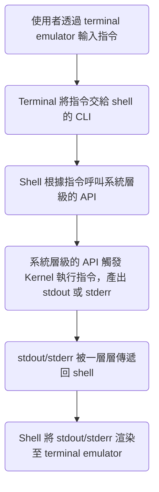

>[!Info]
>閱讀本文前，建議先讀 [[CLI vs Terminal vs Console vs Shell]]。

Shell（殼層）是 OS 的最外層，是一款應用程式，使用者必須透過 shell 與 OS 互動，shell 可以轉譯並執行一種叫做 [[Shell Script]] 的程式語言。

# 如何進入／離開 Shell？

### 進入 Shell

每當使用者打開 terminal emulator 時，terminal emulator 都會幫我們打開系統預設的 shell，所以通常使用者一打開 terminal emulator 就可以直接輸入 shell 指令，==不須要額外使用指令打開 shell==。

只有一個例外是 [[SSH 常用指令#`ssh`：連線|SSH]]，若要連線遠端的 server 並打開其 shell，必須使用指令：

```sh
ssh <USERNAME>@<HOSTNAME>
```

### 離開 Shell

```bash
exit
```

### Sub-Shell

Sub-shell 指的是 shell 中的 shell，由於 shell 本身也只是一個應用程式，所以可以在 shell 中開啟 shell 這個應用程式，此時開啟的 shell 就是 sub-shell，sub-shell 原則上與與原 shell 享有相同的環境變數。

比如現在電腦中已安裝 zsh，則在 shell 中輸入 `zsh` 就會進入 sub-shell：

```bash
zsh
```

使用 `exit` 離開 sub-shell 後，就會回到原 shell。

# 使用者如何透過 Shell 與 OS 互動？

Shell 有 CLI，使用者通常是透過 terminal emulator 操作 shell，shell 透過 CLI 接收到使用者的指令後，會根據指令去呼叫系統層級的 API，系統層級的 API 再觸發核心 (Kernel) 執行指令，最後將執行結果 stdout 或 stderr：



# 系統層級的環境變數

>[!Note]
>關於環境變數 (environment variable) 與一般變數的差別，請見 [[Shell Script#Variables|這篇文章]]。

### `PATH`

在[[#使用者如何透過 Shell 與 OS 互動？]]這段中，互動第三個步驟是「Shell 根據指令呼叫系統層級的 API」請問 shell 是怎麼知道每個指令應該對應到哪個系統層級 API 的呢？

答案是：Shell 其實不知道。

Shell 實際上是==搜尋與指令名稱同名的[[File System#一般檔案 vs 執行檔|執行檔]]==，並透過該執行檔來呼叫系統層級的 API。

那再進一步問，shell 搜尋同名執行檔的範圍是什麼？是搜尋整台電腦嗎？

答案是：Shell 會依序搜尋被列在 `PATH` 這個環境變數中的 directories。

如果尋遍了所有 `PATH` 中的目錄都沒有找到指定名稱的執行檔，就會 stderr `command not found`，比如當 zsh 找不到 `helloworld` 這個執行檔時，會有下方錯誤訊息：

```plaintext
zsh: command not found: helloworld
```

一般情況下，假設在 `<PATH>` 這個路徑底下有一個執行檔叫做 helloworld，若要執行它，就要完整地在 shell 輸入`<PATH>/hellworld`；不過若在設定檔中加入 `export PATH=<PATH>`，那在 shell 直接輸入 `hellworld` 就可以執行該檔案，因為此時 shell 可以在 `<PATH>` 中找到名為 helloworld 的檔案。

###### Colon-Separated String

`PATH` 變數可以儲存多個 paths，這些 paths 被 `:` 分隔，所以 `echo $PATH` 時你會看到類似下面的 output：

```plaintext
/Applications/Visual Studio Code.app/Contents/Resources/app/bin:/opt/homebrew/Cellar/postgresql@15/15.3/bin/:/Library/Frameworks/Python.framework/Versions/3.11/bin:/usr/local/bin:/System/Cryptexes/App/usr/bin:/usr/bin:/bin:/usr/sbin:/sbin:/opt/homebrew/bin:/usr/local/bin:/System/Cryptexes/App/usr/bin:/usr/bin:/bin:/usr/sbin:/sbin:/var/run/com.apple.security.cryptexd/codex.system/bootstrap/usr/local/bin:/var/run/com.apple.security.cryptexd/codex.system/bootstrap/usr/bin:/var/run/com.apple.security.cryptexd/codex.system/bootstrap/usr/appleinternal/bin
```

>[!Note]
>由於只要目標目錄的 path 沒有被列在 `PATH` 中，輸入的指令就必須是 `<PATH>/<FILE>` 的格式，所以當要執行位在「當前目錄」的執行檔 `helloworld` 時，就必須下 `./helloworld`。

>[!Danger]
>有些人為了達到「執行當前目錄的執行檔時，可以不用在前方加上 `./`」，而將 `./` 加入環境變數 `PATH` 中，這樣確實可行，不過也很危險，因為若下載到含有惡意程式的目錄，在那些目錄中，你所熟知的指令可能就不再有你所預期的行為。
>
>比如，若攻擊者在目錄中寫了一個名為 `ls` 的執行檔，內容是刪掉電腦中的所有檔案，那麼當你在該目錄底下執行 `ls` 指令時，就不是列出當前目錄的內容而是刪掉電腦中的所有檔案。

### 其它系統層級的環境變數

```bash
# USER - 目前登入的 user
echo $USER  # jamison

# HOME - 目前登入的 user 的 home directory 的絕對路徑
echo $HOME  # /Users/jamison

# SHELL - 目前所使用的 shell 的執行檔的絕對路徑
echo $SHELL  # /bin/zsh
```

# Alias

若有關鍵字被設定為 alias，則當在 shell 中輸入該關鍵字時，實際會執行的是該 alias 背後所被指派的指令。

### 設定 Alias

e.g.

```bash
alias lss='ls -FiGal'
```

當使用者在 shell 輸入一個指令 `a` 時，shell 其實不是直接去找名為 a 的執行檔，而是先去找有沒有叫做 a 的 alias，若有找到 `alias a='b'`，則 shell 會去執行指令 `b`，同樣地，shell 會先先去找有沒有叫做 b 的 alias … 一直重複下去直到沒有找到 alias 後才去找執行檔。

Alias 的設定與 variables 類似，只有在當前的 shell session 有效，若希望某些 alias 在每次進入 shell 時都被自動設定，則一樣須將那些 alias 寫在 [[#Shell 設定檔]]中。

# Shell 設定檔

- 各種 shell 都可以透過設定檔進行設定
- 設定檔依照「被載入的時機點」大致可分為兩種，以 zsh 為例，就有 .zprofile 與 .zshrc 兩個設定檔：
    - .zprofile 只在使用者登入時被載入
    - .zshrc 會在每次進入新的 shell session 時都被重新載入
- 上述設定檔通常被放在 user 的 home directory
- 當設定檔的內容有所改變時（比如修改變數或 alias）須重新載入設定檔，新的設定才會生效，所以當你更改 .zshrc 中的設定時，就必須離開當前的 shell session 重新進入 shell，才能讓新的設定生效

一個範例設定檔如下：

```bash
# Homebrew path
export PATH=/opt/homebrew/bin:$PATH

# PostgreSQL path
export PATH=/opt/homebrew/Cellar/postgresql@15/15.3/bin/:$PATH

# PostgreSQL default database
export PGDATABASE=postgres

# alias
alias lss='ls -FiGal'
alias push='./push || ./push.sh || sh ./push || sh ./push.sh'
```

# `stdin`, `stdout` & `stderr`

|Name|File Stream|Description|FD|
|:-:|:-:|:-:|:-:|
|Standard Input|`stdin`|一個指令所接收的 input|0|
|Standard Output|`stdout`|一個指令正常執行時的 output|1|
|Standard Error|`stderr`|一個指令執行失敗時的 output|2|

>[!Note]
>一個指令所接收的 stdin 與 arguments 是不一樣的東西。

### File Descriptors (FD)

File descriptors 就是檔案與 input/output resource 的編號，根據 [POSIX stardard](https://pubs.opengroup.org/onlinepubs/9699919799/functions/stdin.html) 的規定，stdin, stdout, stderr 的編號分別是 0, 1, 2。

# 參考資料

- <https://ss64.com/osx/syntax-profile.html>
- <https://www.youtube.com/watch?v=Z56Jmr9Z34Q&list=PLyzOVJj3bHQuloKGG59rS43e29ro7I57J&index=2>
