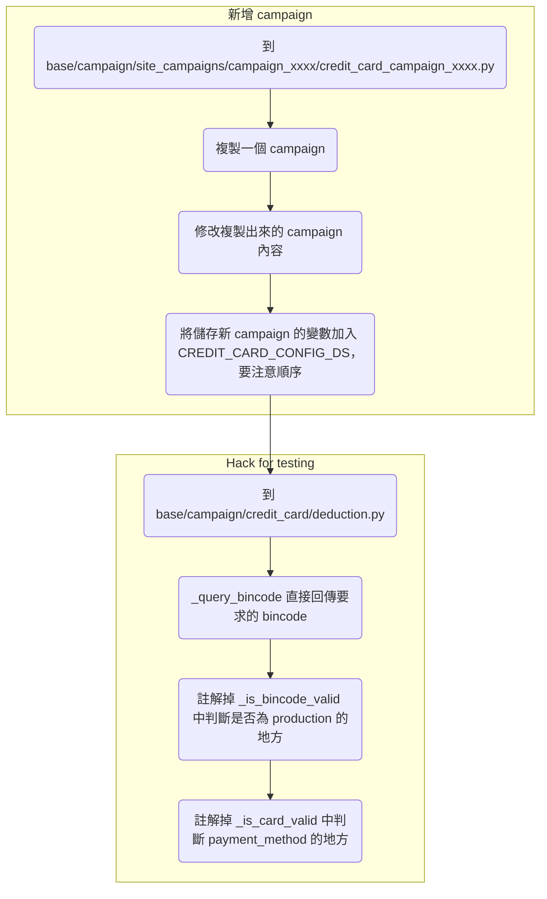

### 流程

### 相關 Tasks

- https://app.asana.com/0/1201591574237600/1204719274585087/f
- https://app.asana.com/0/1201591574237600/1204913798194094/f
- https://app.asana.com/0/1201591574237600/1205071817241001/f

### 會動到的檔案

###### 新增 Campaign

- base/campaign/site_campaigns/campaign_2023/credit_card_campaign_2023.py

###### 有新的信用卡時

- base/campaign/credit_card/const.py

###### 在測試機測試時

- base/campaign/credit_card/deduction.py

### 注意事項

- 同一個週期 (period) 內，若有兩個以上的 campaigns 要進行，則即使這些 campaigns 的期間沒有重疊，也不可以共用同一個 campaign key，否則在計算 period limit 時會出錯
- 若有 campaigns 的設定是 `make_up_to_next_period == True` 或 `only_can_redeem_once == True and reset_redeem_limit == False`，那就不能使用舊活動用過的 campaign key*（原因請見 base/campaign/credit_card/deduction.py 的 query_remaining_deduction_count 與 query_is_user_available 的邏輯）*
- 建議新增 credit card campaigns 時都不要直接把舊的覆蓋掉

### Tester 的用途

- 上正式機後，即使活動還沒開跑，tester 也可以在該看到文案的地方看到文案

#TODO 

### 各種文案的顯示位置

- Credit-card campaign 文案不會顯示在 product page 和 shop page，因為沒有設定 `product_page_message` 和 `shop_page_message`
- Credit-card campaign 文案只會顯示在結帳頁下半部（付款方式的上方，紅底紅字，`payment_method_promotion_note`/`exceed_limit_promotion_note`），實際套用到的會顯示在付款方式的左側（白底灰字，`site_additional_note`）

### 相關 Tables

- `campaign_credit_card`
- `orders`
- `campaign_orders`
