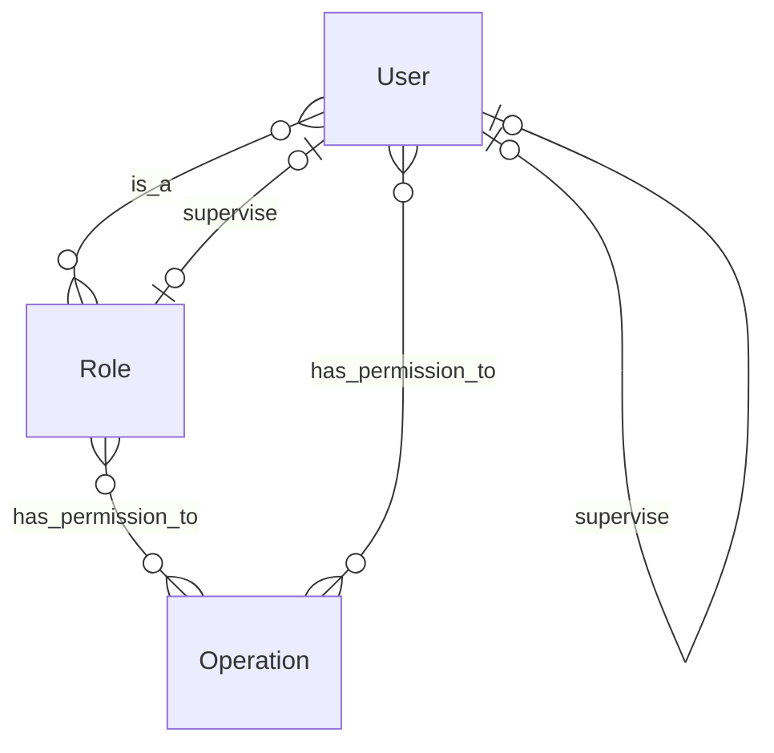

# ER Diagram



# 新增權限

### 法一：使用 Admin Tool

這是正規管道，適用於「符合規則」的授權，所謂的符合規則就是「User 只能為其下轄的 Users 或 Roles 加減權限」。


### 法二：直接改資料庫

**Step1: 使用 Table Plus 或寫 script，在 relation `rbac_permission` 加上一筆資料**

**Step2: 刷新 Cache**

```bash
make shell
python ./pinkoi/scripts/ruby/permission/refresh_permission.py -u '<UID>'
```
