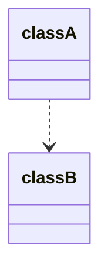

Dependency Injection 常被縮寫為 DI，中文叫「依賴注入」，其他與 DI 相關但不相等的名詞包括 [[SOLID Principles#Dependency Inversion Principle|SOLID Principles 中的 Dependency Inversion Principle]] 與 [[Inversion of Control]]，本文將會解釋他們的關係與差異。

# Dependency

>如果某個 class `A` 裡會「用到」另一個 class `B`，則說 `A` 依賴 `B`。



`A`「用到」`B` 的方式包括：

- Instance of `B` 以參數的方式傳入 `A` 的某個 method
- `A` 的某個 method 輸出的型別為 `B`
- `A` 的某個 attribute (property) 的型別為 `B`（這還不止是 dependency，同時也是 associate）

# 以「人開車」為例

如果有一個人開的車是 Toyota，可以這樣用程式表達：

```TypeScript
class Person {
    private car: Toyota;
    public constructor() {
        this.car = new Toyota();
    }
}
```

現在就可以說「`Person` 依賴 `Toyota`」，然而你也知道，並不是所有人都開 Toyota，難道要為所有開不同廠牌車的 Person 都建立一個 class 嗎？聽起來就很奇怪吧？

比較好的做法應該是：定義一個抽象的 interface `Car`，各個廠牌實作 `Car`，然後讓 `Person` 依賴 `Car`，至於每個人開什麼廠牌的車子，就等實例化 `Person` 時再透過 constructor 傳入某個廠牌實作的 `Car` instance。

另外，雖然在 `Person` 還沒有被實例化之前，我都無法確定一個人開的車子是什麼廠牌，但至少我知道這些車子都會有一些共同的行為，比如 `run()`，所以可以在 `Car` interface 裡先規範好：

```TypeScript
interface Car {
    run(): void;
}

class Toyota implements Car {
    public run(): void {
        // ...
    }
}

class Tesla implements Car {
    public run(): void {
        // ...
    }
}

class Person {
    private car: Car;
    public constructor(car: Car) {
        this.car = car;
    }
    public drive(): void {
        this.car.run();
    }
}

const a = new Person(new Toyota());
const b = new Person(new Tesla());
```

這個例子中，我們做了以下幾件事：

- 在 `Person` class 中，將本來與 class `Toyota` 的互動改成與 interface `Car` 的互動

    這個動作實現了 [[SOLID Principles#Dependency Inversion Principle|SOLID Principles 中的 Dependency Inversion Principle (DIP)]]。

- 將本來 `Person` 對「要開什麼車」的==控制權== ==轉移==到 `Person` 之外，由使用者（建立 `Person` instance 的人）告訴每個 `Person` instance 要開什麼車

    這個動作叫做 [[Inversion of Control]]（控制反轉）。

- 使用者建立 `Person` instance 時，將指定廠牌的 `Car` instance 透過 constructor ==注入== `Person`

    這個注入的動作就是 DI，由此可見 ==DI 是一種實現 IoC 的手段==。

>[!Note]
>有做 IoC/DI 並不一定代表有實現 DIP，如果上面的例子只是改成用 constructor 傳入 `Toyota` 給 `Person`，那就是只有 IoC/DI 沒有 DIP。

# 不同形式的 DI

### Constructor Injection

透過 constructor 傳入需要的 instance：

```TypeScript
class Person {
    private car: Car;
    public constructor(car: Car) {
        this.car = car;
    }
}
```

### Setter Injection

透過 setter method 傳入需要的 instance：

```TypeScript
class Person {
    private car: Car;
    public setCar(car: Car): void {
        this.car = car;
    }
}
```

### Interface Injection

定義一個 DI interface，這個 interface 規範實作者必須實作一個 setter method，供傳入需要的 instance：

```TypeScript
interface DICar {
    setCar(car: Car): void;
}

class Person implements DICar {
    private car: Car;
    public setCar(car: Car): void {
        this.car = car;
    }
}
```

# 參考資料

- <https://notfalse.net/3/ioc-di>
