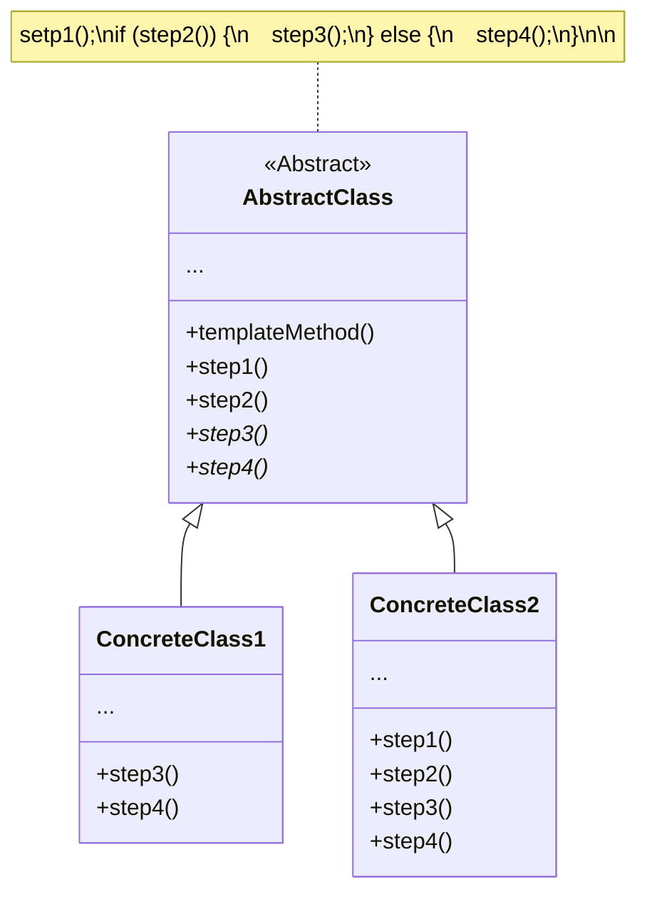

### [Refactoring Guru](https://refactoring.guru/design-patterns/template-method)

### 重點摘要

- 這是一個與 [[OOP 四本柱#繼承 (Inheritance)|OOP 中的繼承]]相關的 design pattern
- 在 superclass 中定義一個 algorithm 應該執行哪些「步驟」，但不詳細實作每一個步驟的內容，步驟的實作交給 subclass
- 通常這裡的 superclass 會使用 abstract class
- 「步驟」分為兩種：
    - Subclass 一定要自己實作的：這在 superclass 會是 abstract method
    - 有預設行為，可以不另外實作的：這在 superclass 會是一般的 (concrete) method
- Template method pattern 符合 [[Inversion of Control|IoC]] 的精神
- 適合使用 template method pattern 的時機
    - 當你不想讓一個 algorithm 太過彈性，想保留主要架構，只想讓其中的某些步驟可以被 override 時
    - 當有多個 classes 都有幾乎相同行為的 method 時，可以把重複的 code 拉到 superclass，把不一樣的部分挖成一個「步驟」

### 缺點

- Algorithm 的步驟越多，越難維護
- 違反了 [[Liskov Substitution Principle]]

### UML

