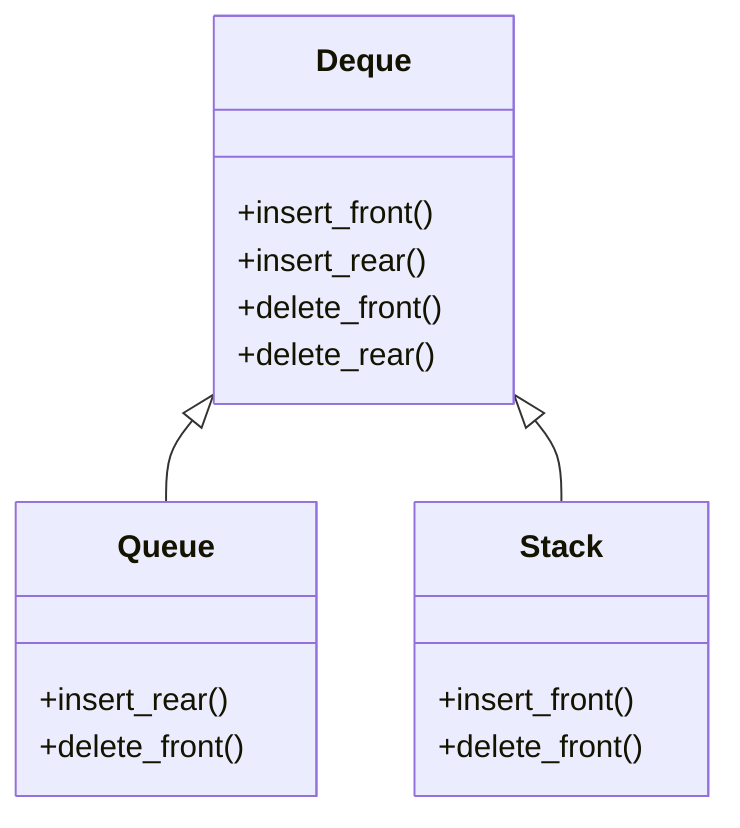
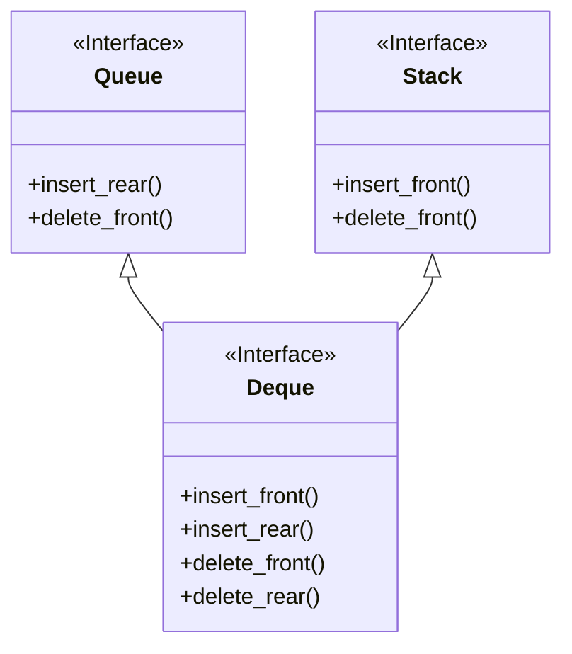

###### 數學上的定義

>假設有一個函數 $\phi(x)$ 可以證明 object $x$ 的型別是否為 $T$，已知有一個型別為 $S$ 的 object $a$，若 $\phi(a)=true$ ，則可說 $S$ 是 $T$ 的 subtype。
>
>\- Barbara Liskov

###### 軟體工程上的定義

>若在可運行的函式（或程式碼片段）中，將任何型別為 $T$ 的物件替換成型別為 $S$ 的物件後，函式／程式碼片段應該仍然可以正常運行，則稱 $S$ 為 $T$ 的 subtype（或說 $T$ 為 $S$ 的 supertype）。

一個簡單的實例就是 `Integer` 與 `Float` 之間的關係：在大多數程式語言中，任何可以接受 `Float` 的地方你都可以放入一個 `Integer`，所以可以說 `Integer` 是 `Float` 的 subtype。

「$S$ 為 $T$ 的 subtype」有兩種以數學符號表示的方法：

- $S \subseteq T$
- $S \leq: T$

# Subtype vs. Subclass

這裡頻繁提到 "subtype" 這個詞，但可千萬別把它和 subclass 視為同一個東西！其實 subtyping 與 OOP 中的 [[OOP 四本柱#繼承 (Inheritance)|繼承 (Inheritance)]] 是兩個分開的概念，這兩個概念具有 orthogonality（正交性），白話文就是「沒有對應關係」。

>Subtyping 是「兩個型別之間的從屬關係」；class inheritance 則是「實作時 code reuse 的行為」。

Subtype 不一定要透過繼承才能得到，只是使用繼承可以少寫一些重複的 code，你也可以不使用繼承，把某個 class A 的所有 code 都重寫在另一個 class B，做一些微調，然後說 B 是 A 的 subtype。

當然在很多例子中，當 class B 繼承 class A 時，B 恰巧會是 A 的 subtype，但是也有反例，比如資料結構中 deque, queue 與 stack 間的關係：

Queue 支援 `enqueue` 與 `dequeue` 兩個 methods，剛好對應到 deque 的 `insert_rear` 與 `delete_front` methods，所以理論上 queue 可以繼承 deque，這樣一來就不用重複實作相同的功能；同樣地，stack 支援 `push` 與 `pop` 兩個 methods，分別對應到 deque 的 `insert_front` 與 `delete_front` methods，理論上 stack 也可以繼承 deque。所以在這裡 queue 與 stack 皆為 deque 的 subclass。

但是根據前面 subtype 的定義，queue 與 stack 皆不是 deque 的 subtype，因為若某段程式碼呼叫了 deque 的 `delete_front` method，此時將 deque 替換成 queue 就會出錯；同樣地，若將 deque 替換成 stack，那麼在原本呼叫 `insert_rear` 的地方就會出錯；反而是 queue 與 stack 都可以替換成 deque，因此 deque 反而同時是 queue 與 stack 的 subtype。

從 Liskov Substitution Principle 的觀點，前面給的 deque, queue, stack 間的繼承關係不是很好的做法，比較好的做法應該是使用 interface：

因此我們可以說：

>只有遵守特定規則來繼承，才會形成 subtype，否則就只是 subclass。

而這些「特定規則」如下：

# Liskov Substitution Principle

### 1. Contravariance of Arguments

若 $S \leq: T$，且 $S$ override $T$ 的一個 method $M$，令 $M_S$ 所接收的第 i 個參數的型別為 $\alpha_i$，$M_T$ 所接收的第 i 個參數的型別為 $\beta_i$，則：

$$
\forall i, \beta_i \leq: \alpha_i
$$

### 2. Covariance of Result

若 $S \leq: T$，且 $S$ override $T$ 的一個 method $M$，若 $M$ 有輸出，則 $M_S$ 的輸出值的型別必須是 $M_T$ 的輸出值的型別的 subtype。

### 3. Exception Rule

若 $S \leq: T$，且 $S$ override $T$ 的一個 method $M$，則 $M_S$ 所可能拋出的 exceptions 的集合必須為 $M_T$ 所可能拋出的 exceptions 的集合的子集。

### 4. Pre-Condition Rule

執行 subtype 的 method $M$ 前的驗證程序，不能比執行 supertype 的 $M$ 前的程序嚴格。

其實對參數型別的檢查就算是一種 pre-condition，而 Contravariance of Arguments 說「subtype 的參數的型別」必須是「supertype 的參數的型別」的 supertype，所以檢查不會比較嚴格。

### 5. Post-Condition Rule

執行 subtype 的 method $M$ 後的驗證程序，不能比執行 supertype 的 $M$ 後的程序還鬆散。

其實對輸出型別的檢查就算是一種 post-condition，而 Covariance of Result 說「subtype 的輸出的型別」必須是「supertype 的輸出的型別」的 subtype，所以檢查不會比較鬆散。

### 6. Invariant Rule

Invariant 可以被理解為「不變的規則」，比如「矩形的面積為長乘以寬」就是一種 invariant。

這個 rule 說的是：「supertype 必須遵守的所有 invaraints，其 subtype 也都要遵守」。

### 7. Constraint Rule

Constraint 可以被理解為：「當某個變量的值更動時，其它變量應該如何反應以符合某些特定的規則」，比如因為正方形的長等於寬，所以當長度變大時，寬度也要跟著變大，這就是一種 constraint。

這個 rule 說的是：「supertype 必須遵守的所有 constraints，其 subtype 也都要遵守」。

---

>[!Note]
>Cotravariance 的中文叫做「逆變」或「反變」；covariance 叫做「協變」或「共變」；invariant 叫做「不變」，關於他們的詳細介紹，請見 [[Covariance,  Contravariance and Invariance]]。

# 結論

>當你想要使用繼承時要非常小心，因為大多數的情況都不該用繼承，繼承是所有依賴關係裡面最強的，而你知道，太過依賴總是沒啥好事。

如果真的想要使用繼承，那你可以用上面這七大規則來檢驗看看到底適不適合。

# 參考資料

- <https://www.jyt0532.com/2020/03/22/lsp/>
- <https://en.wikipedia.org/wiki/Subtyping#Function_types>
- <https://www.cmi.ac.in/~madhavan/courses/pl2009/lecturenotes/lecture-notes/node28.html>
