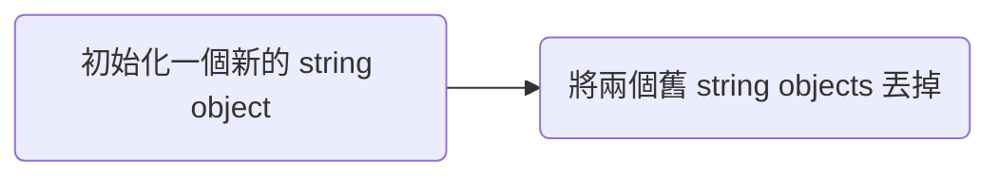

>[!Note]
>「是否 immutable」與「是否為 constant」是兩件不同的事情，前者表示的是一塊已經儲存著某些值的記憶體可不可以被修改內容；後者指的則是一個已經被指派值的變數可不可以再次被指派一個值。

# Immutable

Java、C#、JavaScript、Python、Go

舉例而言，若在 Python 中執行以下程式碼：

```Python
s = "abcd"
s[0] = "e"
```

則你會看到以下錯誤訊息：

```plaintext
TypeError: 'str' object does not support item assignment
```

# Mutable

Ruby、PHP、C++

>[!Note]
>在 C 語言中並沒有 string objects，只能用向量 `char *` 來表示，而向量是 mutable 的

# 字串串接的時間複雜度

如果現在要寫一個 `reverse_string` function，輸入為一個 string，function 須將輸入值反轉後輸出，你會怎麼寫？

有些人可能會這麼做：初始化一個空字串 `result`，使用 for loop 從 input string 的最後面開始讀取，並將每次讀到的值加到 `result` 後面，loop 結束後輸出 `result`。

以 pseudo code 來表示會長得像這樣：

```plaintext
function reverse_string(s) {
    result <- "";
    i <- s.length - 1;
    while i >= 0 {
        result <- concat(result, s[i]);
        i--;
    }
    return result;
}
```

猜猜上面這個演算法的時間複雜度是多少？$O(n)$ 嗎？不可能是 $O(n^2)$ 吧？

這個問題的答案是：「要看你使用的語言的 string 是否為 immutable。」

在 immutable-string language 中，一個 string object 被初始化後（也就是使用 `""` 將文字包起來後），你就無法更改那個 object 的值了，而當你寫出像是 `"abc" + "def"` 這樣的 statement，或直接 call function `concat("abc", "def")` 時，其實並不是直接在 `"abc"` 這個字串後方直接加上 `"def"`，而是先初始化一個新的 string 物件（另外找一塊記憶體空間），將 `"abc"` 與 `"def"` 依序填入，作為這個新 string 的初始值，再將兩個舊的 strings 丟掉：



而「依序填入」這個動作的時間複雜度為 $O(m+n)$，$m$ 和 $n$ 為兩個被串接的字串的長度。由此可知，上面 `reverse_string` 演算法的 for loop 每次加上長度為 1 的 string，單次迴圈中的複雜度就是 $O(i+1)$，$i$ 為前一次 loop 後 `result` 的長度，所以整個演算法的時間複雜度是 $O(n^2)$，$n$ 為 input string 的長度。

在 mutable-string language 中，因為可以直接在原 string object 後方加上新的 character，所以時間複雜度是 $O(n)$，只有當原本分配給該 string object 的空間不夠用時，才需要另外分配一個新的記憶體然後把整個 string 搬過去。

那在 immutable-string 的語言中，有沒有演算法可以用 $O(n)$ 的時間複雜度做到 reverse string 呢？答案是可以「用 array 取代 string」。

### 以 Python 為例

由於是 Python，所以這裡用 list：

```Python
def reverse_string(s: str) -> str:
    l = []
    for i in range(len(s)-1, -1, -1):
        l.append(s[i])
    return "".join(l)
```

for loop 與 `"".join(l)` 的時間複雜度皆為 $O(n)$，其中 $n$ 為 input string 的長度。

甚至可以使用 `list` function 更有效率地將 string 轉成 a list of characters，再用 list 的 `reverse` method 來取代本來的 for loop：

```Python
def reverse_string(s: str) -> str:
    l = list(s)
    l.reverse()
    return "".join(l)
```

還有更簡單的寫法，直接使用 built-in function `reversed`，將字串變成倒序的 iterator：

```Python
def reverse_string(s: str) -> str:
    return "".join(reversed(s))
```

最後順便補充一個 Python 小知識，其實在 Python 中可以用 **slicing** 語法將字串倒過來，而且它比上面所有方式都還要快（雖然時間複雜度也是 $O(n)$）：

```Python
def reverse_string(s: str) -> str:
    return s[::-1]
```

# 參考資料

- <https://python.plainenglish.io/9bfc8e8d6f6e>
