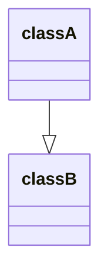

#OOP 

# 抽象化 (Abstraction)

- 將現實世界的問題抽象化為物件 (objects) 間的行為
- 將物件抽象化為類別 (classes)
    - 物件的屬性 → **attributes**
    - 物件的行為 → **methods**
- 將類別抽象化為介面 (interfaces) 或抽象類別 (abstract classes)

### Interface vs. Abstract Class

- 一個 class 可以實作 (implements) 多個 interfaces，但只能[繼承 (extends/inherit)](</./Programming Language/OOP 四本柱.md#繼承 (Inheritance)>) 最多一個 class，abstract class 是一種 class，所以一個 class 最多只能繼承一個 abstract class

- Abstract class 可以 implements interface，但 interface 不會繼承包括 abstract class 在內的任何 class

- Abstract class 中可以有 abstract methods，也可以有 non-abstract (concrete) methods，但 interface 中的 methods 一定都沒有被實作

- Interface 中所列舉的 attributes 與 methods 都是 `public` 的（且不需要額外用 `public` keyword），但 abstract class 就像一般的 class 一樣可以定義 `private` 與 `protected` 的 attributes/methods

- 不能透過 `istanceof` 這類的 operator 來判斷一個 instance 是否有實作某個 interface，但可以用 `instanceof` 來判斷一個 instance 所屬的 calss 是否繼承某個 abstract class 

### 參考資料

- <https://stackoverflow.com/a/50115567/19177912>
- <https://khalilstemmler.com/blogs/typescript/abstract-class/>

# 封裝 (Encapsulation)

Encapsulation 的目的是達到 information hiding，透過 `public`, `private`, `protected` 等關鍵字來限制一個 attribute 或 method 可以在哪裡被存取，而 information hiding 事實上也是 abstraction 的其中一部分。

一個 class 中，很多時候某些 attributes 並不是設計來給外部使用者直接更動的；有些 attributes 則可能因爲是機密資訊所以不希望隨意被外部使用者存取，這種情況就須要使用 encapsulation 來限制使用者的存取權限。

通常一個 class 內的所有 attributes 都會是 `private` 或 `protected`，會另外定義 `public` 的 getter/setter methods 供外部使用者存取部分 attributes。

# 繼承 (Inheritance)

繼承的目的是提高 code reusability，當 class `A` 繼承 class `B` 時，我們稱 `A` 為 subclass，`B` 為 superclass，且說 "`A` **is a** `B`"：



所有定義在 superclass 的 `public` 與 `protected` methods/attributes 都可以直接在 subclass 中使用（`private` 的不行）。

### Interface Implementation vs. Class Inheritance

定義 class 的目的是為物件進行「分門別類」，一個物件一定只屬於一個類別，一個類別也必定只屬於一個父類別，或者沒有父類別（頂層的分類沒有父類別）。

以生物生物學對生物的分類為例（界、門、綱、目、科、屬、種），不會有一個動物同時屬於兩個「種」，也不會在兩個不同的「屬」下找到同一個「種」。

而 interface 的性質可以比喻為「身份」，一個物件可以同時具有多種身份，比如一個人可能同時是學生、是兒子、是老公，也是某公司的股東，當一個物件具有某身份時，就可以參加該身份的人能參加的活動。

- 一個 class 最多只能==繼承一個 class==，但可以==實作多個 interfaces==
- Interface 間也可以繼承，一個 interface 可以==繼承多個 interfaces==

### 請謹慎使用 Inheritance

之所以想提高 code reusability，究其根本是想一定程度地提高「維護」程式的方便性。然而，繼承所形成的依賴關係很強，當 class `A` 繼承 class `B` 後，`A` 與 `B` 就「耦合」(coupled) 了，耦合會使得彼此互相限制彼此的擴展性，不當地使用反而會讓程式更難維護，所以應謹慎使用。若既想提高 code reusability 又不想增加耦合度，可以使用 [Object Composition](</Programming Language/Object Composition.md>)。

# 多型 (Polymorphism)

Polymorphism 字面上的意思是「一體多面」或「一詞多義」，在 OOP 中意思則是：

>即使寫的是抽象 interfaces 間的互動，在程式執行時 (run time) 也會根據 instance 的 class 的繼承狀況與實作狀況，來決定要使用哪個 method。

### Override vs. Overload

設 superclass 有一個 method `m`，此時 subclass 的 method `m` 的行為會與 superclass 相同，若 subclass 想要讓自己的 `m` 有不同的行為，就必須自己重新定義 `m`。

在 subclass 重新定義 method `m` 時，若 `m` 所接收的參數數量、參數型別、輸出值的型別皆與 superclass 的 `m` 相同，則稱此行為稱為 **Method Overriding**；若參數數量或型別不同，則稱為 **Method Overloading**，在一個 class 內定義多個接收不同參數數量、型別的同名 methods 也算是 overloading。

並不是所有程式語言都支援 method overloading，有支援者如 Java 和 C++，沒支援的則包括 TypeScript 與 Python。==通常會沒有支援 method overloading 都是因為該語言在定義 function/method 時，可以提供預設值給 parameters，所以不需要定義多個同名但接收參數不同的 methods==。

### Dynamic Method Lookup

試想一個問題，今有 `S` 繼承 `T`，superclass `T` 裡的某個 method `m` 內呼叫了另一個 method `n`，在 subclass `S` 裡有 override method `n`（沒有 override method `m`），請問當一個 intance of `S` 呼叫 method `m` 時，`m` 內所呼叫的 `n` 是被 override 過的嗎？

答案是 yes。

我們不須另外在 subclass `S` 裡 override method `m`，讓 method `m` 呼叫被 override 過的 method `n`，interpreter 會在 run time 自動根據 instance 的 class 決定要使用哪個 method，這個現象就是所謂的 dynamic method lookup。

我們可以用 TypeScript 為例驗證：

```TypeScript
class T {
    public greet(): void {
        console.log("hi");
        this.sayName();
    }
    protected sayName(): void {
        console.log("T");
    }
}

class S extends T {
    protected sayName(): void {
        console.log("S");
    }
}

const s = new S();
s.greet();
// hi
// S
```

# 參考資料

- <https://www.mropengate.com/2015/11/software-engineering-oop.html>
