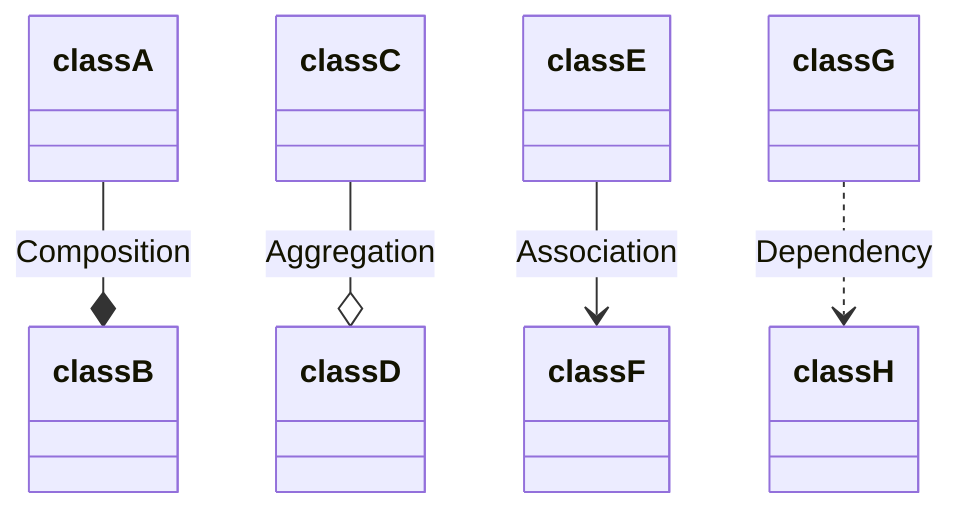
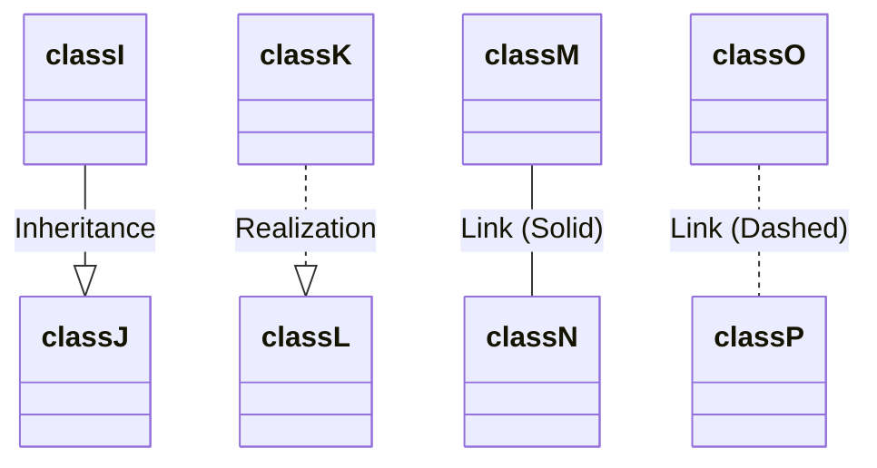
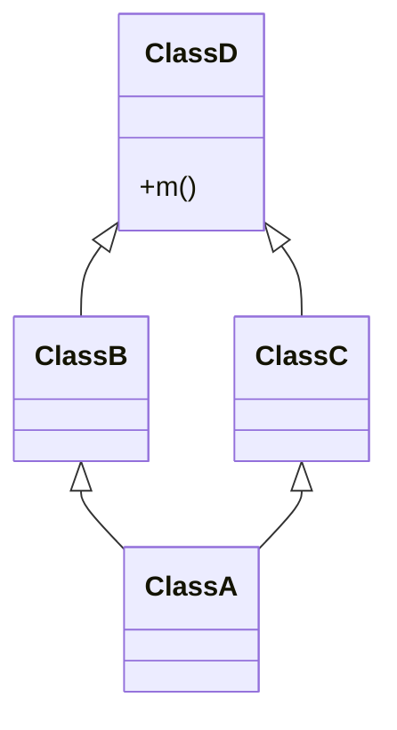

#OOP 

### Objects

在其他 programming paradigms 中，object 只是一種資料結構（通常指的是 key-value pair），但 object 在 OOP 中不只是「資料」，還定義了「行為」。OOP 透過 objects 間的「互動」來實現所有功能。

### UML Notations

---

### Diamond Problem

- 只有 OOP 才有可能出現這個問題
- 這個問題因為 UML 的形狀為菱形而得名

在上方的繼承狀況中，若 ClassB 與 ClassC 各自 override ClassD 的 method `m`，請問 ClassA 的 method `m` 應該繼承自 ClassB 還是 Class C？

這個問題只會出現在可以進行 multiple inheritance 的語言中，比如 C++ 和 Python，每個語言處理的方式不盡相同，比如 Python 使用的是 [C3 Linearization](https://en.wikipedia.org/wiki/C3_linearization)，也叫做 Method Resolution Order (MRO)。

---
