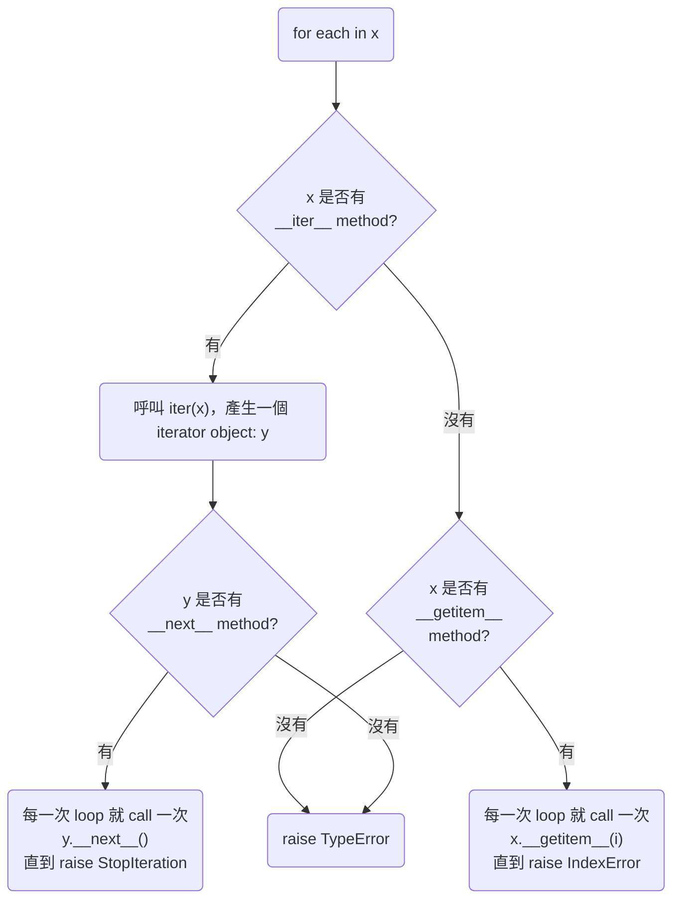

>[!Note]
>本篇請搭配 [Iterable & Iterator](</Programming Language/Python/Iterable & Iterator.md>) 一起服用。



由上圖可知：

- 對一個有 `__iter__` method 的 object 而言，一個 for loop block 會在第一次 loop 的時候呼叫==一次==被迭代對象的 `__iter__` method，取得 iterator，然後在每一次 loop 時呼叫該 iterator 的 `__next__` method 來取值，直到 raise `StopIteration` 為止

    可以用下面這段程式碼來「模擬」`for` loop 的行為：

    ```Python
    iterator = x.__iter__()
    while True:
        try:
            each = iterator.__next__()
        except StopIteration:
            break
        else:
            # Statements in the for loop
            ...
    ```

- 對一個沒有 `__iter__` method 但有 `__getitem__` method 的 object 而言，for loop 唯一做的事就是在每一次 loop 時呼叫 `__getitem__` method 來取值，直到 raise `IndexError` 為止

    因此我們可以實作一個簡單的 class 如下：

    ```Python
    class ForLoopable:
        def __init__(self, max_num: int) -> None:
            self.max_num = max_num

        def __getitem__(self, index: int):
            if index < self.max_num:
                return index**2
            else:
                raise IndexError

    f = ForLoopable(3)
    print(f[2])
    # 4

    for each in f:
        print(each)
    # 0
    # 1
    # 4
    ```
