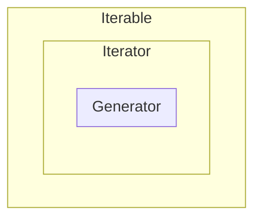

>[!Note]
>本篇請搭配 [[Python 的 for Loop 運作機制]] 一起服用。

Iterable 泛指一切可以被迭代的 object，換句話說就是一切可以被 `for` loop "loop" 的 object；iterator 一樣可以被迭代，只是有其他比較嚴格的規範，因此可以說 ==iterator 是 iterable 的子集==。

從 [[Generator and the yield Statement]] 一文中可知：一個 generator object 也可以被迭代，所以 ==generator 也是 iterable 的子集==，事實上，在閱讀過全文後你會發現以下關係：

$$Generator \subset Iterator \subset Iterable$$




# Iterable

在 Python 中，一個 iterable 必須「同時」具備下列幾個條件：

- 可以被 `for` loop 迭代
- 可以被 [[Python/零碎筆記#Tuple Unpacking|unpacking]]
- 可以做為參數被傳入 `all()`、`any()`、`enumerate()`、`max()`、`min()`、`len()`、`zip()`、`sum()`、`map()`、`filter()` 等 Python built-in function 中

list, tuple, dictionary, set, string 在 Python 中皆是 iterable。

一個 Iterable 必須實作 [[#The Iterable Protocol]]「或」[[#The Sequence Protocol]]：

### The Iterable Protocol

Iterable protocol 規定 class 必須實作 `__iter__` methods，而一個 `__iter__` method 必須 return 一個 [[#Iterator]]。

### The Sequence Protocol

一個 Sequence 可以被使用 `[ ]` operator 進行 **indexing**，sequence protocol 規定 class 必須實作以下兩個 methods：

|Method|Description|
|---|---|
|`__getitem__`|接收一個 index 參數，回傳 sequence 中的第 index 個元素，找不道指定 index 的元素則 raise IndexError|
|`__len__`|回傳 sequence 的元素數量|

### 自己實作一個 Sequence

```Python
class MyIterable:
    def __init__(self, max_num: int) -> None:
        self.max_num = max_num

    def __getitem__(self, index: int):
        if index <= self.max_num:
            return index**2
        else:
            raise IndexError

my_iterable = MyIterable(3)
print(my_iterable[2])
# 4

for each in my_iterable:
    print(each)
# 0
# 1
# 4
# 9
```

# Iterator

### The Iterator Protocol

在 Python 中，一個 iterator 一定要實作以下兩個 methods：

|Method|Description|
|---|---|
|`__iter__`|須 return 一個 iterator object|
|`__next__`|須 return「下一個」element，如果沒有下一個了，須 raise `StopIteration` exception|

### 判別一個 Instance 是否為 Iterator

```Python
from collections.abc import Iterator

l = [1, 2, 3]
print(isinstance(l, Iterator))  # False
```

>[!Note]
>list, tuple, dictionary, set, string 在 Python 中皆==不是== Iterator，只是 Iterable。

### 將 Iterable 轉換成 Iterator

使用 `iter` function 可以將 iterable 轉換成 iterator，舉例如下：

```Python
from collections.abc import Iterator

l = iter([1, 2, 3])
print(isinstance(l, Iterator))  # True
```

>[!Note]
>`iter` 是 Python 內建的 function，`iter(x)` 就是去呼叫 `x.__iter__()`。

### 自己實作一個 Iterator

```Python
from collections.abc import Iterator

class MyIterator:
    def __init__(self, max_num: int) -> None:
        self.max_num = max_num
        self.index = 0

    def __iter__(self) -> Iterator:
        self.__init__(self.max_num)  # for reusability
        return self

    def __next__(self):
        self.index += 1
        if self.index <= self.max_num:
            return self.index
        else:
            raise StopIteration

for i in MyIterator(3):
    print(i)
# 1
# 2
# 3
```

上方的範例中，`__iter__` method 直接 `return self`，可以這麼做是因為 `MyIterator` 本身具備 `__iter__` 以及 `__next__` 兩個 methods，是一個完整的 iterator，所以「return 自己」可以滿足「`__iter__` method 要 return 一個 iterator object」的要求。

那有沒有一種情況是：「class 本身沒有 `__next__` method（不是 iterator），但 class 的 `__iter__` method 卻可以回傳一個 iterator」呢？

答案是肯定的，讓我們看看下面這個例子：

```Python
class MyIterable2:
    def __init__(self, max_num: int) -> None:
        self.max_num = max_num

    def __iter__(self):
        num = 0
        while num < self.max_num:
            yield num
            num += 1
```

在這個例子中，我們看到 `__iter__` method 中出現了 `yield` statement，這意味著 `MyIterable2.__iter__` 是一個 [[Generator and the yield Statement|generator]] function，會產出一個 generator object（Recall: $Generator \subset Iterator$）。

所以 `MyIterable2` 的 instance 本身雖然不是一個 iterator，但是卻可以透過呼叫 `__iter__` method 來產生一個 iterator，所以 `MyIterable2` 的 instance 可以做為 `for` loop 迭代的對象。

### Implement Iterator ABC

```Python
from collections.abc import Iterator

class MyIterator(Iterator):
    ...
```

若 implement `collections.abc.Iterator`，則可以不用實作 `__iter__` method，因為 `collections.abc.Iterator` 已經實作了一個基本的（直接 `return self`）。

### 使用 `next` Function 對 Iterator 取值

[[#The Iterator Protocol]] 規定一個 iterator 必須實作的其中一個 method 叫做 `__next__`，閱讀過 [[Python 的 for Loop 運作機制]] 後你會了解 `for` loop 是透過不斷地呼叫 iterator 的 `__next__` method 來取值，那我們可不可以手動呼叫 `__next__` method 來取值呢？

答案是：「可以，但是有點太粗暴。」因為沒有人會直接呼叫一個 object 的 [[Super Method]]。

那有沒有不粗暴的取值方法呢？有的那就是使用 `next` function。透過將 iterator 傳入 `next` function，`next` function 就會幫我們呼叫該 iterator 的 `__next__` method，達到取值的目的。

以 `MyIterator` 為例：

```Python
i = MyIterator(3)
print(next(i))  # 1
print(next(i))  # 2
print(next(i))  # 3
print(next(i))  # StopIteration
```

### Iterator 的優點：節省記憶體

從 `MyIterator` 的例子我們可以看見，要 print 1 到 n 並不一定要先建立一個長度為 n 的 list 再放進 `for` loop，現在可以透過 iterator「一次只產出一個 output value」，交給 `for` loop 或手動呼叫 `next()` function 逐一把值取出。

### 常見的 Iterator: 讀取檔案的 `open()`

在 Python 中讀取檔案時，我們常會看到以下寫法：

```Python
with open("./text.txt", "r") as f:
    ...
```

其實這樣的寫法中，`f` 就是一個 iterator。

# 一個 Iterable 是否可以被重複使用？

這裡所謂的「可以被重複使用」，意思是同一個 object 重複被放進 `for` loop 中的行為應相同，比如：

```Python
for each in x:
    print(each)
for each in x:
    print(each)
```

若上面兩次 `for` loop 印出的東西相同（行為相同），則可說 `x` 可以被重複使用。

### 對有 `__iter__` Method 的 Instance 而言

要讓一個有 `__iter__` method 的 object 可以被重複使用，有以下兩種做法：

1. 在每次呼叫 `__iter__` method 時，把要 return 的 iterator 的狀態恢復到初始狀態（如果要 return 的是自己，就把自己恢復到初始狀態）
2. 在 raise `StopIteration` 前，把 iterator 的狀態恢復到初始狀態

讓我們回顧一下 `MyIterator` 的例子：

```Python
from collections.abc import Iterator

class MyIterator:
    def __init__(self, max_num: int) -> None:
        self.max_num = max_num
        self.index = 0

    def __iter__(self) -> Iterator:
        self.__init__(self.max_num)  # for reusability
        return self

    def __next__(self):
        self.index += 1
        if self.index <= self.max_num:
            return self.index
        else:
            raise StopIteration
```

你會發現，這裡採用的是「呼叫 `__iter__` 時恢復初始狀態」的做法，若要改成第二個方法，則程式碼會變成：

```Python
from collections.abc import Iterator

class MyIterator:
    def __init__(self, max_num: int) -> None:
        self.max_num = max_num
        self.index = 0

    def __iter__(self) -> Iterator:
        return self

    def __next__(self):
        self.index += 1
        if self.index <= self.max_num:
            return self.index
        else:
            self.__init__(self.max_num)  # for reusability
            raise StopIteration
```

說穿了其實就是把 `self.__init__(self.max_num)` 從 `__iter__` method 中移到 `raise StopIteration` 前而已。

無論是哪個版本，都使得同一個 `MyIterator` instance 可以多次被放進不同 `for` loop 使用，反之，若一個 iterator 沒有採取上述措施，那在第一次被放入 `for` loop 並迭代完後，後續被放入 `for` loop 時都會直接結束 loop（會直接 raise `StopIteration`）。

---

現在換回顧一下 `MyIterable2`：

```Python
class MyIterable2:
    def __init__(self, max_num: int) -> None:
        self.max_num = max_num

    def __iter__(self):
        num = 0
        while num < self.max_num:
            yield num
            num += 1
```

這裡採用的也是「呼叫 `__iter__` 時恢復初始狀態」的做法，所以可以被重複使用。

---

### 對 Sequence 而言

所有 Sequence object 都可以重複使用，因為每一次 sequence s 進 `for` loop 時都會從 i = 0 開始呼叫 `s.__getitem__(i)`，直到 `i == s.__len__() - 1` 為止。

# 參考資料

- <https://realpython.com/python-iterators-iterables/>
