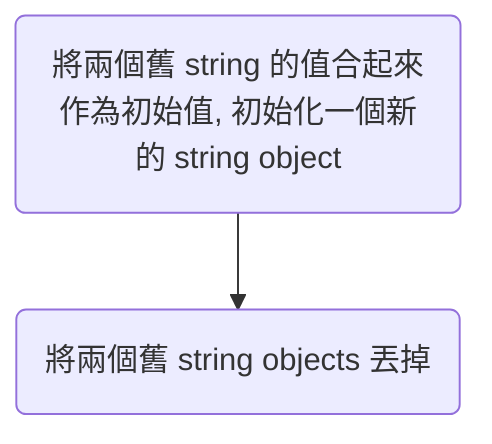

如果現在要寫一個函式 reverse_string，輸入為一個 string，輸出則為輸入值反轉後的 string，你會怎麼寫？

有些人可能會這麼做：初始化一個空字串 s，使用 for loop 從 input string 的最後面開始讀取，並將每次讀到的值加到 s 後面，loop 結束後輸出 s。

```Python
def reverse_string(s_in: str) -> str:
    s = ""
    for i in range(len(s_in)-1, -1, -1):
        s += s_in[i]
    return s
```

你覺得這個演算法的時間複雜度為何？$O(n)$ 嗎？還是 $O(n^2)$ 呢？

在知道答案前你必須先瞭解，在 Python 中， string object 是 immutable 的*（關於 string 在其他語言中是否為 immutable，請見 [[String#各種語言中的 String 是否為 Immutable|此文]]）*。

這使得一個 string object 被初始化後（也就是使用 `""` 將文字包起來後），你就無法更改那個 object 的值了。而當你使用 `+` 來將 string 串接時（比如 `"abc" + "def"`），其實並不是直接在 `"abc"` 這個字串後方加上 `"def"`，而是先初始化一個新的 string object（也就需要另外使用一塊記憶體空間），將兩個字串的值依序填入作為這個新字串的初始值，再將兩個舊的字串丟掉：



而「依序填入」這個動作的時間複雜度為 $O(m+n)$，m 和 n 為兩個被串接的字串的長度。

由此可知，上面那個例子即使 for loop 中每次只加上長度為 1 的 string，迴圈中的複雜度看似 $O(1)$，但其實是 $O(n+1)$，n 為串接前的字串長度，所以整個演算法的時間複雜度是 $O(n^2)$。

你應該也發現，導致複雜度變成 $O(n^2)$ 的元兇就是 string object immutable 這個特性。這也代表，如果有一種資料型態可以：

1. 儲存多個長度為 1 的 string
2. mutable

那上面那個演算法的時間複雜度就可以降為 $O(n)$ 了。

而 list 正好可以達到上述兩個要求，先初始化一個空 list，再倒序地將每個長度為 1 的 string 加入 list，最後再使用 `"".join` 函式將 list 一口氣變成 string。

我們重寫一下 `reverse_string`：

```Python
def reverse_string(s_in: str) -> str:
    l = []
    for i in range(len(s_in)-1, -1, -1):
        l.append(s_in[i])
    return "".join(l)
```

`"".join(l)` 的時間複雜度為 $O(n)$，n 為 `l` 的長度。

你甚至可以使用 string 的`split` 函式與 list 的`reverse` 函式來取代 for loop：

```Python
def reverse_string(s_in: str) -> str:
    l = s_in.split("")
    l.reverse()
    return "".join(l)
```

# 參考資料

- <https://python.plainenglish.io/concatenating-strings-efficiently-in-python-9bfc8e8d6f6e>
