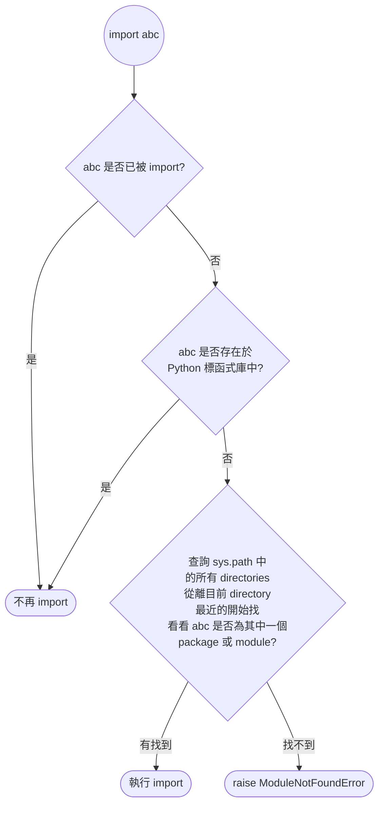

# `import` 如何運作？

一個最簡單的 `import` statement 可能長得如下：

```Python
import abc
```

Python interpreter 處理 `import` statement 的流程則如下：



第一步的 `sys.modules` 扮演 module cache 的角色，值得注意的是，`sys.modules` 是可以被篡改的，有心人士可以透過竄改 module cache 讓 Python Interpreter 誤以為自己有或沒有 import 某個 package/module。

由上方的流程圖可以發現，因為是先查看標準函式庫再查詢 `sys.path`，所以當有三方或 local 的 package/module 與標準函式庫的 package/module 撞名時，只有標準函式庫的那份會被 import 進來。

>[!Note]
>若使用 absolute 或 relative 的方式 import，Python Interpreter 就會跳過流程圖中的前兩個步驟，直接尋找你指定的 directory 是否存在這個 package/module）。

# 各種 `import` 語法

### 一、`import XXX`

e.g.

```Python
import abc
```

- XXX 可能是 package 或 module，範例中的 `abc` 是標準函式庫中的某個 package。
- 當 XXX 是 module 時，那這個 module 一定與目前的檔案在同一個 directory 內。
- 其實 `import <PACKAGE>` 真正 import 的是 package 中的 `__init__.py`。

### 二、`from XXX import YYY`

e.g.

```Python
from datetime import time
```

- 有可能 XXX 是 package 而 YYY 是 module；或者 XXX 是 module 而 YYY 是 objects（object 可以是 funcion, class, variable 等）。

- XXX 可以透過 `.` 來表示「路徑的下一層」，但 YYY 不可以有 `.`

    e.g.

    ```Python
    from my_package.sub import my_module
    ```

### 三、使用 `as` 取別名

無論是 `import XXX` 或 `from XXX import YYY` 都可以在 `import` 的東西後面加上 `as 別名` 。

```Python
from datetime import datetime as dt
```

### 四、Wildcard Import (`*`)

```Python
from my_module import *
```

使用這個方法會將所有指定 module 中的 object 都 import 進來，所以可以直接使用該 module 中的 functions、variables 與 classes。

被 import 的 module 可以透過定義 `__all__` 來控制「當別的 module 使用 wildcard import 時會自動 import 哪些東西」。

舉例而言，現在有 `a.py` 以及 `b.py` 在同一個 directory 底下：

```Python
# a.py
def say_hi() -> None:
    print("hi")

def say_bye() -> None:
    print("bye")

__all__ = ["say_hi"]
```

```Python
# b.py
from a import *

say_hi()
say_bye()
```

當執行 `b.py` 時，你會發現無法順利執行 `say_bye()` 這一行：

```plaintext
hi
Traceback (most recent call last):
  File "b.py", line 4, in <module>
    say_bye()
    ^^^^^^^
NameError: name 'say_bye' is not defined
```

---

>[!Warning]
>強烈建議不要使用 Wildcard import，因為沒有人知道 `*` 到底包含了什麼！
>
>只有一個例外，就是當 module A 與 module B 扮演的角色都是設定檔，而 module B 想要繼承 module A 的所有屬性時。比如有 `settings_dev.py` 與 `settings_production.py` 兩個檔案，其中 `settings_production.py` 大部分的設定與 `settings_dev.py` 相同，只有一些需要修改，此時可以選擇將所有設定都寫在 `settings_dev.py` 中，然後在 `settings_production.py` 中先 `from settings_dev import *`，然後下面再針對一些設定值做調整。

# Absolute Imports

如果你 import local app package 或 module 時，是乖乖地從那個 package/module 所在的最上層 directory 開始寫，那麼你用的就是 absolute imports，absolute imports 是 PEP8 建議的 import 方式。

比如當你的 project 結構如下時：

```plaintext
└── project
    ├── package1
    │   ├── module1.py
    │   └── module2.py
    └── package2
        ├── __init__.py
        ├── module3.py
        ├── module4.py
        └── subpackage1
            └── module5.py
```

absolute imports 會長得像這樣：

```Python
from package1 import module1
from package1.module2 import function1
from package2 import class1
from package2.subpackage1.module5 import function2
```

# Relative Imports

雖然 absolute imports 是建議的寫法，但有時候鄰近的兩個 modules 之間 import 還要寫完整個路徑感覺好像很蠢。比如若在 /a/b/c/d/e 這個路徑下有個 `m1.py` 裡面想要 import 與自己在相同 directory 的 `m2.py` 檔案，如果使用 absolute import 就會是 `from a.b.c.d.e import m2`；如果是 relative import 就是：

```Python
from . import m2
```

同理，如果你想 import /a/b/c/d 這個路徑底下的 `m3.py`，你可以這麼寫：

```Python
from .. import m3
```

# Circular Import Problem

如果兩個 modules `a.py` 與 `b.py` 互相 import 彼此，就「可能」會造成 circular import problem。請注意這裡的用詞是「可能」，也就是說「兩個 modules 互相 import 彼此」並不是不可以做，只是需要用某些方式避免 cicular import problem。

最簡單的會造成 cicular import problem 的例子如下：

```Python
# a.py
import b

def say_hi_and_yes():
    b.say_hi()
    print("yes")

def say_no():
    print("no")

say_hi_and_yes()
```

```Python
# b.py
import a

def say_hi():
    print("hi")

def say_hello_and_no():
    print("hello")
    a.say_no()
```

此時若執行 `a.py`，就會造成 circular import problem，原因是因為當 `a.py` import `b.py` 時，`b.py` 內的程式碼就會開始編譯並執行，執行完才算 import 完畢，而 `b.py` 首先執行的就是 `import a`， 感覺就要掉入無窮迴圈了，不過其實問題不是出在這，Python Interpreter 有做基本的防呆，不會就此掉入迴圈，而是會「假裝」`a.py` 已經 import 好 `b.py`了，然後繼續執行 `a.py` 後續的程式碼。真正的錯誤是發生在 `a.py` 執行到 `say_hi_and_yes()` 時，這個 function 會 call `b.py` 的 `say_hi()`，而因為剛剛 `b.py` 是「假裝」import 好的，所以其實 `b.py` 中的 `say_hi` function 根本還沒被編譯到，於是就會跳出以下 error:

```plaintext
AttributeError: partially initialized module 'b' has no attribute 'say_hi' (most likely due to a circular import)
```

避免 cicular import problem 的方法之一，就是在 `a.py` 中 `b.say_hi()` 這段程式碼放入 `if __name__ == "__main__":` ([[Python/零碎筆記#`__name__ == "__main__"`|詳見此文]]) 這樣的 block 中：

```Python
# a.py
import b

def say_hi_and_yes():
    b.say_hi()
    print("yes")

def say_no():
    print("no")

if __name__ == "__main__":
    say_hi_and_yes()
```

第二種方法，就是在 function 中再 import 必要的資源：

```Python
# a.py
def say_hi_and_yes():
    import b
    
    b.say_hi()
    print("yes")

def say_no():
    print("no")

say_hi_and_yes()
```

```Python
# b.py
def say_hi():
    print("hi")

def say_hello_and_no():
    import a
    
    print("hello")
    a.say_no
```

# PEP - 0008 建議的 `import` 風格

1. `import` 通常會寫在一個檔案的最前面（為了防止 circular import problem 者則不在此限），但要在 docstring 後面
2. `import` 最好依「標準函式庫 $\rightarrow$ 第三方套件 $\rightarrow$ local package」這樣的順序寫，並且以一行空行將上述三塊區分開（若使用 VS Code 可以用 "isort" 這個 extension 自動排序）
3. 上述三塊中，內部最好以字母順序排序
4. 不要為了節省行數把不同 modules 擠在同一行 import

以下提供正確示範：

```Python
"""Illustration of good import statement styling.
Note that the imports come after the docstring.
"""

import datetime
import os

from flask import Flask
from flask_restful import Api

from local_module import local_class
from local_package import local_function
```

# 參考資料

- <https://realpython.com/absolute-vs-relative-python-imports/>
- <https://peps.python.org/pep-0008/#imports>
