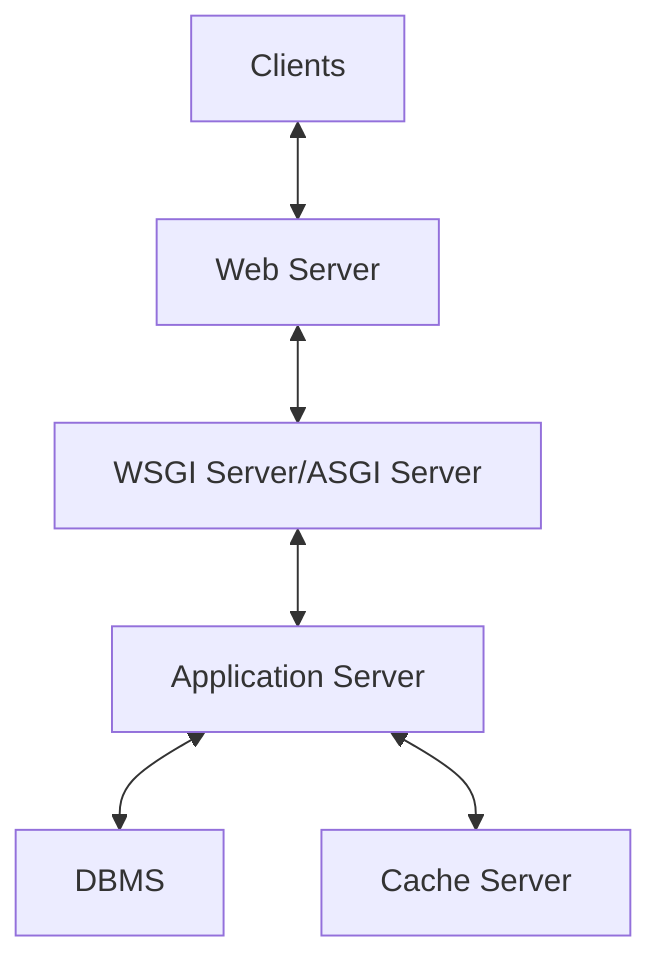

```mermaid
flowchart
    id1[Clients]
    id2[Web Server]
    id3[WSGI Server/ASGI Server]
    id4[Application Server]
    id5[DBMS]
    id6[Cache Server]
    id1 <--> id2
    id2 <--> id3
    id3 <--> id4
    id4 <--> id5
    id4 <--> id6
```

![[Screen Shot 2023-01-26 at 12.16.27 PM.png]]
