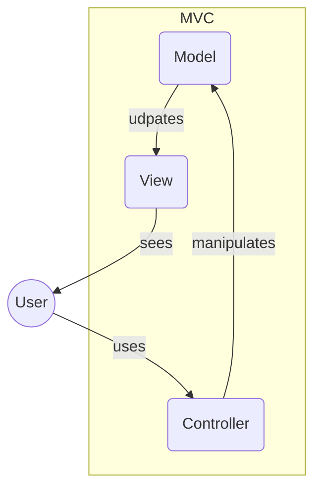
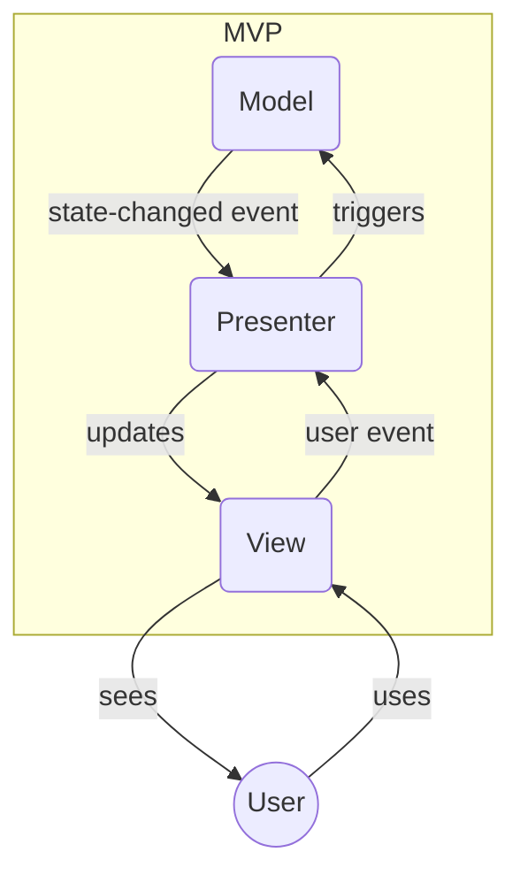
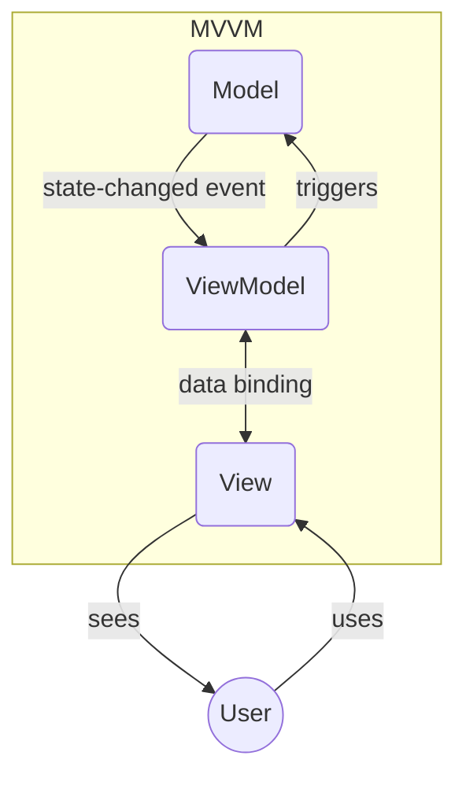

Architectural pattern 泛指描述「資料」、「畫面」、「使用者」如何互動的設計模式。常見的包括 MVC、MVP 與 MVVM。

# MVC

MVC 最早由 [Trygve Reenskaug](https://en.wikipedia.org/wiki/Trygve_Reenskaug) 在 1979 年提出，分別取 Model、View、Controller 三個字的開頭組成縮寫，其架構圖如下：

### Model

Model 負責根據商業邏輯存取資料，並更新 view。

- 商業邏輯會寫在 model 裡
- 如果有資料庫的話，會由 model 負責資料庫溝通

### View

View 就是畫面，如果一個服務沒有畫面，那 view 指的就是經過整理後給 user 看的資料。

- 以網站為例，view 就是使用者看到的網頁，也就是 HTML、CSS、JavaScript 經過瀏覽器渲染後的結果
    - 也有人會說網頁中的每個 UI 元件都是一個 view
    - JavaScript 其實只有控制 DOM 的程式碼算是 view，所以不包括事件監聽相關的程式碼

### Controller

Controller 負責接收 user 的輸入，並呼叫對應的 model。

- User 須透過 view（上面的 UI 元件）或 API 觸發 controller
- Controller 中不會有商業邏輯，商業邏輯會寫在 controller 所呼叫的 model 裡
- 以網站為例，從 client-side JavaScript 的事件監聽、到 client 呼叫 server-side 的 API、到 server 接收到 request 並根據 endpoint 決定要交給哪個 model 處理，以上整段都算是 controller

---

>[!Note] 以前後端分離的系統架構為例
>在一個前後端分離的系統架構中，後端絕大部分的程式碼都屬於 model，除了「根據 API endpoint 決定要呼叫哪個 model」這段算是 controller 外。但 model 並不全在後端，「前端收到後端的 response 後，JavaScript 將新的 data 渲染到畫面上」這段也算是 model。
>
>View 的角色會完全由前端負責，後端不會處理到 view（後端回資料給前端的這段仍然算是 model 的工作範圍）。
>
>你會發現前後端各自都有部分 model 的工作，後端雖然主要扮演 model 的角色，但前端好像也與 model 沾到一點點邊，所以其實 ==MVC 不是最適合用來描述前後端分離這種架構的 pattern==。

# MVP

後人對 MVC 的定義做了修改，並將其中的 **controller** 改名為 **presenter**，於是就有了 MVP，其架構圖如下：

從圖可見，MVP 與 MVC 最大的差異在於 MVP 的 model 與 view 是被隔離的。

### Model

Model 負責根據商業邏輯存取資料，與 MVC 的 model 的差異在於 MVP 的 model 不負責更新 view，更新 view 的工作會交給 presenter。

### View

與 MVC 的 view 定義相同。

### Presenter

除了和 MVC 的 controller 一樣負責接收 user 的輸入並呼叫對應的 model 外，也負責將被 model 更新後的資料整理並放到 view 中。

- 在前後端分離的網站服務中，「前端收到後端的 response 後，JavaScript 將新的 data 渲染到畫面上」這段在 MVP 中算是 presenter，「後端在 model 更新完資料後，將資料整理成前端需要的格式並回傳給前端」這段也算是 presenter
    - 在這個 pattern 中， model 的角色完全由後端扮演

# MVVM

MVVM 分別取 Model、View、View Modal 四個字的開頭組成縮寫，其架構圖如下：

你會發現這張圖好像跟 MVP 沒有差太多，唯一的差別就是 view 與 view model 中間的箭頭變成雙向的。

在 MVP 中我們會說 "presenter updates view"，因為 presenter 是拿著資料去更改 view（實務上就是 JavaScript 所做的 DOM manipulation）；但在 MVVM 中我們並不會說 "view model updates view"，因為呈現在 view 中的資料本身就算是 view model 的一部份。

用另一種方式舉例好了：想像一張被挖了一個洞的卡紙，卡紙後面墊著一張比卡紙大的世界地圖，當卡紙不動但後面的世界地圖被挪動時，人們透過卡紙的上的洞所看到的地圖局部就會跟著改變。在這裡，卡紙以及洞裡的局部世界就是 view，後面的世界地圖則是 view model，當 view model 更動時，人們所看到的 view 就會跟著改變。

如果用類似的方式來描述 MVP，那這時卡紙上就不會有洞了，本來洞裡的地圖局部會變成以貼紙的形式貼在卡紙上，當要觀察世界的另一個角落時，就必須將原本的貼紙撕下來，然後貼新的上去。此時卡紙與上面的貼紙是 view，撕貼貼紙的人則是 presenter。

>[!Note] MVVM 通常用來描述前端框架
>由於 MVVM 強調「view 與 view model 的資料綁定」，而這種技術只有在 client side 才能做到，所以通常我們會說使用這種技術的前端框架使用的是 MVVM 架構。這種情況下，你可以把整個後端想像成資料庫，所以 model 就會是前端負責呼叫後端 API 與整理資料格式的模組。

---

>[!Note] 實務上邊界模糊
>雖然上述 architecture patterns 的定義都很明確，但各種 framework 不一定會完全根據這些定義來實作或規範開發者，這導致實務上 model、view、controller/presenter/view model 的邊界其實很模糊。
>
>比如在一個 MVC 架構中，你可能可以把一些商業邏輯寫在一個 framework 所謂的 "controller" 中，這時候那個 framework 所謂的 "controller" 其實同時也扮演了一部份 model 的角色。

# 參考資料

- <https://en.wikipedia.org/wiki/Model%E2%80%93view%E2%80%93controller>
- <https://en.wikipedia.org/wiki/Model%E2%80%93view%E2%80%93presenter>
- <https://en.wikipedia.org/wiki/Model%E2%80%93view%E2%80%93viewmodel>
- <https://medium.com/ken-do-everything/4fd595581e7f>
- <https://blog.yyisyou.tw/1dddc6d7/>
