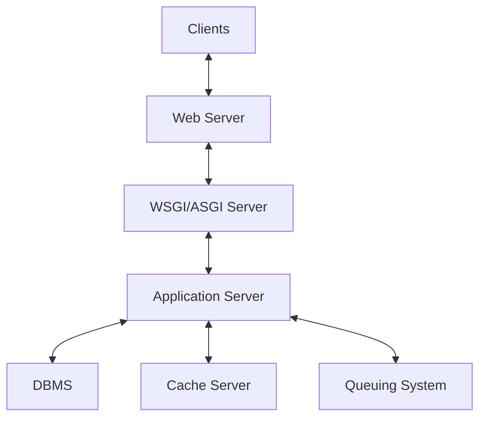

一個基本的 backend web architecture 大致可以分為下圖這幾個 components：

下圖是一個實際的範例：

![[backend_web_architecture.png]]

在繼續閱讀前，推薦看看下面這部影片：

<iframe style="aspect-ratio: 16/9" src="https://www.youtube.com/embed/YnrgBeIRtvo?si=7KERF5O9YU0cgrcK" title="YouTube video player" frameborder="0" allow="accelerometer; autoplay; clipboard-write; encrypted-media; gyroscope; picture-in-picture; web-share" allowfullscreen></iframe>

# Web Server

常見的 web server 包括 **Apache** 與 [[Nginx]]。

### Static vs. Dynamic

單純的 web server 又被稱為 static web server 或者 stack，可以接收 HTTP requests 並依照 URL path 提供對應位置的檔案，檔案的類型可以是 html、css、js，以及各種圖片、影片、字體等，但不能動態地執行程式並回傳結果。

一個 web server 若串接上 application server 就叫做 dynamic web server，dynamic web server 除了可以提供 static files，也可以透過 application server 動態地執行程式並回傳結果。

Web server 與 application server 的溝通必須符合某些 protocol，這個 protocol 可以是 WSGI 或 ASGI。

### 參考資料

- <https://developer.mozilla.org/en-US/docs/Learn/Common_questions/Web_mechanics/What_is_a_web_server>

# WSGI/ASGI Server

WSGI 的全名是 Web Server Gateway Interface，讀作whiskey；ASGI 的全名則是 Asynchronous Server Gateway Interface，它們負責規範 web server 應如何與 application server 溝通。

而 WSGI/ASGI server 就是「實作 WSGI/ASGI 使得 web server 與 application server 可以溝通的 server」。

常見的 WSGI server 如 [[Gunicorn]]；ASGI 則有 **Uvicorn** 與 **Daphne**。

# Application Server

- 負責根據 HTTP request 動態產生 response
- 可以存取資料庫 & cache，如 [[Database/PostgreSQL/Introduction|PostgreSQL]] 與 [[Database/Redis/Introduction|Redis]]
- 可以執行 cron jobs
- 可以與 [[RabbitMQ]]、[[CH1 - Intro to Elasticsearch|Elasticsearch]] 等其它服務溝通

許多程式語言都可以打造 application server，某些程式語言中甚至有專門用來開發 application server 的 framework，如 Python 中的 Django、Node.js 中的 express 等。
