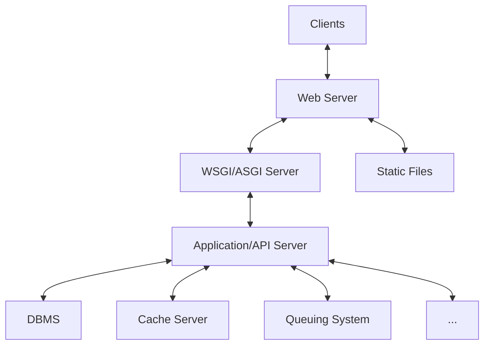

一個基本的 backend web architecture 大致包括下圖這幾個 components：

套用上常用的服務後會長得像下圖這樣：

推薦你看看下面這部影片：

<iframe style="aspect-ratio: 16/9" src="https://www.youtube.com/embed/YnrgBeIRtvo?si=7KERF5O9YU0cgrcK" title="YouTube video player" frameborder="0" allow="accelerometer; autoplay; clipboard-write; encrypted-media; gyroscope; picture-in-picture; web-share" allowfullscreen></iframe>

# Web Server

常見的 web server 包括 Apache 與 [Nginx](</Services/Nginx.md>)。

### Static vs. Dynamic

單純的 web server 又被稱為 static web server 或者 stack，可以接收 HTTP requests 並依照 URL path 提供對應位置的檔案，檔案的類型可以是 html、css、js，以及各種圖片、影片、字體等，但不能動態地執行程式並回傳結果。

一個 static web server 若串接上 application server（或叫 API server），就成為了 dynamic web server。Dynamic web server 除了可以提供 static files，也可以透過 API server 動態地執行程式並回傳結果。

==Web server 與 API server 間的溝通必須符合某個 protocol，這個 protocol 可以是 WSGI 或 ASGI==：

# WSGI/ASGI Server

WSGI 的全名是 Web Server Gateway Interface，讀作whiskey；ASGI 的全名則是 Asynchronous Server Gateway Interface，它們負責規範 web server 應如何與 application server 溝通。

而 WSGI/ASGI server 就是「實作 WSGI/ASGI 使得 web server 與 application server 可以溝通的 server」。常見的 WSGI server 如 [Gunicorn](</Services/Gunicorn.md>)；ASGI 則有 Uvicorn 與 Daphne。

# Application/API Server

- 負責根據 HTTP request 執行程式並產生 response
- 可以與資料庫 (DMBS) 溝通
- 可以與 cache server 溝通
- 可以與 [RabbitMQ](</Services/RabbitMQ.draft.md>)、[Elasticsearch](</Services/Elastic Stack/1 - Intro to Elasticsearch.md>) 等其它服務溝通

許多程式語言都可以用來打造 API server，某些程式語言也發展出[專門用來開發 API server 的 framework](</Web Development/Backend Frameworks/熱門的後端框架.md>)，如 Python 中的 Django、Node.js 中的 Express 等。

# 參考資料

- <https://developer.mozilla.org/en-US/docs/Learn/Common_questions/Web_mechanics/What_is_a_web_server>
