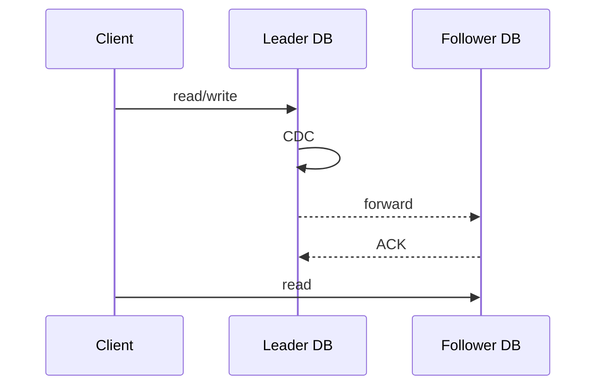

#SystemDesign #Database

設置 Database **Replica**（備援資料庫）的好處主要有二：

1. 若其中一個 DBMS 掛了，或者大量資料遺失／誤刪時，其他 replicas 可以替補上場
2. 多個 replicas 可以分擔流量

有時候 Replica 不只一個，而是一群，這樣的話又會被稱作 **Database Cluster**，cluster 中有相互[[#Single-Socket Channel|連線]]的 DB 稱為 **peer** DBs。

Database Replication 的設計模式主要分為 Leader-Follower Model 以及 Leader-Leader Model：

# Leader-Follower Model

各個 DBs 之間有主從關係，其中只會有一個 Leader DB，leader DB 可以提供 read 與 write 服務，Follower DB 可以有多個，但只提供 read 服務。

Leader DB 會定時或即時將資料的變動 forward 到各個 follower DBs 上，其中「擷取異動資料」的動作叫做 [[CDC]]。

當存在許多 follower DBs 時，各個 follower 的狀態可能不一樣，可能有些已經從 leader DB 手上拿到最新的資料但有些還沒，此時同一個 client 「多次」read 資料時，就可能因為每次都被導向不同的 follower DB，而導致每次讀到的結果不盡相同。

解決上述的 [[CAP Theorem#Consistency|consistency]] 問題的其中一種方法是「讓相同的 client 讀取資料時，每次都被導向相同的 DB」，取代每次導向隨機 follower DB 的做法。

### Replication Lag

Leader DB 將新資料 forward 給 Follower DB 會需要時間，這段時間就叫作 Replication Lag。若要讀取具有「即時性」的資料，必須向 Leader DB 讀取，否則向 Follower DB 讀取即可。

### Failover (備援機制)

Leader DB 會定期發送 **heart beat** 給各個 follower DBs，以表示自己還活著，如此一來萬一 leader DB 掛了，剩於的 follower DBs 就可以察覺，並票選出一個人做為新的 leader，這個機制就叫做 failover。

但當所有 DB 中有一半以上的 DB 都掛掉時，就視為整個 cluster 掛掉，可以將「總 DB 數量」與「最高可接受死機數量」整理成下面這張表：

|Number of DBs in Cluster|Number of Tolerated Failures|
|---|---|
|1|0|
|2|0|
|3|1|
|4|1|
|5|2|
|…|…|

任一 DB 會有三種可能狀態：

1. Follower
2. Leader
3. Looking for Leader

當 Cluster 中的 DB 數量不多時，新的 leader 可以透過 peer DB 間互相選舉得到（選擁有最新資料的那個），但當 cluster 中的 DB 很多個時（比如數百甚至數千個），此時用一個獨立於 cluster 外的服務（e.g. Zookeeper, etcd…）來決定誰要成為新 leader 會比較有效率。

### Synchronous/Asynchronous Forwarding

Forwarding 可以依照 Leader DB 將新資料 forward 給 follower DBs 後，是否等待 follower DB 回應 (ACK) 才關閉 transaction，分為 synchronous 與 asynchronous。

- **Synchronous (Blocking) Approach**

    Client 寫入資料時，leader DB 會將新資料 forward 給所有 follower DBs 並等得到所有 follower DBs 的 ACK 後，才算完成 transaction 並 ACK client，所以 client 可能因為某個 follower DB 回的比較慢或者 leader 與 followers 間的網路不好，而等待很長的時間才收到 ACK。

- **Asynchronous (Non-Blocking) Approach**

    Client 寫入資料時，只要 leader DB 自己寫入成功就會 close transaction 並 ACK client，forward 給所有 follower DBs 是之後的事，所以 client 不會感受到很長的 latency。然而若 leader DB 還沒來得及 forward data 給 follower DBs 就觸發 failover，那就會出現 data loss。

### Single-Socket Channel

Leader forward 給各 followers 的 data 有以下兩個要求：

1. 順序要與 leader 自己收到 data 的順序相同
2. 不可以有任何 package loss

因此 peer DBs 之間的連線必須使用 single-socket channel + [[TCP]]，且 follower 必須使用 [[Singular Update Queue]] 來處理 leader 送來的訊息（一個 connection 只能用一個 [[Process & Thread#Thread (執行緒)|thread]]）。

實務上被用來當作 Singular Update Queue 的服務比如：Kafka 和 Debezium。

### 當 Forward 失敗時

若 Leader DB forward 資料給任何一台 follower DB 時失敗了，leader DB 有兩種做法：

1. 直接 rollback 並通知所有 follower DBs 也 rollback

    這樣 client 感受到的「寫入失敗的機率」會比較高，但可以確保所有 DBs 的 consistency。

2. Error Handling and Retry

    這樣會導致某些 follower DB 出現暫時或永久的 data loss，未來某刻若觸發 failover 機制，可能還會選上有 data loss 的 DB 做為新的 leader DB。

### The Split-Brain Scenario

我們已經知道，當 leader DB 掛掉時會觸發 failover，但如果 follower DBs 們「誤認」為 leader DB 掛掉，但其實只是 leader 與 follwers 之間的網路斷線了，如此一來就會出現兩個甚至更多 leader DBs 各自為政：

![[split-brain-scenario.webp]]

# Leader-Leader Model

所有 DBs 都可以提供 read 與 write 服務，但這樣的架構比起 Leader-Follower Model 更容易出現 data inconsistency，說穿了其實就是常態性的 [[#The Split-Brain Scenario|Split-Brain Scenario]]，也可以稱為 No-Leader Model。

### Quorum (多數決)

當沒有 leader 可以控制資料的寫入時，要避免 data inconsistency，就必須限制「不能同時有兩個以上的 transactions 在相同或不同的 DB 讀／寫同一筆（堆）資料」，而 Quorum 就是一種決定是誰可以讀／寫資料的方法：當有 client 要對某個 DB 進行讀／寫時，請所有 DBs 投票，過半才允許這次的 transaction。

可以將總 DB 數與 quorum 整理成下面這張表：

|Number of DBs in Cluster|Quorum|
|---|---|
|1|1|
|2|2|
|3|2|
|4|3|
|5|3|
|…|…|

>[!Note]
>其實在 Leader-Follower Model 中，[[#Failover (備援機制)|failover]] 時也會用到 Qrorum 來選拔新 leader。

# 參考資料

- <https://towardsdatascience.com/database-replication-explained-5c76a200d8f3>
- <https://martinfowler.com/articles/patterns-of-distributed-systems/leader-follower.html>
- <https://www.youtube.com/watch?v=uq4kb7gLrPQ>
- <https://en.wikipedia.org/wiki/Quorum_(distributed_computing)>
