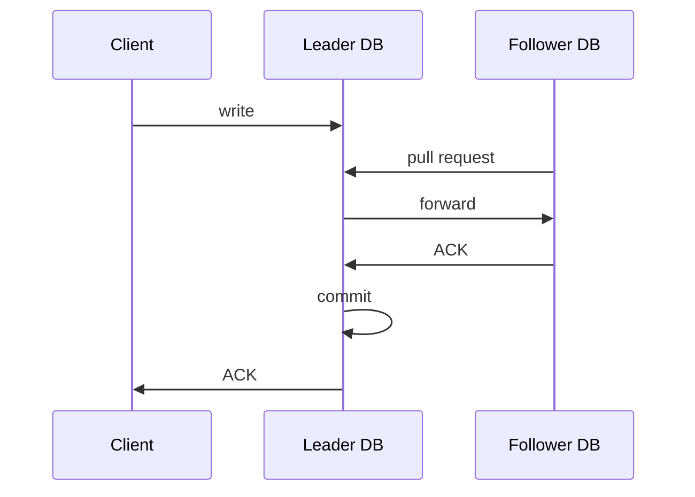
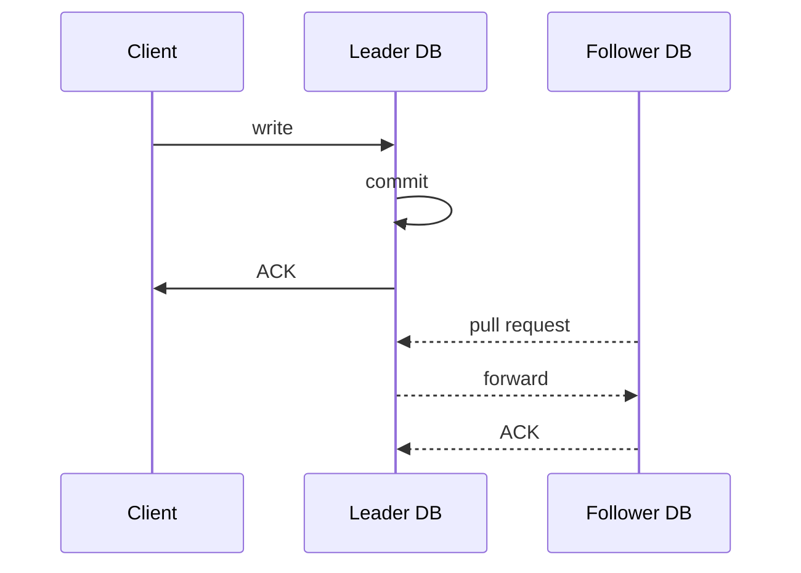

設置 database **replica**（備援資料庫）的好處主要包括：

- 當其中一個 DB server crash 或者大量資料遺失／誤刪時，其它 replicas 可以替補上場
- **Read/Write Splitting（讀寫分離）**: Replicas 可以分攤讀／寫工作

有時候會不只有一個 replica，而是有一群，這樣的話又會被稱作 **Database Cluster**，cluster 中有相互[[#Single-Socket Channel|連線]]的 DB 稱為 **peer** DBs。

# Replication Models

Database replication 的系統架構主要有三種：

### Single-Leader Model

有一個 leader DB，leader DB 可以提供 read 與 write 服務，follower DB 可以有多個，但只提供 read 服務。

這種 model 適合「讀多寫少」的服務使用。

### Multi-Leader Model

將 DB cluster 切成多個 sub-cluster，每個 cluster 有一個 leader DBs（可 read & write），multi-leader model 可以支撐比 single-leader model 更高的同時寫入量。

所有 single-leader model 有的問題 multi-leader model 有都會有，除此之外還額外有 leaders conflict 的問題。（這些問題在本篇後續都會提到）

在這種 model 下還有一個值得討論的議題：cluster leaders 間的 [[Network Topology.draft|topology]]：

- **Fully Connected**
    - 優點：同步所需時間最短，沒有 single point of failure
    - 缺點：網路連線數量多，以 $n^2$ 的速度成長
- **Ring**
    - 優點：網路連線數量少
    - 缺點：同步所需時間最長，且中間任何一站若 crash，後面的就都無法同步
- **Star**
    - 優點：在網路連線數量與速度間取得平衡
    - 缺點：Single point of failure

### Leaderless Model

所有 DBs 都可以提供 read 與 write 服務，client 的 read 與 write request 都會打向所有 DB nodes，並等待一定數量的 DB ACKs，這個「一定數量」是由 admin 自行決定，但通常不會隨便決定，而是使用 [[#Quorum (多數決)]]。

---

上述三種 models 中，single-leader 與 multi-leader 可以歸納為 **leader-follower model**（又稱為 master-slave model）在這種 model 中，各個 DBs 之間有主從關係，反之在 leaderless model 中就沒有主從關係。

# Push-Based or Pull-Based

在 leader-follower model 中，「概念上」leader DB 會定時或即時將資料的變動 forward 到各個 follower DBs 上，其中在 multi-leader model 中， 負責此次寫入的 leader DB 也會同時將資料 forward 給其它 sub-clusters 中的 leader DBs。

前面的敘述看起來是 leader DB 主動將變動 forward 給 follower DBs，但其實在大多數 relational database 中（如 MySQL 與 PostgreSQL）==是 follower DBs 主動向 leader DB pull 資料==，這麼做的好處是 followers 可以自行依照忙碌程度調整 pull 的頻率。

以 MySQL 為例，follower 會從 leader 身上 pull [[MySQL Server Logs.draft#Binary Log|binlog]]，放進自己的 [[MySQL Server Logs.draft#Relay Log|relay log]] 中，然後逐一將 relay log 中的資料／操作紀錄重現，如下圖：

![[replication-in-mysql.jpg]]

# Sync vs. Async

Replication 可以依照 leader DB 發生資料變動後，是否等待 follower DB 回應 (ACK) 才 commit [[Database/0 - Introduction#Database Transaction|transaction]] 並 ACK client，分為 synchronous approach 與 asynchronous approach。

### Synchronous Approach



Client 寫入資料時，leader 須等得到所有 followers pull & ACK 後，才會 commit transaction 並 ACK client，所以 client 可能因為某個 follower 回的比較慢、leader 與 followers 間的網路不好、甚至是某個 follower crash 而等很久。

### Asynchronous Approach



Client 寫入資料時，只要 leader 自己寫入成功就會 commit transaction 並 ACK client，同時將變動的資料 forward 給所有 followers，所以 client 不用等很久。然而若在 forward 完成之前 client 就從 follower 身上讀資料，client 就會感受到 inconsistency。

Async approach 還有不同程度：

- 任一個 follower DB ACK，leader DB 就 commit（又叫做 semi-synchronous）
- 不用等任何 follower DBs ACK，leader DB 就 commit

在 async approach 下，若要確保讀取到的資料具有 consistency，有以下幾種方式：

- 跟 leader 拿資料
    - ==**Read your own write**==：當 client 短時間內要讀一個自己剛寫的資料，只能向 leader 讀，這樣可以避免 client 覺得自己剛寫入的東西沒寫成功
- 透過比對 leader 與 follower 上資料的 timestamp，跟已經有最新資料的 follower 拿資料

    可再細分成兩種：

    1. 每次 read 都向隨機的 follower 拿 → 每次都要檢查 timestamp
    2. 確定某個 follower 有最新資料後，相同的 read request 就固定向那個 follower 拿 → 只須檢查一次 timestamp

# Replication Lag

將變動的資料 forward 給其它 DB nodes 需要時間，這段時間叫作 replication lag。

在 MySQL 中，followers 會用 **Seconds_Behind_Master** 來描述目前自己與 leader 身上的資料差了幾秒（過去幾秒的資料沒有還沒有完成同步）在 follower 上輸入以下指令可以查看：

```SQL
-- for mysql 5.x ~ 8.x
SHOW SLAVE STATUS;  -- Output 裡會有 follower 的 Seconds_Behind_Master

-- for mysql 9.0
SHOW REPLICA STATUS;
```

當存在許多 follower DBs 時，各個 follower 的狀態可能不一樣，可能有些已經從 leader DB 手上拿到最新的資料但有些還沒，此時同一個 client 多次 read 資料時，就可能因為每次都被導向不同的 follower DB，而導致每次讀到的結果不盡相同。

解決上述 [[ACID vs. BASE#Consistency|consistency in read]] 問題的其中一種方法是 **fixed routing**：「讓相同的 client 讀取相同資料時，每次都被導向相同的 DB」，取代每次導向隨機 follower DB 的做法。

### Eventual Consistency

根據 [[ACID vs. BASE#CAP Theorem|CAP Theorem]] 可知，在分散式系統中，我們必須在 availability 與 consistency 間做出取捨，而採用 replica 機制就是選擇提高 availability，因此勢必要犧牲一些 consistency。但這並不代表不同 DB nodes 的資料就永遠不會一致，只要時間足夠讓所有 replicas 都可以更新資料，那資料最終就會一致，因此我們會說這種系統具備 eventual consistency。

# Replication 的系統要求

Leader forward 給各 followers 的資料有以下兩個要求：

- 資料順序要與 leader 自己收到的順序相同
- 不可以有任何 package loss

因此 leader 與 followers 之間的連線必須使用 **single-socket channel** + [[TCP.draft|TCP]]。

Followers 必須使用 [[Singular Update Queue]] 來處理 leader 送來的訊息（一個 connection 只能用一個 [[Process.draft#Thread|thread]]）：

- Single-socket channel
- TCP
- Singular update queue

MySQL 上的 relay log 就是一種實作在 follower DB 上的 singular update queue，市面上也有其它第三方服務可以被用來當作 singular update queue，比如 Kafka 和 Debezium。

# 當 Replication 失敗時

若任何一台 follower DB 嘗試 replicate 時失敗了，leader DB 有兩種選擇：

1. 直接 rollback 並通知所有 follower DBs 也 rollback

    這樣 client 感受到的「寫入失敗的機率」會比較高，且有可能 rollback 這個指令也沒有成功傳送到所有剛才成功拿到資料的 followers。

2. Error Handling and Retry

    由於不能保證 retry 一定會成功，所以這種做法可能會導致某些 followers 出現暫時或永久的 data loss，未來某刻若觸發 failover 機制，可能還會選上有 data loss 的 DB 做為新的 leader DB。

# Failover (備援機制)

在 leader-follower model 中，leader DB 會定期發送 **heart beat** 給各個 follower DBs，以表示自己還活著，如此一來萬一 leader DB crash了，剩下的 follower DBs 就可以察覺，並票選出一個做為新的 leader，這個機制就叫做 failover，但當所有 DBs 中有一半或以上的 DBs 都 crash 時，就視為整個 cluster crash。

每個 DB node 都有三種可能的狀態：

1. Follower
2. Leader
3. Looking for Leader

當 cluster 中的 DB 數量不多時，可以透過 peer DBs 間互相選舉得到新的 leader（選擁有最新資料的那個）但當 cluster 中的 DB 有很多時（比如數百甚至數千個）用一個獨立於 cluster 外的服務（e.g. Apache Zookeeper, etcd…）來決定誰要成為新 leader 會比較有效率。

在 async replication approach 下，有可能因為 failover 機制而造成永久性的 data loss，比如在某個 follower 無法成功複製資料時，leader DB 剛好 crash 了，然後又票選出這個有缺資料的 follower 當作新的 leader，這時候新 leader 就會缺資料。

### Split Brain

如果 follower DBs 們「誤認」為 leader DB crash 了，但其實只是 leader 與 followers 之間的網路斷線了，如此一來就會出現兩個甚至更多 leader DBs 各自為政：

![[split-brain-scenario.jpg]]

多個 leader DBs 各自為政就會使得 sub-clusters 間可能出現 conflicts，其實 multi-leader model 就是一種常態性的 split brain，只是在 multi-leader model 中，有一些機制來解決 conflict，這些機制包括：

##### Last Write Wins

當兩個 leader 間有同一筆資料被更改時，以最晚寫入的那筆為準。

這個方法看起來天衣無縫，但前提是 leader DB nodes 間的時間沒有任何偏差。

##### Fixed Routing

同一筆資料的寫入固定透過某台 leader DB。

##### Read Repair

當兩個 leader 間有同一筆資料被更改時，保留所有版本，當 client 讀取時，請 client 自行決定要保留哪個版本。

# Quorum (多數決)

在 leader-follower model 中，failover 時也會透過 quorum 來選拔新 leader。

在 leaderless model 中，沒有 leader 可以控制資料的寫入，此時若要要避免 inconsistency 就必須限制「不能同時有兩個以上的 transactions 在相同或不同的 DB 讀／寫同一筆（堆）資料」，而 quorum 就是一種決定是誰可以讀／寫資料的方法：當有 client 要對某個 DB 進行讀／寫時，請所有 DBs 投票，過半才允許這次的 transaction。

### Strict Quorum

在 leaderless model 中，當有 **read after write** 時，read 所要求的 ACK 數量應該要大於 「cluster 中的 nodes 總數減掉 write 時所拿到的 ACK 數量」，為什麼呢？

想像有人把三個蘋果隨機放進五個籃子裡（每個籃子最多放一顆），請問另一個人最多須要打開幾個籃子才會看到裝著蘋果的籃子？答案是 $5-3+1 = 3$。

Read/write 時至少要拿到的 ACK 數量是由 admin 決定的，假設設定 write 時至少要拿到的 ACK 數量為 w、read 至少要拿到的 ACK 數量為 r，再令 cluster 中的總 node 數量為 N，則 strict quorum 要求 $r + w > N$。

對一個 read 與 write 數量差不多的服務中，將 r 與 w 都設為 $N\over2$ 是個不錯的選擇；但在一個讀多寫少的服務中，會建議將 r 設小一點，讓使用體驗更好。

由此可見，strict quorum 機制下的 leaderless model 中可以達到完全的 consistency。

### Sloppy Quorum & Hinted Handoff

當目前存活的 node 數量小於 w (when writing) 或 r (when reading) 時，額外用一些臨時的 DB node 暫時加入 cluster 中，等到原本 cluster 中的 node 復活後，再將這些臨時的 node 上的資料轉交給它們。

相對於 strict quorum，sloppy quorum 擁有更高的 availability。

# 怎麼決定連到哪個 DB？

### Application-Level Logic

在 application code 每一段存取到資料庫的程式碼中聲明要存取哪個資料庫。

這個做法的其中一個缺點是若 code 所指定連線的 node 下線了，則須要有一個機制可以改連到下一個可用的 DB node。

為了減少 latency，application 會須要記錄每個 DB node 的狀態，以避免每次都需要重新嘗試連線那些已經下線的 DB nodes，而如果 application 也是分散式架構，就會須要把 DB cluster 的資訊分享給所有的 app nodes。上述工作都有現成的服務可以做到，比如 Apache Zookeeper。

### Proxy/ Load Balancer

在 DB cluster 前方架設一個扮演 load balancer 的 proxy server，比如若是要進行讀寫分離，則 proxy 可以透過 SQL 的內容來決定要將流量導向哪個 node，常見的服務如：[ProxySQL](https://proxysql.com/)。

# 參考資料

- [Database Replication Explained 1](https://towardsdatascience.com/5c76a200d8f3)
- [Database Replication Explained 2](https://towardsdatascience.com/10ff929bdf8a)
- [Database Replication Explained 3](https://towardsdatascience.com/32d6deceeca7)
- <https://www.youtube.com/watch?v=uq4kb7gLrPQ>
- [資料庫讀寫分離 | mysql - 今天晚放学](https://www.youtube.com/watch?v=eje9Bp6pW_8)
- <https://en.wikipedia.org/wiki/Quorum_(distributed_computing)>
- <https://dev.mysql.com/doc/refman/8.4/en/replication-implementation.html>
