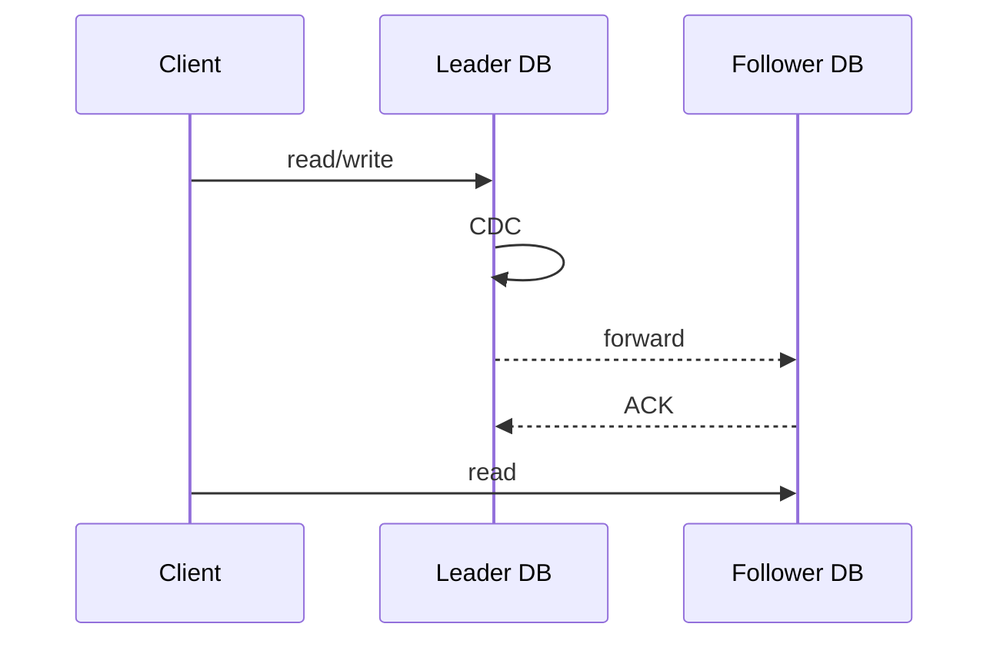

設置 database **replica**（備援資料庫）的好處主要包括：

- 當其中一個 DB server crash 或者大量資料遺失／誤刪時，其他 replicas 可以替補上場
- **Read/Write Splitting（讀寫分離）**: Replicas 可以分攤讀／寫工作

有時候會不只有一個 replica，而是有一群，這樣的話又會被稱作 **Database Cluster**，cluster 中有相互[[#Single-Socket Channel|連線]]的 DB 稱為 **peer** DBs。

Database replication 的設計模式主要有兩種：

- Leader-Follower Model
- Leaderless Model

# Leader-Follower Model

Leader-follower model 又稱為 master-slave model，各個 DBs 之間有主從關係，其中只會有一個 leader DB，leader DB 可以提供 read 與 write 服務，follower DB 可以有多個，但只提供 read 服務。

Leader DB 會定時或即時將資料的變動 forward 到各個 follower DBs 上，其中「擷取異動資料」的動作叫做 [[CDC]]。

### Eventual Consistency

當存在許多 follower DBs 時，各個 follower 的狀態可能不一樣，可能有些已經從 leader DB 手上拿到最新的資料但有些還沒，此時同一個 client「多次」read 資料時，就可能因為每次都被導向不同的 follower DB，而導致每次讀到的結果不盡相同。

解決上述 consistency 問題的其中一種方法是「讓相同的 client 讀取資料時，每次都被導向相同的 DB」，取代每次導向隨機 follower DB 的做法。

根據 [[ACID vs. BASE#CAP Theorem|CAP Theorem]] 可知，在分散式系統中，我們必須在 availability 與 consistency 間做出取捨，而採用 replica 機制就是選擇提高 availability，因此勢必要犧牲一些 consistency。但這並不代表不同 leader 與 followers 的資料就永遠不會一致，只要時間足夠讓所有 replicas 都可以更新資料，那資料最終就會一致，因此我們會說這種系統具備 **eventual consistency**。

### Synchronous/Asynchronous Forwarding

Forwarding 可以依照 leader DB 將新資料 forward 給 follower DBs 後，是否等待 follower DB 回應 (ACK) 才 close [[Database/0 - Introduction#Database Transaction|transaction]] 並 ACK client，分為 synchronous 與 asynchronous。

##### Synchronous Approach

Client 寫入資料時，leader 會將變動的資料 forward 給所有 followers 並等得到所有（或部分）followers 的 ACK 後，才會 close transaction 並 ACK client，所以 client 可能因為某個 follower 回的比較慢或者 leader 與 followers 間的網路不好而等很久。

##### Asynchronous Approach

Client 寫入資料時，只要 leader 自己寫入成功就會 close transaction 並 ACK client，同時將變動的資料 forward 給所有 followers，所以 client 不用等很久。然而若在 forward 完成之前 client 就從 follower 身上讀資料，client 就會感受到 inconsistency。

在 async approach 下，若要確保讀取到的資料具有 consistency，有以下幾種方式：

- 跟 leader 拿資料
- 跟已經有最新資料的 follower 拿資料（透過比對 timestamp 來判斷）
    - 每次 read 都是向隨機的 follower，所以每次都要檢查
    - 當確定某個 follower 有最新資料後，相同的 read request 就固定向那個 follower 拿

其中若選擇跟 follower 拿資料，也可以選擇不用每次都檢查 timestamp，而是

### Replication Lag

Leader 將變動的資料 forward 給 followers 會需要時間，這段時間叫作 replication lag，在 MySQL 中，followers 會用 **seconds_behind_master** 來描述目前自己與 leader 身上的資料差了幾秒（過去幾秒的資料沒有還沒有完成同步）。

### Single-Socket Channel + TCP + Singular Update Queue

Leader forward 給各 followers 的資料有以下兩個要求：

- 資料順序要與 leader 自己收到的順序相同
- 不可以有任何 package loss

因此 leader 與 followers 之間的連線必須使用 **single-socket channel** + [[TCP.draft|TCP]]，且 followers 必須使用 [[Singular Update Queue]] 來處理 leader 送來的訊息（一個 connection 只能用一個 [[Process & Thread#Thread|thread]]）。

實務上被用來當作 singular update queue 的服務比如 Kafka 和 Debezium。

### 當 Forward 失敗時

若 leader DB forward 資料給任何一台 follower DB 時失敗了，leader DB 有兩種做法：

1. 直接 rollback 並通知所有 follower DBs 也 rollback

    這樣 client 感受到的「寫入失敗的機率」會比較高，且有可能 rollback 這個指令也沒有成功傳送到所有剛才成功拿到資料的 followers。

2. Error Handling and Retry

    由於不能保證 retry 一定會成功，所以這種做法可能會導致某些 followers 出現暫時或永久的 data loss，未來某刻若觸發 failover 機制，可能還會選上有 data loss 的 DB 做為新的 leader DB。

### Failover (備援機制)

Leader DB 會定期發送 **heart beat** 給各個 follower DBs，以表示自己還活著，如此一來萬一 leader DB crash了，剩於的 follower DBs 就可以察覺，並票選出一個做為新的 leader，這個機制就叫做 failover，但當所有 DBs 中有==一半或以上的 DBs 都 crash 時，就視為整個 cluster crash==。

每個 DB node 都有三種可能的狀態：

1. Follower
2. Leader
3. Looking for Leader

當 cluster 中的 DB 數量不多時，可以透過 peer DBs 間互相選舉得到新的 leader（選擁有最新資料的那個）但當 cluster 中的 DB 有很多時（比如數百甚至數千個）用一個獨立於 cluster 外的服務（e.g. Apache Zookeeper, etcd…）來決定誰要成為新 leader 會比較有效率。

### Split Brain

我們已經知道當 leader DB crash 時會觸發 failover，但如果 follower DBs 們「誤認」為 leader DB crash 了，但其實只是 leader 與 followers 之間的網路斷線了，如此一來就會出現兩個甚至更多 leader DBs 各自為政：

![[split-brain-scenario.webp]]

# Leaderless Model

所有 DBs 都可以提供 read 與 write 服務，但這樣的架構比起 leader-follower model 更容易出現 inconsistency。

### Quorum (多數決)

在 leaderless model 中，沒有 leader 可以控制資料的寫入，此時若要要避免 inconsistency 就必須限制「不能同時有兩個以上的 transactions 在相同或不同的 DB 讀／寫同一筆（堆）資料」，而 quorum 就是一種決定是誰可以讀／寫資料的方法：當有 client 要對某個 DB 進行讀／寫時，請所有 DBs 投票，過半才允許這次的 transaction。

在 leader-follower model 中，failover 時也會透過 quorum 來選拔新 leader。

# 怎麼決定連到哪個 DB？

### Application-Level Logic

在 application code 每一段存取到資料庫的程式碼中聲明要存取哪個資料庫。

這個做法的其中一個缺點是若 code 所指定連線的 node 下線了，則須要有一個機制可以改連到下一個可用的 DB node。

為了維持好的使用體驗，application 會須要記錄每個 DB node 的狀態，以避免每次都需要重新嘗試連線那些已經下線的 DB nodes，而如果 application 也是分散式架構，就會須要把 DB cluster 的資訊分享給所有的 app nodes，已上工作有現成的服務可以做到，比如 Apache Zookeeper。

### Proxy/ Load Balancer

在 DB cluster 前方架設一個扮演 load balancer 的 proxy server，比如若是要進行讀寫分離，則 proxy 可以透過 SQL 的內容來決定要將流量導向哪個 node。

# 資料復原

#TODO 

# 如何選擇 Replication Model？

在決定系統要使用哪種 replication model 時，最好先分析系統使用者的行為。

如果是一個「讀多寫少」的系統，那麼 leader-follower model 會很適合；相反地，如果是一個「讀少寫多」的系統，則使用 leader-follower model 的效果就會不顯著，因為還是只有一個 node 可以寫，這時可以考慮使用 leaderless model，但如果系統同時需要很高的 consistency，那 leaderless model 又無法滿足，此時可能就只剩下 vertical scaling 這個選項了。

# 參考資料

- [Database Replication Explained 1](https://towardsdatascience.com/5c76a200d8f3)
- [Database Replication Explained 2](https://towardsdatascience.com/10ff929bdf8a)
- [Database Replication Explained 3](https://towardsdatascience.com/32d6deceeca7)
- <https://www.youtube.com/watch?v=uq4kb7gLrPQ>
- [資料庫讀寫分離 | mysql - 今天晚放学](https://www.youtube.com/watch?v=eje9Bp6pW_8)
- <https://en.wikipedia.org/wiki/Quorum_(distributed_computing)>
