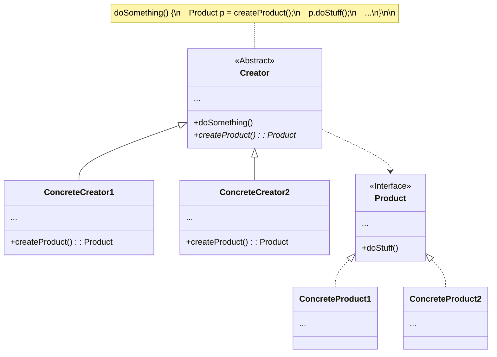

### [Refactoring Guru](https://refactoring.guru/design-patterns/factory-method)

### 重點摘要

- 在 class A 中定義一個會回傳一個 instance of class B 的 method M，M 即 factory method
    - Class A 扮演的角色是 **creator**
    - Class B 扮演的角色是 **product**
- 通常 class A 會是一個 superclass，或者甚至只是一個 abstract class
    - Class A 的 factory method M 通常只是一個 abstract method
- 通常 class B 也會是一個 superclass，或者甚至只是一個 interface
- 繼承 class A 的 subclass S 可以 override factory method M（當 M 在 class A 是 abstract method 時則 S「必須」implement M）
- Subclass S 的 factory method M 的 return type 可以是 class B 的 subclass（當 class B 是 interface 時，S 的 M 就「必須」回傳一個 implement 此 interface 的 class instance）

### 優點

- 降低了 creator 與 product 間的耦合度
- 實踐了 [[SOLID Principles]] 中的 single responsibility principle，一個 class 只對一個角色負責
- 實踐了 SOLID Principle 中的 open-closed principle，擴充功能時不須修改既有功能的 code

### UML

